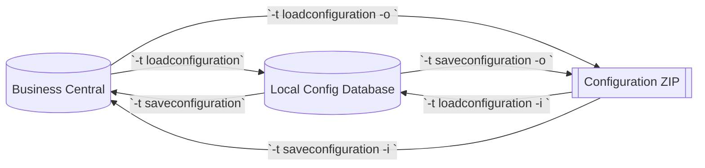

# Configuration Scenarios: `loadconfiguration` vs. `saveconfiguration`

The following scenarios illustrate how configurations can be moved between Business Central (BC), the local DataMigratePro
installation, and ZIP archives. Each example assumes that base settings (tenant, endpoint, databases) are already in place.

👉 For the German version, see [Konfigurationsszenarien: `loadconfiguration` vs. `saveconfiguration`](Konfiguration-Load-Save-Uebersicht.md).

## 1. Configuration from BC to Local (`-t loadconfiguration`)
- **Command:** `DataMigratePro -t loadconfiguration`
- **Result:** Loads configuration data from BC into the local environment. This includes Migration, Mapping, optional BC Table/
Field, Value Mapping, and Value Mapping Value records, transferred in paginated batches.
- **Typical use case:** Synchronize the baseline before making local adjustments.

## 2. Push Local Configuration back to BC (`-t saveconfiguration`)
- **Command:** `DataMigratePro -t saveconfiguration`
- **Result:** Sends the locally maintained configuration tables to BC. Target tables in BC are cleared and then refilled in
chunks.
- **Important:** The **BC Field** and **BC Table** tables are **not** written back.

## 3. Export BC Configuration as ZIP (`-t loadconfiguration -o ./path/to/zipfile.zip`)
- **Command:** `DataMigratePro -t loadconfiguration -o ./output/configuration.zip`
- **Result:** Stores the configuration retrieved from BC as a ZIP archive containing individual JSON files, instead of writing it directly to the local database.

## 4. Load Local Configuration from ZIP (`-t loadconfiguration -i ./path/to/zipfile.zip`)
- **Command:** `DataMigratePro -t loadconfiguration -i ./path/to/configuration.zip`
- **Result:** Imports a previously exported configuration ZIP locally without contacting BC (useful for offline reviews or testing).

## 5. Save Local Configuration as ZIP (`-t saveconfiguration -o ./path/to/zipfile.zip`)
- **Command:** `DataMigratePro -t saveconfiguration -o ./output/configuration.zip`
- **Result:** Creates a ZIP archive from the current local configuration that can later be uploaded to BC or versioned.

## 6. Load BC Configuration from ZIP (`-t saveconfiguration -i ./path/to/zipfile.zip`)
- **Command:** `DataMigratePro -t saveconfiguration -i ./path/to/configuration.zip`
- **Result:** Uses a ZIP file as the source and sends its content to BC, making it suitable for distributing validated configurations in batches.
