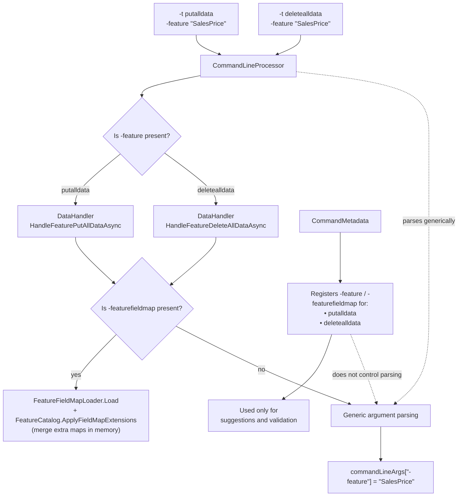

# DataMigratePro Feature Upgrade — Implementation

Technical reference for the feature-based migration (`-t putalldata -feature "..."` /
`-t deletealldata -feature "..."`). The first implemented feature is **`SalesPrice`**.

---

## 1. Command flow




## 2. Components

### PC tool (`DataMigratePro.Core`)

| File | Responsibility |
|------|----------------|
| `CommandMetadata.cs` | Registers `-feature` and the optional `-featurefieldmap` as value flags for `putalldata`/`deletealldata`. |
| `CommandLineProcessor.cs` | Dispatches to the feature handler when `-feature` is present. |
| `FeatureMigration/FeatureCatalog.cs` | Feature model + the `SalesPrice` definition (field maps, number-series records, value/amount normalization) + `ApplyFieldMapExtensions` (merges external maps in memory). |
| `FeatureMigration/FeatureSqlComposer.cs` | Composes the staging SQL; accepts optional `FeatureExtraColumn`s to project customer extension columns. |
| `FeatureMigration/FeatureFieldMapExtension.cs` | Model + `FeatureFieldMapLoader` for the external `-featurefieldmap` file (deserialize + validate). |
| `DataHandler.FeatureMigration.cs` | Orchestration: load SQL, resolve table names, transform, send, call BC endpoint, write log; applies the optional field map via `TryApplyFeatureFieldMap`. |
| `MappingDatabaseInitializer.cs` | Creates the `DMP Feature Migration Log` table. |
| `ParameterHelper.cs` | Help text for `--feature` / `--featurefieldmap`. |
| `DataMigratePro.Core.csproj` | Embeds the two staging SQL files as resources. |

### Business Central (`DMP-AppSource/DataMigratePro`)

| Object | Responsibility |
|--------|----------------|
| `DMP Feature Upgrade Mgt. IOI` (codeunit 72359595) | `featureupgrade` / `featurerevert` logic. |
| `Upload IOI` (codeunit 72359580) | New `featureupgrade` / `featurerevert` actions in `LoadData`. |
| `Permissions IOI` | Grants execution rights on the new codeunit. |

---

## 3. In-memory mapping (no persistence)

The feature mapping is **not** read from `BC Migration Tables` / `BC Migration Mapping`. It is defined
in code in `FeatureCatalog.cs` and converted to a `MappingConfiguration` at runtime:

- `FeatureFieldMap` = one source column (SQL alias) → one BC field id, with `Validate` and `PrimaryKey`
  flags.
- Field order in the list controls the order in which BC applies/validates the fields
  (e.g. `Source Type` before `Source No.`, `Amount Type` before the amount fields).

### Target field maps (SalesPrice)

The tables below are the **built-in base set**. Externally supplied maps (via `-featurefieldmap`, see
§10) are appended to this set at runtime and are not shown here — they are data-driven, not code-driven.

**Price List Header (7000):**

| BC field | Source column |
|----------|---------------|
| 1 Code (PK) | `HeaderCode` |
| 8 Price Type | `PriceType` (validate) |
| 4 Source Type | `SourceType` (validate) |
| 5 Source No. | `SourceNo` (validate) |
| 6 Parent Source No. | `ParentSourceNo` (validate) |
| 9 Amount Type | `AmountType` (validate) |
| 10 Currency Code | `CurrencyCode` |
| 11 Starting Date | `StartingDate` |
| 12 Ending Date | `EndingDate` |
| 2 Description | `Description` |

**Price List Line (7001):**

| BC field | Source column |
|----------|---------------|
| 1 Price List Code (PK) | `PriceListCode` |
| 28 Price Type | `PriceType` |
| 3 Source Type | `SourceType` (validate) |
| 4 Source No. | `SourceNo` (validate) |
| 5 Parent Source No. | `ParentSourceNo` (validate) |
| 7 Asset Type | `AssetType` (validate) |
| 8 Asset No. | `AssetNo` (validate) |
| 9 Variant Code | `Variant Code` (validate) |
| 10 Currency Code | `Currency Code` |
| 15 Unit of Measure Code | `Unit of Measure Code` (validate) |
| 12 Starting Date | `Starting Date` |
| 13 Ending Date | `Ending Date` |
| 14 Minimum Quantity | `Minimum Quantity` |
| 16 Amount Type | `AmountType` (validate) |
| 17 Unit Price | `UnitPrice` (synthetic) |
| 31 Direct Unit Cost | `DirectUnitCost` (synthetic) |
| 20 Line Discount % | `LineDiscountPct` (synthetic) |
| 21 Allow Line Disc. | `Allow Line Disc.` |
| 22 Allow Invoice Disc. | `Allow Invoice Disc.` |
| 23 Price Includes VAT | `Price Includes VAT` |

---

## 4. Loading source data

1. The staging queries are **composed in C#** at runtime from per-source-table fragments in
   `DataMigratePro.Core/FeatureMigration/FeatureSqlComposer.cs` (no external `.sql` resources), so the
   tool ships as a single self-contained EXE. A transfer selects its source tables and projection
   (`Header` or `Line`) via `FeatureDataTransfer.Sources` / `Projection`.
2. `[<Company>$Table]` tokens are replaced with an **extension-aware source expression**: the logical
   table is resolved to its real physical name (`{SourceCompany}${TableName}`, allowing the usual
   `$guid` suffix), then expanded through `SqlQueryBuilder.BuildUnifiedSourceExpressionAsync` into
   either the plain table or a `base + LEFT JOIN(extension $guid tables)` derived table so extension
   columns are exposed under their real names.
3. `[<Field>Name]` tokens on physical columns are encoded to real SQL column names using the source
   database's `invalididentifierchars` (`$ndo$dbproperty`, fallback `."\/'%][]`).
4. Data is read with the existing `GetDataFromSqlAsListAsync` (the same reader used by `-i "<sql>"`).

### Row normalization (before mapping)

Because the staging queries are analysis-oriented, a per-row normalization step prepares the values
for BC:

- **Source Type** — legacy Sales rows encode `Source Type` as an integer (the option value of
  `Sales Type`). It is translated to the `Price Source Type` caption; the `Customer Price Group` vs.
  `Customer Disc. Group` ambiguity is resolved via `Amount Type` (Price vs. Discount).
- **Asset Type** — `Resource Group / All` → `Resource Group`.
- **Amount routing** — the single `AmountValue` column is routed to the correct field:
  Sale price → `Unit Price`, Purchase price → `Direct Unit Cost`, Discount → `Line Discount %`.
- **Empty values** — `null`/`DBNull` and empty dates (`DateTime.MinValue` from NULL date columns) are
  removed so those fields are not sent and BC keeps its blank default.

---

## 5. Sending to Business Central

- The transformed records are sent in batches of 500 through the existing
  `SendDataChunkWithRetryAsync` path (identical to the `putdata` transfer).
- Header rows are sent **before** line rows.
- `validateOnInsert = true` so BC triggers run (defaults, `AutoIncrement` line numbers, etc.).
- **No transfer table** is written for feature transfers — the result is recorded only in the feature
  log (see §8).

### Number series (hand-built records)

`No. Series` (308) and `No. Series Line` (309) are built "by hand" in memory (primary key + the
required fields) and sent through the same transfer path. Values come from the AL feature code:

| Series | Description | Range |
|--------|-------------|-------|
| `S-PL` | Sales Price List | `S00001`–`S99999` |
| `P-PL` | Purchase Price List | `P00001`–`P99999` |
| `J-PL` | Project Price List | `J00001`–`J99999` |

`No. Series` fields used: Code (1), Description (2), Default Nos. (3), Manual Nos. (4).
`No. Series Line` fields used: Series Code (1), Line No. (2), Starting No. (4), Ending No. (5),
Increment-by No. (7).

---

## 6. Business Central endpoint

The setup singleton fields and the "data upgrade done" marker are handled inside BC, because the
generic data endpoint cannot partially update an existing singleton record without blanking its other
fields.

Endpoint: `Upload IOI` codeunit (published web service `Upload`), action added to `LoadData`.

**`featureupgrade`** (payload `{ "feature": "SalesPrice" }`):
1. Fill `Price List Nos.` on Sales & Receivables Setup (`S-PL`), Purchases & Payables Setup (`P-PL`),
   Jobs Setup (`J-PL`) — only when the field is empty.
2. Set `Feature Data Update Status` = `Complete` for feature key `SalesPrices` / current company.
3. Set the upgrade tag `IOI-DMP-FEATURE-SALESPRICE-DATAUPGRADE` (registered via
   `OnGetPerCompanyUpgradeTags`).

**`featurerevert`**:
1. Delete `Price List Line` and `Price List Header` where the code matches `MIG-HDR-*`.
2. Clear the setup `Price List Nos.` fields if they still hold the feature series.
3. Delete the `Feature Data Update Status` record for the feature.

The tool calls these actions by POSTing `{action, transaction, data(base64)}` to the endpoint (the same
mechanism as `-t execute`).

---

## 7. Reversal (`deletealldata -feature`)

1. Call the BC `featurerevert` action (removes price lists, clears setup fields, resets status).
2. Delete the `No. Series Line` and `No. Series` records by primary key (safe deletes from the tool).
3. Write a `delete` entry to the feature log.

---

## 8. Feature migration log (migration database)

Table **`DMP Feature Migration Log`** documents every run (one row per action):

| Column | Meaning |
|--------|---------|
| Entry No | Identity primary key. |
| Feature | e.g. `SalesPrice`. |
| Action | `put` or `delete`. |
| Status | `Running` → `Completed` / `Failed`. |
| Started At UTC / Finished At UTC | Timing. |
| Records Transferred | Number of records sent. |
| Message | Summary or error text. |

The table is created by `MappingDatabaseInitializer` and self-created on demand before the first write.

---

## 9. Resolved Business Central object/field IDs

| Object | ID |
|--------|----|
| Price List Header | 7000 |
| Price List Line | 7001 |
| No. Series | 308 |
| No. Series Line | 309 |
| Sales & Receivables Setup | 311 |
| Purchases & Payables Setup | 312 |
| Jobs Setup | 315 |
| Feature Data Update Status | 2610 |
| Setup `Price List Nos.` field | 7001 (Sales/Purchase), 7000 (Jobs) |
| `DMP Feature Upgrade Mgt. IOI` codeunit | 72359595 |

---

## 10. Extending with a new feature

1. Add a new `FeatureDefinition` to `FeatureCatalog.Features` with its data transfers, field maps,
   number-series records and any normalization.
2. If BC-side steps are needed, extend `DMP Feature Upgrade Mgt. IOI` with the new feature name in the
   `ApplyFeatureUpgrade` / `RevertFeatureUpgrade` `case` blocks.
3. Provide the staging SQL (embedded resource or `docs/` fallback).

---

## 11. Field map extensions (`-featurefieldmap`)

Customers who extended the legacy source tables and the target `Price List Line` via a `tableextension`
can migrate those extra dimensions with an external JSON file, **without any code change**:

```
DMP.exe -t putalldata -feature "SalesPrice" -featurefieldmap "C:\path\to\salesprice-fieldmap.json"
```

Absent the parameter, behavior is byte-for-byte identical to the built-in set.

### JSON schema

```json
{
  "feature": "SalesPrice",
  "extensions": [
    { "source": "SalesPrice", "sourceColumn": "Group Code", "column": "GroupCode", "type": "code20" },
    { "source": "PurchasePrice", "sourceColumn": "Group Code", "column": "GroupCode", "type": "code20" },
    { "source": "SalesPrice", "sourceColumn": "Weight", "column": "Weight", "type": "decimal" }
  ],
  "fieldMaps": [
    { "column": "GroupCode", "targetTableId": 7001, "targetFieldNo": 7250, "validate": false },
    { "column": "Weight", "targetTableId": 7001, "targetFieldNo": 7253, "validate": false }
  ]
}
```

| Path | Meaning |
|------|---------|
| `feature` | Must be a known feature and match the `-feature` argument. |
| `extensions[].source` | A `FeatureSourceTable` name (`SalesPrice`, `PurchasePrice`, …). A logical `column` may be fed by several sources. |
| `extensions[].sourceColumn` | Physical NAV column reference (use the `<Field>` prefix where the composer already does for a field). Emitted as `<alias>.[sourceColumn]`. |
| `extensions[].column` | Logical alias carried through `normalized` → `lines_with_header` → final SELECT and referenced by `fieldMaps`. |
| `extensions[].type` | `code10`/`code20`/`code30`/`text250`/`decimal`/`date`/`boolean`/`integer` — drives the `CAST(NULL AS …)` used by non-owning sources. |
| `fieldMaps[].column` | Must reference an `extensions[].column`. |
| `fieldMaps[].targetTableId` | Must match an existing transfer of the feature (7000 or 7001 for `SalesPrice`). |
| `fieldMaps[].targetFieldNo` | BC field number on the target table/extension. |
| `fieldMaps[].validate` | Same meaning as `FeatureFieldMap.Validate`. |

### Loading & validation (`FeatureFieldMapExtension.cs`)

`FeatureFieldMapLoader.Load(path, featureName)` deserializes the file and rejects it (fail fast, with the
file path + broken rule) if: the feature is unknown or mismatched, a source or type is invalid, a
`(source, column)` pair is duplicated or a column has conflicting types, a `fieldMaps.column` is
undeclared, a `targetTableId` matches no transfer, or a `(targetTableId, targetFieldNo)` collides with
the built-in or another extension map.

### Merge points

- `FeatureCatalog.ApplyFieldMapExtensions(feature, document)` returns a **cloned** definition (the shared
  catalog is never mutated) with, per transfer, the extra `FeatureFieldMap`s appended and the referenced
  `FeatureExtraColumn`s attached.
- `FeatureSqlComposer.Compose(sources, projection, extraColumns)` appends each extra column to every
  source's normalized block — the value expression for the owning source, a typed `CAST(NULL AS …)` for
  the others — and threads it through `lines_with_header` and the final line SELECT. The header
  projection is unaffected.
- Extension columns are never part of the primary key, so they only add descriptive dimensions and do
  not participate in insert/modify matching.

---

## 12. Notes / to verify on first live run

- The Source Type caption mapping (legacy Sales integers) and the Asset Type mapping should be checked
  against real data; they are isolated in `FeatureCatalog` and easy to adjust.
- Writing `Feature Data Update Status` requires the full primary key (Feature Key + Company Name); both
  are set before insert.
