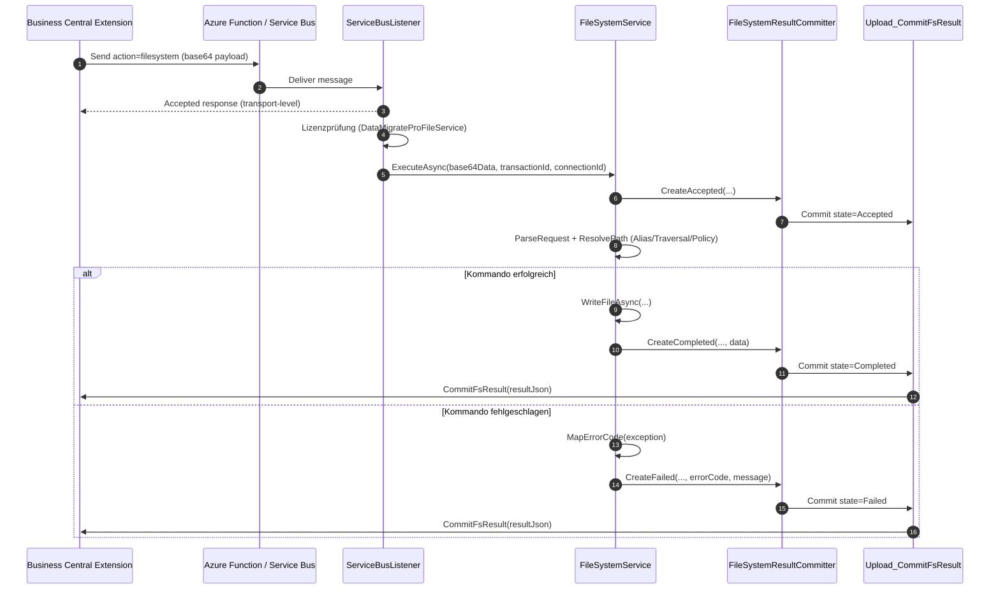

# DataMigratePro Listener – Dateisystem-Dienste (File Services)

> Diese Dokumentation folgt den Vorgaben aus [Dokumentations-Richtlinien.md](Dokumentations-Richtlinien.md).
> Quellartefakte: [DataMigratePro-FileServices-Implementation.md](DataMigratePro-FileServices-Implementation.md), [FileSystemService.cs](../DataMigratePro.Core/FileSystemService.cs), [ServiceBusListener.cs](../DataMigratePro.Core/ServiceBusListener.cs), [DataConnectionSettings.cs](../DataMigratePro.Core/DataConnectionSettings.cs), [DataConnectionManager.cs](../DataMigratePro.Core/DataConnectionManager.cs).

## 1. Kontext und Ziel

Business Central (BC) muss auf dem lokalen DataMigratePro-Listener Dateisystem-Operationen ausführen können, ohne selbst direkten Zugriff auf das lokale Dateisystem zu besitzen. Die Übertragung nutzt die bestehende Azure-Relay-/Service-Bus-Architektur mit der Listener-Aktion `filesystem`.

Ziel ist eine kontrollierte, alias-basierte Dateizugriffsschicht mit folgenden Eigenschaften:

- Ausführung typischer Datei- und Verzeichnisoperationen (Lesen, Schreiben, Anhängen, Kopieren, Verschieben, Archivieren, Auflisten, Löschen, Existenzprüfung).
- Zugriff ausschließlich über konfigurierte **Pfad-Aliase** – niemals über absolute, von BC gelieferte Pfade.
- Verhinderung von Pfad-Ausbrüchen (Path Traversal) aus dem Alias-Wurzelverzeichnis.
- Policy-basierte Sicherheitsprüfungen (erlaubte Endungen, maximale Dateigröße, rekursives Löschen).
- Sofortige transportbezogene Empfangsbestätigung (Accepted), entkoppelt vom eigentlichen Kommando.
- Rückmeldung des Endergebnisses (Completed/Failed) an BC über die Callback-Aktion `Upload_CommitFsResult` mit Retry.
- Transaktionsbasierte Nachvollziehbarkeit über eine eindeutige `transactionId`.

Die Funktion ist das Dateisystem-Pendant zur listener-basierten [PowerShell-Ausführung](DataMigratePro-Listener-ShellExecution-Dokumentation.md) und ist so gestaltet, dass sie von BC-Extensions über einen stabilen Action-Contract wiederverwendet werden kann.

## 2. Scope

### 2.1 In Scope

- Listener-Aktion `filesystem` in `ServiceBusListener` inkl. sofortiger Accepted-Antwort.
- Dateisystem-Ausführungsdienst `FileSystemService` inkl. Request-Parsing, Alias-/Pfad-Auflösung und Kommando-Dispatch.
- Unterstützte Kommandos: `ListFiles`, `ListDirectories`, `CreateDirectory`, `DeleteDirectory`, `DirectoryExists`, `ReadFile`, `WriteFile`, `AppendFile`, `DeleteFile`, `MoveFile`, `CopyFile`, `FileExists`, `GetFileInfo`, `ArchiveFile`, `ImportXmlPortSource`, `ExportXmlPortTarget`.
- Callback-Committer `FileSystemResultCommitter` (Accepted/Completed/Failed) mit Wiederholungslogik.
- Sicherheits- und Policy-Prüfungen über `FileSystemSecuritySettings` und Alias-Whitelist.
- Lizenzprüfung: Aktion nur für Extension `DataMigrateProFileService` zulässig.
- Stabile Fehlercode-Abbildung für die Fehleranalyse in BC.

### 2.2 Out of Scope

- Zugriff über absolute Pfade oder nicht konfigurierte Aliase.
- Nicht in der Kommando-Liste enthaltene Operationen (z. B. Berechtigungsänderungen, Symlinks).
- Änderungen am Transport (Azure Function / Service-Bus-Envelope bleibt unverändert).
- Änderung des Verhaltens bestehender Aktionen (`putdata`, `getdata`, `getstructure`, `executepowershell`, AL `execute`).
- BC-seitige AL-Objekte (Tabellen/Seiten/Codeunits) werden hier nur referenziert, nicht spezifiziert (siehe [Implementation](DataMigratePro-FileServices-Implementation.md)).

## 3. Anforderungen

### 3.1 Funktionale Anforderungen (FR)

| ID | Titel | Beschreibung | Priorität | Quelle | Akzeptanzregel |
|---|---|---|---|---|---|
| FR-001 | Dateikommando senden | BC sendet ein base64-kodiertes JSON-Envelope über den Relay-Weg mit Aktion `filesystem`. | Must | Implementation §4 | Listener empfängt und verarbeitet Aktion `filesystem`. |
| FR-002 | Sofortige Empfangsbestätigung | Der Listener bestätigt den Empfang eines `filesystem`-Kommandos sofort mit einer Accepted-Antwort, unabhängig von der Kommandolaufzeit. | Must | ServiceBusListener | BC erhält vor Kommandoausführung eine Accepted-Antwort. |
| FR-003 | Alias-basierte Pfad-Auflösung | Zielpfade werden ausschließlich aus konfigurierten Aliassen plus relativem Pfad gebildet. | Must | FileSystemService `ResolvePath` | Nicht konfigurierter Alias führt zu Fehler `INVALID_OPERATION`. |
| FR-004 | Pfad-Ausbruch verhindern | Ein aufgelöster Pfad außerhalb der Alias-Wurzel wird abgelehnt. | Must | FileSystemService `IsUnderRoot` | Traversal-Pfad erzeugt `ACCESS_DENIED`. |
| FR-005 | Datei lesen | `ReadFile` liefert Größe, Base64-Inhalt, dekodierten Text und XML-Erkennung. | Must | `ReadFileAsync` | Ergebnis enthält `ContentBase64`, `ContentText`, `IsXml`. |
| FR-006 | Datei schreiben/anhängen | `WriteFile` erzeugt/überschreibt, `AppendFile` hängt an; fehlende Zielverzeichnisse werden angelegt. | Must | `WriteFileAsync`, `AppendFileAsync` | Datei existiert mit erwarteter Größe nach Ausführung. |
| FR-007 | Datei kopieren/verschieben/archivieren | `CopyFile`, `MoveFile`, `ArchiveFile` nutzen Ziel-Alias/-Pfad aus dem Payload. | Must | `CopyFile`, `MoveFile`, `ArchiveFile` | Zielpfad wird aus Payload-Alias/-Pfad korrekt aufgelöst. |
| FR-008 | Verzeichnisoperationen | `ListFiles`, `ListDirectories`, `CreateDirectory`, `DeleteDirectory`, `DirectoryExists` werden unterstützt. | Must | `ExecuteCommandAsync` | Jedes Verzeichniskommando liefert das dokumentierte Ergebnisobjekt. |
| FR-009 | Existenz-/Metadatenabfrage | `FileExists`, `DirectoryExists`, `GetFileInfo` liefern Existenz und Metadaten. | Must | `GetFileInfo` | `GetFileInfo` liefert Größe, Zeitstempel (UTC), Endung, Read-Only. |
| FR-010 | XML-Port-Aliase | `ImportXmlPortSource` liest und `ExportXmlPortTarget` schreibt eine Datei. | Should | `ExecuteCommandAsync` | Beide Kommandos verhalten sich wie `ReadFile`/`WriteFile`. |
| FR-011 | Ergebnis-Callback an BC | Endergebnis wird über `Upload_CommitFsResult` an BC gemeldet. | Must | `FileSystemResultCommitter` | BC-Transaktion wird auf Completed/Failed aktualisiert. |
| FR-012 | Fehler-Differenzierung | Ausnahmen werden auf stabile, fachlich lesbare Fehlercodes abgebildet. | Must | `MapErrorCode` | Bekannte Ausnahmen ergeben stabile Codes (z. B. `FILE_NOT_FOUND`). |
| FR-013 | Lizenzprüfung | `filesystem` ist nur für Extension `DataMigrateProFileService` zulässig. | Must | ServiceBusListener | Falsche Extension erzeugt `LICENSE_NOT_PERMITTED`. |

### 3.2 Nicht-funktionale Anforderungen (NFR)

| ID | Kategorie | Anforderung | Messgröße | Grenzwert |
|---|---|---|---|---|
| NFR-001 | Kompatibilität | Bestehende Listener-Aktionen bleiben unverändert lauffähig. | Regression bestehender Aktionen | 0 Regressionen |
| NFR-002 | Kompatibilität | Transport-Envelope (Azure Function / Service Bus) bleibt unverändert. | Kompatibilität Queue/Ack | 100 % |
| NFR-003 | Sicherheit | Zugriff nur über konfigurierte Aliase, kein Pfad-Ausbruch, Policy-Prüfungen aktiv. | Alias-/Traversal-/Policy-Prüfung | keine Verletzung |
| NFR-004 | Sicherheit | Erlaubte Dateiendungen und maximale Dateigröße werden bei konfigurierter Policy durchgesetzt. | Extension-/Size-Guard | 100 % geprüft |
| NFR-005 | Robustheit | Der Ergebnis-Callback verfügt über Wiederholungslogik. | Retry im Committer | bis zu 5 Versuche |
| NFR-006 | Auditierbarkeit | Jede Ausführung ist per `transactionId` nachvollziehbar. | Zuordenbarkeit | 100 % der Ausführungen |
| NFR-007 | Datenformat | `data`-Payload und Ergebnis sind gültiges base64 UTF-8 JSON (CamelCase). | Payload-/Result-Validierung | valide bei 100 % |

## 4. Feature-Liste

| Feature-ID | Feature-Name | Zugeordnete Anforderungen | Beschreibung | Abhängigkeiten | Datenfelder/Schnittstellen |
|---|---|---|---|---|---|
| FEAT-001 | Listener-Aktion Dateisystem | FR-001, FR-002, FR-013 | Aktion `filesystem` inkl. Accepted-Antwort und Lizenzprüfung. | bestehender Service-Bus-Transport | Action `filesystem`, `transactionId`, `data` |
| FEAT-002 | Request-Parsing | FR-001, NFR-007 | Dekodierung des base64-JSON-Envelopes zu `FileSystemCommandRequest`. | FEAT-001 | `ParseRequest`, `FileSystemCommandRequest` |
| FEAT-003 | Alias- & Pfad-Sicherheit | FR-003, FR-004, NFR-003, NFR-004 | Alias-Auflösung, Traversal-Schutz, Endungs-/Größen-Policy. | FEAT-002, Konfiguration | `ResolvePath`, `IsUnderRoot`, `FileSystemSecuritySettings` |
| FEAT-004 | Kommando-Ausführung | FR-005–FR-010 | Dispatch und Ausführung aller Datei-/Verzeichniskommandos. | FEAT-003 | `ExecuteCommandAsync`, `ReadFileAsync`, `WriteFileAsync` u. a. |
| FEAT-005 | Ergebnis-Callback | FR-011, FR-012, NFR-005 | Rückmeldung des Endergebnisses mit Retry und Fehlercode-Abbildung. | FEAT-004, BC-Endpoint | `FileSystemResultCommitter`, `MapErrorCode`, `Upload_CommitFsResult` |
| FEAT-006 | Konfiguration | FR-003, NFR-003, NFR-004 | Bereitstellung von Aliassen und Sicherheits-Policy über Settings. | Setup | `FileSystemAliases`, `FileSystemSecurity` |

## 5. Umsetzungsdesign

### 5.1 Zielbild (fachlich)

BC erzeugt ein Dateikommando (z. B. „XML-Datei in Import-Verzeichnis schreiben“), sendet es über den vorhandenen Relay-Weg und erhält sofort eine Annahmebestätigung. Der Listener löst den Alias in einen sicheren, gekapselten Pfad auf, führt das Kommando aus und liefert das Ergebnis per Callback zurück. Die `transactionId` bleibt der eindeutige Audit- und Statusträger.

### 5.2 Technisches Design

Kernpfad der Laufzeit:

1. BC-Extension speichert eine Anfrage und sendet ein `filesystem`-Command-Envelope (base64 JSON).
2. `ServiceBusListener` reiht die Nachricht ein und sendet sofort eine Accepted-Antwort (FR-002).
3. Der Worker prüft die Lizenz (Extension `DataMigrateProFileService`) und ruft `FileSystemService.ExecuteAsync` auf.
4. `FileSystemService` parst den Request, löst Alias + Pfad sicher auf und führt das Kommando aus.
5. `FileSystemResultCommitter` sendet den Ergebniszustand (Accepted zu Beginn, dann Completed/Failed) an den BC-Endpoint `Upload_CommitFsResult`.
6. BC aktualisiert Anfrage- und Ergebnisdatensätze.

Wichtige Design-Entscheidungen:

- **Alias-Whitelist:** `ResolvePath` erlaubt ausschließlich in `FileSystemAliases` registrierte Wurzeln; ein leerer oder unbekannter Alias führt zu `INVALID_OPERATION`.
- **Traversal-Schutz:** `IsUnderRoot` normalisiert Wurzel und Kandidat und prüft, dass der Kandidat unterhalb der Wurzel liegt; sonst `ACCESS_DENIED`.
- **Policy-Prüfung:** Bei gesetzter `FileSystemSecurity` werden erlaubte Endungen (`AllowedExtensions`), maximale Dateigröße (`MaxFileSizeBytes`) und rekursives Verzeichnislöschen (`AllowRecursiveDeleteDirectories`) durchgesetzt.
- **Fehlercodes:** `MapErrorCode` bildet .NET-Ausnahmen auf stabile Codes ab (`PATH_NOT_FOUND`, `FILE_NOT_FOUND`, `ACCESS_DENIED`, `COMMAND_NOT_SUPPORTED`, `INVALID_OPERATION`, `IO_ERROR`, `PROCESSING_ERROR`).
- **Callback-Endpoint:** `BuildFileSystemCommitEndpointUrl` leitet aus `Upload_LoadData` den Endpoint `Upload_CommitFsResult` ab, sofern nicht explizit konfiguriert.
- **Retry:** Der Committer versucht die Zustellung bis zu fünfmal mit 1 s Pause; unter SaaS wird ein Bearer-Token gesetzt.

### 5.3 Sequenzdiagramm (Beispiel: ExportXmlPortTarget)



### 5.4 Änderungsübersicht

| Feature-ID | Objekt/Komponente | Art der Änderung | Kurzbeschreibung |
|---|---|---|---|
| FEAT-001 | `ServiceBusListener` | Logik | Behandlung Aktion `filesystem`, Accepted-Antwort, Lizenzprüfung |
| FEAT-002 | `FileSystemService.ParseRequest` | Logik | Envelope-Dekodierung zu `FileSystemCommandRequest` |
| FEAT-003 | `FileSystemService.ResolvePath`/`IsUnderRoot` | Sicherheit | Alias-Auflösung, Traversal-Schutz, Endungs-/Größen-Policy |
| FEAT-004 | `FileSystemService.ExecuteCommandAsync` | Logik | Dispatch und Ausführung aller Kommandos |
| FEAT-005 | `FileSystemResultCommitter` | Logik | Callback mit Retry + `MapErrorCode` |
| FEAT-006 | `DataConnectionSettings`/`DataConnectionManager` | Konfiguration | `FileSystemAliases`, `FileSystemSecurity` |

### 5.5 Risiken und Gegenmaßnahmen

| Risiko | Gegenmaßnahme |
|---|---|
| Pfad-Ausbruch über manipulierten `relativePath` | `IsUnderRoot`-Normalisierung, harte Ablehnung mit `ACCESS_DENIED` |
| Zugriff auf nicht freigegebene Verzeichnisse | Ausschließlich Alias-Whitelist (`FileSystemAliases`) |
| Ungewolltes rekursives Löschen | `AllowRecursiveDeleteDirectories`-Policy erzwingt `recursive=false` |
| Übergroße Dateien / unerlaubte Typen | `MaxFileSizeBytes` und `AllowedExtensions`-Prüfung |
| Transienter Callback-Fehler | Retry (bis zu 5 Versuche) im Committer |

## 6. Traceability-Matrix (Anforderung → Umsetzung → Test)

| Anforderung | Feature | Umsetzung (Objekt/Komponente) | Testfall | Testergebnis | Status |
|---|---|---|---|---|---|
| FR-001 | FEAT-001, FEAT-002 | `ServiceBusListener` (`action=filesystem`), `ParseRequest` | TC-001 | Offen | Ready for Test |
| FR-002 | FEAT-001 | `ServiceBusListener` Accepted-Antwort | TC-002 | Offen | Ready for Test |
| FR-003 | FEAT-003 | `ResolvePath` | TC-003 | Offen | Ready for Test |
| FR-004 | FEAT-003 | `IsUnderRoot` | TC-004 | Offen | Ready for Test |
| FR-005 | FEAT-004 | `ReadFileAsync` | TC-005 | Offen | Ready for Test |
| FR-006 | FEAT-004 | `WriteFileAsync`, `AppendFileAsync` | TC-006 | Offen | Ready for Test |
| FR-007 | FEAT-004 | `CopyFile`, `MoveFile`, `ArchiveFile`, `ResolveTargetPath` | TC-007 | Offen | Ready for Test |
| FR-008 | FEAT-004 | `ListFiles`, `ListDirectories`, `CreateDirectory`, `DeleteDirectory` | TC-008 | Offen | Ready for Test |
| FR-009 | FEAT-004 | `GetFileInfo`, `FileExists`, `DirectoryExists` | TC-009 | Offen | Ready for Test |
| FR-010 | FEAT-004 | `ImportXmlPortSource`, `ExportXmlPortTarget` | TC-010 | Offen | Ready for Test |
| FR-011 | FEAT-005 | `FileSystemResultCommitter`, `Upload_CommitFsResult` | TC-011 | Offen | Ready for Test |
| FR-012 | FEAT-005 | `MapErrorCode` | TC-012 | Offen | Ready for Test |
| FR-013 | FEAT-001 | Lizenzprüfung im Listener | TC-013 | Offen | Ready for Test |
| NFR-003/004 | FEAT-003 | `ResolvePath` + `FileSystemSecuritySettings` | TC-014 | Offen | Ready for Test |
| NFR-005 | FEAT-005 | Retry-Schleife im Committer | TC-015 | Offen | Ready for Test |
| NFR-001/002 | – | Bestehende Aktionen unverändert | TC-016 | Offen | Ready for Test |

## 7. Testfälle und Prüfprotokoll

### 7.1 Funktionale Tests

| Testfall-ID | Bezug | Vorbedingung | Testschritte | Erwartetes Ergebnis | Ist-Ergebnis | Status |
|---|---|---|---|---|---|---|
| TC-005 | FR-005, FEAT-004 | Datei existiert im Alias `IMPORT` | 1. `ReadFile` senden 2. Ergebnis prüfen | `Exists=true`, `ContentBase64`/`ContentText` gefüllt, `IsXml` korrekt | – | Offen |
| TC-006 | FR-006, FEAT-004 | Alias `IMPORT` beschreibbar | 1. `WriteFile` 2. `AppendFile` | Datei existiert, `SizeBytes` stimmt, Anhang addiert | – | Offen |
| TC-007 | FR-007, FEAT-004 | Quelldatei vorhanden, Ziel-Alias konfiguriert | 1. `CopyFile`/`MoveFile`/`ArchiveFile` | Ziel entsteht aus Payload-Alias/-Pfad, Quelle je Kommando bewegt/kopiert | – | Offen |
| TC-008 | FR-008, FEAT-004 | Alias-Verzeichnis vorhanden | 1. `ListFiles`/`ListDirectories`/`CreateDirectory`/`DeleteDirectory` | Jeweiliges Ergebnisobjekt (`Items`, `Created`, `Deleted`) | – | Offen |
| TC-009 | FR-009, FEAT-004 | Datei vorhanden | 1. `GetFileInfo` | Größe, UTC-Zeitstempel, Endung, Read-Only korrekt | – | Offen |
| TC-010 | FR-010, FEAT-004 | XML-Datei vorhanden/Alias beschreibbar | 1. `ImportXmlPortSource` 2. `ExportXmlPortTarget` | Verhalten identisch zu `ReadFile`/`WriteFile` | – | Offen |

### 7.2 Technische Tests

| Testfall-ID | Bezug | Vorbedingung | Testschritte | Erwartetes Ergebnis | Ist-Ergebnis | Status |
|---|---|---|---|---|---|---|
| TC-001 | FR-001 | Listener läuft | 1. `filesystem`-Envelope senden | Aktion wird empfangen und verarbeitet | – | Offen |
| TC-002 | FR-002 | Listener läuft | 1. `filesystem` senden 2. Antwort beobachten | Accepted-Antwort vor Kommandoausführung | – | Offen |
| TC-003 | FR-003 | Alias nicht konfiguriert | 1. Kommando mit unbekanntem Alias | Fehler `INVALID_OPERATION` | – | Offen |
| TC-004 | FR-004 | Alias konfiguriert | 1. `relativePath` mit `..`-Traversal | Fehler `ACCESS_DENIED` | – | Offen |
| TC-011 | FR-011 | BC-Endpoint erreichbar | 1. Kommando ausführen 2. Callback prüfen | BC-Transaktion auf Completed/Failed | – | Offen |
| TC-012 | FR-012 | Datei fehlt | 1. `ReadFile` auf fehlende Datei | Fehlercode `FILE_NOT_FOUND` | – | Offen |
| TC-013 | FR-013 | Extension ≠ FileService | 1. `filesystem` senden | Fehler `LICENSE_NOT_PERMITTED` | – | Offen |
| TC-015 | NFR-005 | BC-Endpoint temporär nicht erreichbar | 1. Callback auslösen | Bis zu 5 Wiederholungen, dann Aufgabe | – | Offen |

### 7.3 Kompatibilitätstests

| Testfall-ID | Bezug | Vorbedingung | Testschritte | Erwartetes Ergebnis | Ist-Ergebnis | Status |
|---|---|---|---|---|---|---|
| TC-014 | NFR-003, NFR-004 | Policy mit `AllowedExtensions`/`MaxFileSizeBytes` gesetzt | 1. Unerlaubte Endung 2. Übergroße Datei 3. Rekursives Delete bei Policy=false | `ACCESS_DENIED` bzw. `INVALID_OPERATION`; `recursive` auf false erzwungen | – | Offen |
| TC-016 | NFR-001, NFR-002 | Bestehende Aktionen konfiguriert | 1. `putdata`, `getdata`, `getstructure`, `executepowershell`, AL `execute` prüfen | Verhalten unverändert | – | Offen |

Nachweisbare Artefakte je Test: Testdatum, Tester, Umgebung/Version, Beleg (Log, API-Response, Screenshot).

## 8. Abnahmekriterien

| AK-ID | Bezug | Kriterium | Nachweismethode | Ergebnis |
|---|---|---|---|---|
| AK-001 | FR-001, FR-002 | `filesystem`-Kommando wird angenommen und sofort bestätigt | Listener-Log + BC-Antwort | Offen |
| AK-002 | FR-003, FR-004, NFR-003 | Zugriff nur über Alias, kein Pfad-Ausbruch | Negativtest + Log | Offen |
| AK-003 | FR-005–FR-010 | Alle Kommandos liefern das dokumentierte Ergebnis | Funktionstest je Kommando | Offen |
| AK-004 | FR-011, FR-012 | Ergebnis inkl. stabiler Fehlercodes wird an BC gemeldet | Callback-Log + BC-Transaktion | Offen |
| AK-005 | NFR-004 | Endungs-/Größen-Policy wird durchgesetzt | Policy-Negativtest | Offen |
| AK-006 | NFR-001, NFR-002 | Bestehende Aktionen bleiben unverändert | Regressionstest | Offen |

Formulierungsbeispiele (Given/When/Then):

> **Given** ein konfigurierter Alias `IMPORT` und ein gültiges `WriteFile`-Kommando
> **When** der Listener das `filesystem`-Kommando verarbeitet
> **Then** wird die Datei innerhalb der Alias-Wurzel erstellt und der Zustand `Completed` an BC gemeldet.

> **Given** ein `relativePath`, der mit `..` aus der Alias-Wurzel ausbricht
> **When** `ResolvePath` den Zielpfad auflöst
> **Then** wird das Kommando mit Fehlercode `ACCESS_DENIED` abgelehnt und kein Dateizugriff ausgeführt.

> **Given** eine Extension ungleich `DataMigrateProFileService`
> **When** ein `filesystem`-Kommando eintrifft
> **Then** wird `LICENSE_NOT_PERMITTED` gemeldet und kein Dateizugriff ausgeführt.

## 9. Abnahmeentscheidung

| Feld | Wert |
|---|---|
| Vorhaben-ID / Titel | FileServices – Listener-Dateisystemdienste |
| Version / Build | *(bei Abnahme eintragen)* |
| Abnahmedatum | *(offen)* |
| Teilnehmer (Fachbereich, IT, QA) | *(offen)* |
| Ergebnis je AK-ID | AK-001…AK-006: *(offen)* |
| Gesamtentscheidung | *(offen: Abgenommen / mit Auflagen / Nicht abgenommen)* |
| Offene Punkte mit Zieltermin | *(offen)* |

## 10. Kompatibilität und Migrationshinweise

1. **Unverändertes Altverhalten:** `putdata`, `getdata`, `getstructure`, `executepowershell` und AL `execute` bleiben funktional identisch; Transport-Envelope sowie Queue/Ack-Verhalten sind unverändert (NFR-001, NFR-002).
2. **Zusätzliche Variante:** Die Aktion `filesystem` kommt additiv hinzu und ist über den bestehenden Relay-/Service-Bus-Weg erreichbar.
3. **Umschaltung/Migration:** Aktivierung erfolgt über die Registrierung der Extension `DataMigrateProFileService` und die Konfiguration von `FileSystemAliases`/`FileSystemSecurity`; ohne diese Konfiguration werden Kommandos abgelehnt.
4. **Rückwärtskompatible Prüfung:** Regressionstest TC-016 stellt sicher, dass bestehende Aktionen unverändert arbeiten.

## 11. Anhang

### 11.1 Request-Envelope (Listener-Eingang)

```json
{
  "interfaceVersion": "1.0",
  "transactionId": "GUID",
  "connectionId": "DWP",
  "command": "WriteFile",
  "pathAlias": "IMPORT",
  "relativePath": "inbound/customer.xml",
  "requestedBy": "Extension",
  "createdAt": "2026-06-24T10:15:00Z",
  "payload": {
    "contentText": "<root>...</root>",
    "recursive": false,
    "targetPathAlias": "ARCHIVE",
    "targetRelativePath": "done/customer.xml"
  }
}
```

### 11.2 Result-Envelope (Commit-Callback)

```json
{
  "interfaceVersion": "1.0",
  "transactionId": "GUID",
  "state": "Completed",
  "success": true,
  "command": "WriteFile",
  "pathAlias": "IMPORT",
  "relativePath": "inbound/customer.xml",
  "data": {
    "written": true,
    "sizeBytes": 2048,
    "fullPath": "C:\\Migration\\Import\\inbound\\customer.xml"
  },
  "completedAt": "2026-06-24T10:15:02Z"
}
```

### 11.3 Konfigurationsbeispiel (Settings)

```json
{
  "FileSystemAliases": {
    "IMPORT": "C:\\Migration\\Import",
    "EXPORT": "C:\\Migration\\Export",
    "ARCHIVE": "C:\\Migration\\Archive"
  },
  "FileSystemSecurity": {
    "AllowedExtensions": [".xml", ".json", ".txt"],
    "MaxFileSizeBytes": 52428800,
    "ReadOnlyAliases": [],
    "WriteOnlyAliases": [],
    "AllowRecursiveDeleteDirectories": false,
    "ValidateXmlWellFormed": false
  }
}
```

### 11.4 Fehlercode-Abbildung (`MapErrorCode`)

| Ausnahme | Fehlercode |
|---|---|
| `DirectoryNotFoundException` | `PATH_NOT_FOUND` |
| `FileNotFoundException` | `FILE_NOT_FOUND` |
| `UnauthorizedAccessException` | `ACCESS_DENIED` |
| `NotSupportedException` | `COMMAND_NOT_SUPPORTED` |
| `InvalidOperationException` | `INVALID_OPERATION` |
| `IOException` | `IO_ERROR` |
| sonstige | `PROCESSING_ERROR` |

### 11.5 Referenzierte Quelldateien

- [FileSystemService.cs](../DataMigratePro.Core/FileSystemService.cs)
- [ServiceBusListener.cs](../DataMigratePro.Core/ServiceBusListener.cs)
- [DataConnectionSettings.cs](../DataMigratePro.Core/DataConnectionSettings.cs)
- [DataConnectionManager.cs](../DataMigratePro.Core/DataConnectionManager.cs)
- [CommandMetadata.cs](../DataMigratePro.Core/CommandMetadata.cs)
- [DataMigratePro-FileServices-Implementation.md](DataMigratePro-FileServices-Implementation.md)
