# DataMigratePro File Services - Technical Implementation

## 1. Scope

This document explains how the File Services feature is implemented end-to-end, using a concrete example flow. It also shows where and how to integrate the functionality.

## 2. High-Level Architecture

Main components:
- AL API and tracking tables in Business Central
- Service Bus listener in local client (`action = "filesystem"`)
- Local file execution service (`FileSystemService`)
- Callback commit endpoint (`Upload_CommitFsResult`)

Core runtime path:
1. AL submits a file command and stores request metadata.
2. Local listener receives Service Bus message.
3. `FileSystemService` executes command against configured alias path.
4. Result is committed back to BC via `CommitFsResult` endpoint.
5. Request/Result tables are updated for monitoring and retry.

## 3. Core Artifacts

### Business Central (AL)

- `codeunit 72359617 "DMP File System API IOI"`
  - `Submit*` methods per command
  - `CommitFsResult(ResultJson: Text)`
  - `RetryRequest(TransactionId: Guid)`
  - XML hooks (`OnBeforeXmlImport`, `OnAfterXmlImport`, `OnBeforeXmlExport`, `OnAfterXmlExport`)

- `table 72359615 "DMP FS Request IOI"`
  - request lifecycle (`Created`, `Sent`, `Completed`, `Failed`)
  - payload metadata (`Payload Length`, `Payload Truncated`)

- `table 72359616 "DMP FS Result IOI"`
  - result lifecycle (`Accepted`, `Running`, `Completed`, `Failed`)
  - result metadata (`Result Length`, `Result Truncated`)

- `page 72359618 "DMP FS Request List IOI"`
  - operational action: `Retry Selected Failed Requests`

- `page 72359619 "DMP FS Result List IOI"`
  - navigation action: `Open Request`

- `codeunit 72359580 "Upload IOI"`
  - callback entrypoint: `CommitFsResult(resultJson: Text)`

### Local Client (C#)

- `ServiceBusListener`
  - handles `action == "filesystem"`

- `FileSystemService`
  - parse request
  - resolve alias + path security
  - execute command
  - map exceptions to stable error codes

- `FileSystemResultCommitter`
  - posts accepted/completed/failed states back to BC endpoint
  - retry logic for transient callback failures

- `DataConnectionSettings`
  - `FileSystemAliases`
  - `FileSystemSecurity`

## 4. Request/Response Contract

## 4.1 Request Envelope (Listener input)

```json
{
  "interfaceVersion": "1.0",
  "transactionId": "GUID",
  "connectionId": "DWP",
  "command": "WriteFile",
  "pathAlias": "IMPORT",
  "relativePath": "inbound/customer.xml",
  "requestedBy": "Extension",
  "createdAt": "2026-06-24T10:15:00Z",
  "payload": {
    "contentText": "<root>...</root>",
    "recursive": false,
    "targetPathAlias": "ARCHIVE",
    "targetRelativePath": "done/customer.xml"
  }
}
```

## 4.2 Result Envelope (Commit callback)

```json
{
  "interfaceVersion": "1.0",
  "transactionId": "GUID",
  "state": "Completed",
  "success": true,
  "command": "WriteFile",
  "pathAlias": "IMPORT",
  "relativePath": "inbound/customer.xml",
  "data": {
    "written": true,
    "sizeBytes": 2048,
    "fullPath": "C:\\Migration\\Import\\inbound\\customer.xml"
  },
  "completedAt": "2026-06-24T10:15:02Z"
}
```

## 5. Example Flow (ExportXmlPortTarget)

Use case: BC exports XML content to a local file.

### 5.1 Process Flow Sequence Diagram

This diagram focuses on process states and the success/failure branch.

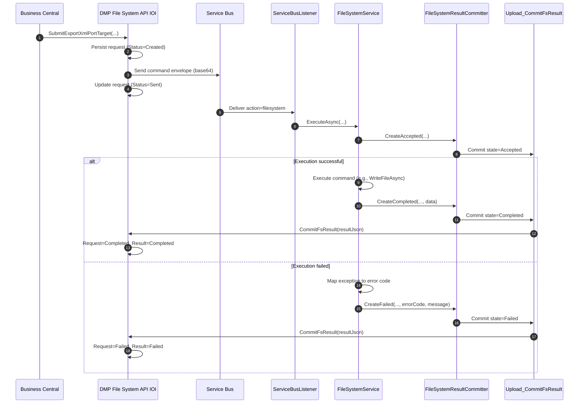

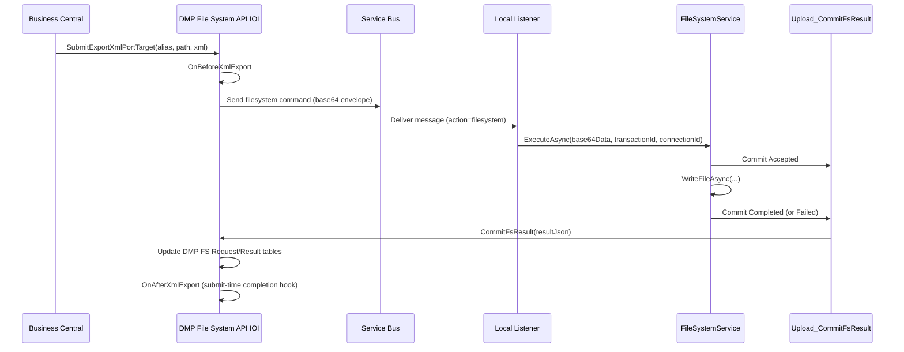

## 6. Command Behavior Notes

- `ImportXmlPortSource` currently maps to `ReadFileAsync` in local client.
- `ExportXmlPortTarget` currently maps to `WriteFileAsync` in local client.
- `MoveFile`, `CopyFile`, `ArchiveFile` use payload target alias/path.
- `DeleteDirectory` honors recursive flag, but can be restricted by policy.

## 6. Full Command Process Flows (Per Action)

Legend for all diagrams:
- `AL API` = `DMP File System API IOI`
- `Listener` = `ServiceBusListener`
- `FS` = `FileSystemService`
- `Commit` = `FileSystemResultCommitter` -> `Upload_CommitFsResult`

### 6.1 ListFiles

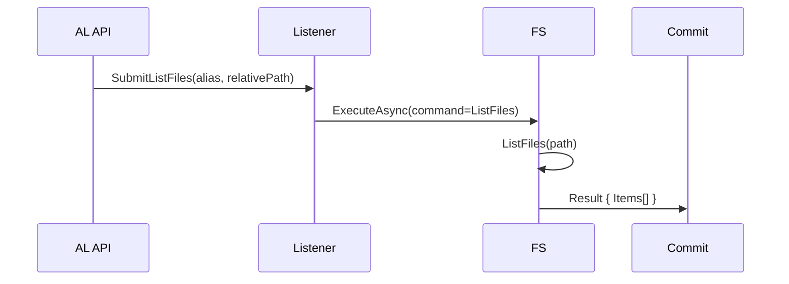

### 6.2 ListDirectories

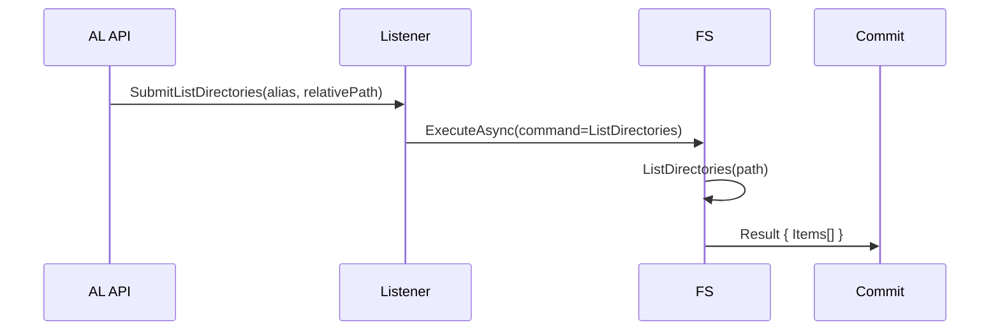

### 6.3 CreateDirectory

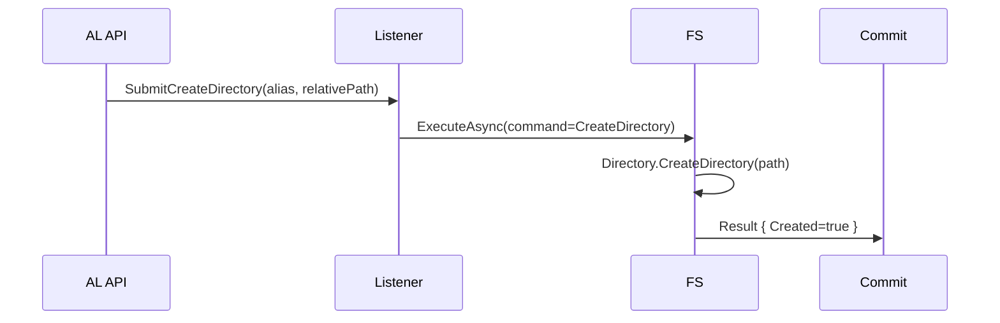

### 6.4 DeleteDirectory

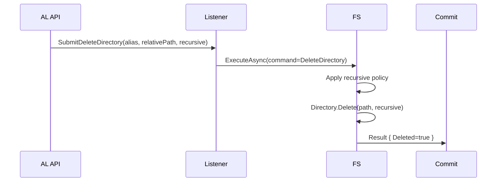

### 6.5 DirectoryExists

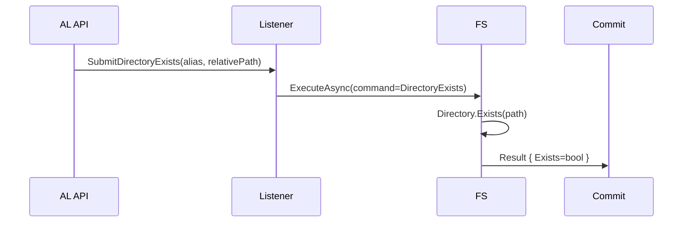

### 6.6 ReadFile

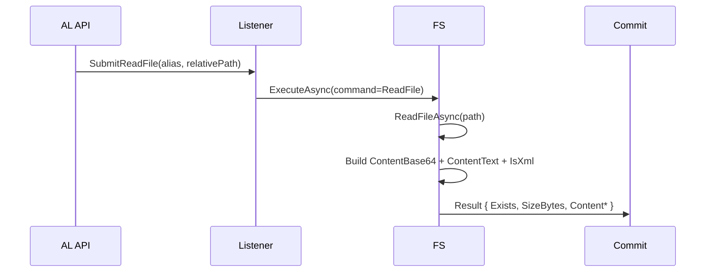

### 6.7 WriteFile

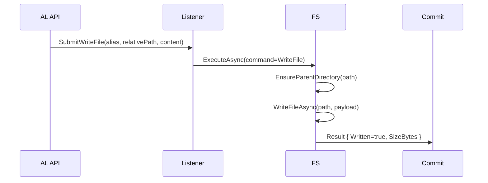

### 6.8 AppendFile

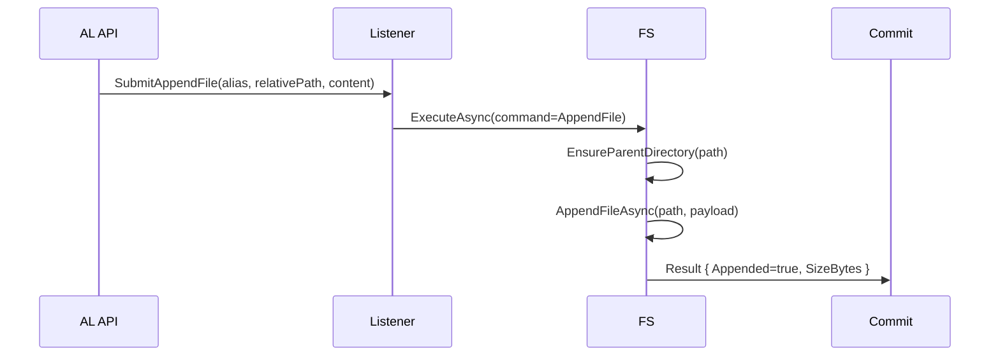

### 6.9 DeleteFile

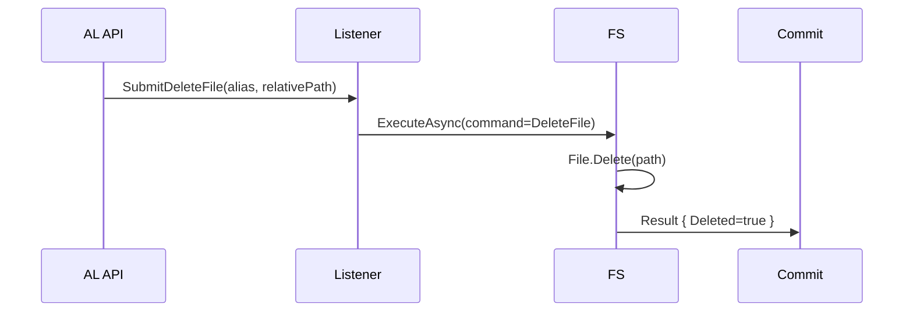

### 6.10 MoveFile

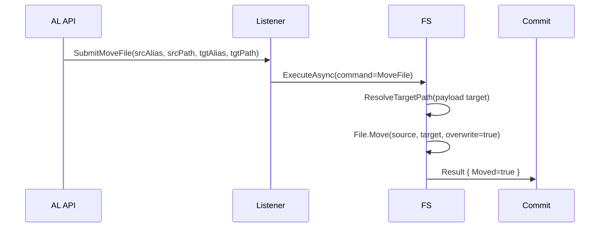

### 6.11 CopyFile

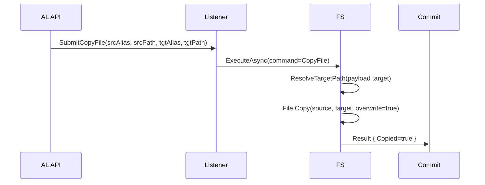

### 6.12 FileExists

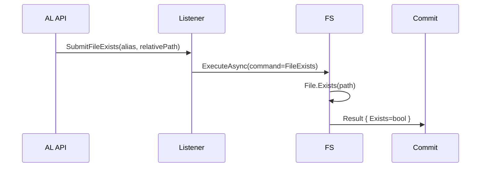

### 6.13 GetFileInfo

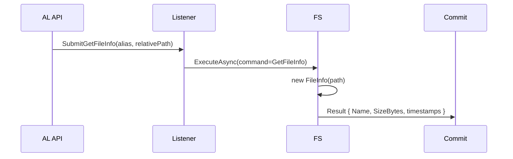

### 6.14 ArchiveFile

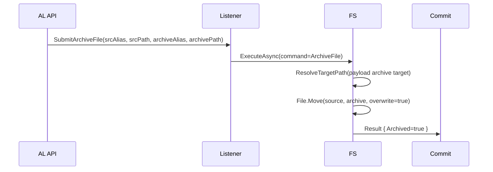

### 6.15 ImportXmlPortSource

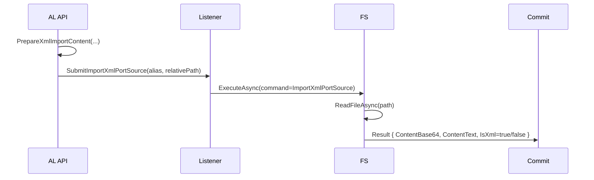

### 6.16 ExportXmlPortTarget

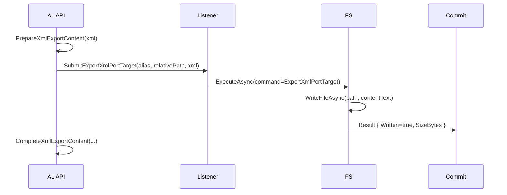

## 7. Security and Guardrails

Path and policy checks are enforced in local client:
- Alias must exist in `FileSystemAliases`.
- Relative paths cannot escape alias root (anti-traversal check).
- Allowed extension policy can block disallowed file types.
- Max file size policy validates existing target file size on access.
- Recursive directory delete can be denied globally.

Available settings model:

```json
{
  "FileSystemAliases": {
    "IMPORT": "C:/Migration/Import",
    "ARCHIVE": "C:/Migration/Archive"
  },
  "FileSystemSecurity": {
    "AllowedExtensions": [".xml", ".json", ".txt"],
    "MaxFileSizeBytes": 10485760,
    "ReadOnlyAliases": ["IMPORT"],
    "WriteOnlyAliases": ["ARCHIVE"],
    "AllowRecursiveDeleteDirectories": false,
    "ValidateXmlWellFormed": false
  }
}
```

Note: `ReadOnlyAliases`, `WriteOnlyAliases`, and `ValidateXmlWellFormed` are present in settings model and can be used by policy extensions. Current base execution path primarily enforces alias mapping, traversal prevention, extension policy, max file size check, and recursive delete policy.

## 8. Where to Use the Feature

Recommended integration points:
- XML import/export pipelines in BC extension logic
- Staging-file orchestration before `putdata`/after `getdata`
- Automated archive handling for processed files
- Operational checks (`FileExists`, `DirectoryExists`, `GetFileInfo`) before long-running jobs

Typical AL integration call:

```pascal
var
    FileSystemApi: Codeunit "DMP File System API IOI";
    TransactionId: Guid;
begin
    TransactionId := FileSystemApi.SubmitWriteFile('IMPORT', 'inbound/sample.json', '{"ok":true}');
end;
```

## 9. Monitoring and Recovery

Operational workflow:
1. Monitor `DMP FS Request List IOI` and `DMP FS Result List IOI`.
2. Use result `Error Code` + `Message` to identify root cause.
3. Retry failed requests with page action `Retry Selected Failed Requests`.
4. Avoid retry when payload was truncated (`Payload Truncated = true`).

Error code mapping from local service:
- `PATH_NOT_FOUND`
- `FILE_NOT_FOUND`
- `ACCESS_DENIED`
- `COMMAND_NOT_SUPPORTED`
- `INVALID_OPERATION`
- `IO_ERROR`
- `PROCESSING_ERROR`

## 10. Extension Points

- Subscribe to FileSystem API integration events for custom auditing or validation.
- Add command-specific payload schema checks in AL before submit.
- Extend local `FileSystemService` to enforce additional security controls (for example read/write alias mode enforcement).
- Add dedicated UI filters/actions for operational teams (for example batch retry by command type).

## 11. C/AL to AL Migration Examples (Legacy vs New Extension)

The following examples show legacy C/AL style patterns and equivalent AL usage with the new File Services extension API.

### 11.1 Ensure Directory Exists

C/AL (legacy):

```pascal
// C/AL
IF NOT EXISTS('C:\Import\Inbound') THEN
  CREATE('C:\Import\Inbound');
```

AL (new extension usage):

```pascal
// AL
var
  FsApi: Codeunit "DMP File System API IOI";
  TxExists: Guid;
  TxCreate: Guid;
begin
  TxExists := FsApi.SubmitDirectoryExists('IMPORT', 'Inbound');
  TxCreate := FsApi.SubmitCreateDirectory('IMPORT', 'Inbound');
end;
```

### 11.2 Write Text File

C/AL (legacy):

```pascal
// C/AL
MyFile.CREATE('C:\Import\Inbound\customer.txt');
MyFile.WRITE('Customer No.;Name');
MyFile.CLOSE;
```

AL (new extension usage):

```pascal
// AL
var
  FsApi: Codeunit "DMP File System API IOI";
  TxWrite: Guid;
begin
  TxWrite := FsApi.SubmitWriteFile('IMPORT', 'Inbound/customer.txt', 'Customer No.;Name');
end;
```

### 11.3 Append to Existing File

C/AL (legacy):

```pascal
// C/AL
MyFile.OPEN('C:\Import\Inbound\log.txt');
MyFile.SEEK(MyFile.LEN);
MyFile.WRITE('Processed entry 1001');
MyFile.CLOSE;
```

AL (new extension usage):

```pascal
// AL
var
  FsApi: Codeunit "DMP File System API IOI";
  TxAppend: Guid;
begin
  TxAppend := FsApi.SubmitAppendFile('IMPORT', 'Inbound/log.txt', 'Processed entry 1001');
end;
```

### 11.4 Read File Content

C/AL (legacy):

```pascal
// C/AL
MyFile.OPEN('C:\Import\Inbound\customer.xml');
WHILE NOT MyFile.EOS DO BEGIN
  MyFile.READ(LineTxt);
END;
MyFile.CLOSE;
```

AL (new extension usage):

```pascal
// AL
var
  FsApi: Codeunit "DMP File System API IOI";
  TxRead: Guid;
begin
  TxRead := FsApi.SubmitReadFile('IMPORT', 'Inbound/customer.xml');
end;
```

### 11.5 Move/Archive Processed File

C/AL (legacy):

```pascal
// C/AL
RENAME('C:\Import\Inbound\customer.xml', 'C:\Archive\Done\customer.xml');
```

AL (new extension usage):

```pascal
// AL
var
  FsApi: Codeunit "DMP File System API IOI";
  TxArchive: Guid;
begin
  TxArchive := FsApi.SubmitArchiveFile('IMPORT', 'Inbound/customer.xml', 'ARCHIVE', 'Done/customer.xml');
end;
```

### 11.6 Copy Template File

C/AL (legacy):

```pascal
// C/AL
COPY('C:\Template\default.json', 'C:\Import\Inbound\default.json');
```

AL (new extension usage):

```pascal
// AL
var
  FsApi: Codeunit "DMP File System API IOI";
  TxCopy: Guid;
begin
  TxCopy := FsApi.SubmitCopyFile('TEMPLATE', 'default.json', 'IMPORT', 'Inbound/default.json');
end;
```

### 11.7 XML Import Source Pattern

C/AL (legacy):

```pascal
// C/AL
MyXmlPort.IMPORT('C:\Import\Inbound\Customer.xml');
```

AL (new extension usage):

```pascal
// AL
var
  FsApi: Codeunit "DMP File System API IOI";
  TxImport: Guid;
begin
  TxImport := FsApi.SubmitImportXmlPortSource('IMPORT', 'Inbound/Customer.xml');
end;
```

### 11.8 XML Export Target Pattern

C/AL (legacy):

```pascal
// C/AL
MyXmlPort.EXPORT('C:\Export\Outbound\Customer.xml');
```

AL (new extension usage):

```pascal
// AL
var
  FsApi: Codeunit "DMP File System API IOI";
  XmlText: Text;
  TxExport: Guid;
begin
  XmlText := '<Root><Customer>No10000</Customer></Root>';
  TxExport := FsApi.SubmitExportXmlPortTarget('EXPORT', 'Outbound/Customer.xml', XmlText);
end;
```


