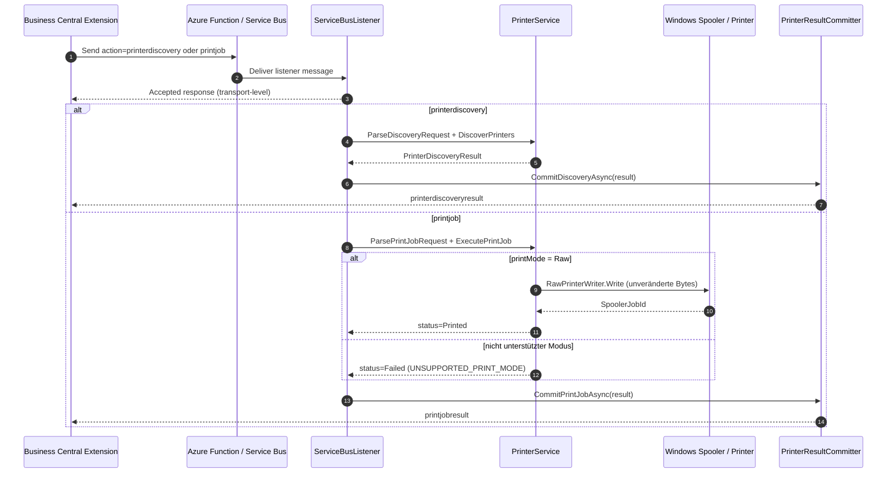

# DataMigratePro Listener – Lokaler Druckdienst aus Business Central

> Diese Dokumentation folgt den Vorgaben aus [Dokumentations-Richtlinien.md](Dokumentations-Richtlinien.md).
> Quellartefakte: [DataMigratePro-Listener-PrintService-Requirements.md](DataMigratePro-Listener-PrintService-Requirements.md), [DataMigratePro-Listener-PrintService-Implementation.md](DataMigratePro-Listener-PrintService-Implementation.md), [DataMigratePro-Listener-PrintService-FactSheet.md](DataMigratePro-Listener-PrintService-FactSheet.md).

## 1. Kontext und Ziel

Business Central (BC) läuft in der Cloud und hat keinen direkten Zugriff mehr auf lokal installierte Drucker. Der DataMigratePro-Listener übernimmt die lokale Ausführungsbrücke, die früher durch lokal installiertes NAV/C/AL abgedeckt war.

Ziel des Druckdienstes ist es, cloudbasiertem BC den Umgang mit lokalen Druckern wieder so natürlich zu ermöglichen wie bei einer klassischen lokalen Installation:

- BC kann lokal installierte Drucker über den Listener ermitteln (Discovery).
- BC kann Druckaufträge an einen benannten lokalen Drucker senden.
- Der Listener druckt lokal und meldet Status, Fehler und Job-Metadaten zurück.
- Zebra/Raw-Drucker (ZPL/EPL) und normale Windows-Treiberdrucker sollen unterstützt werden.
- Die Druckerermittlung kann synchron, asynchron (Listener + Callback) und zeitgesteuert über die CLI (`serviceSchedule`) erfolgen.

Die Funktion nutzt den bestehenden Azure-Function-/Service-Bus-Transport und ist das Druck-Pendant zu [DataMigratePro-Listener-ShellExecution-Dokumentation.md](DataMigratePro-Listener-ShellExecution-Dokumentation.md).

## 2. Scope

### 2.1 In Scope

- Neue Listener-Aktionen `printerdiscovery` und `printjob` in `ServiceBusListener.ProcessActionAsync`.
- Lokaler Druckdienst `PrinterService` inkl. DTOs, Payload-Parsing, Druckerermittlung und Raw-Druck.
- Callback-Aktionen `printerdiscoveryresult` und `printjobresult` zurück an BC über `PrinterResultCommitter`.
- Zeitgesteuerte CLI-Druckerermittlung über `-t printerdiscovery` (`PrinterDiscoveryCliService`) für den geplanten `serviceSchedule`-Modus.
- Byte-genaue Raw-Übertragung für Zebra/ZPL/EPL über `IRawPrinterWriter`/`RawPrinterWriter`.
- Strukturierte Status- und Fehlerbehandlung (`PrinterStatuses`, `PrinterErrorCodes`).
- Korrelation über `listenerConnectionId`/`listenerActivityId`.
- Unit-Tests für Discovery-Kontrakt, Raw-Byte-Erhalt, fehlenden Drucker und nicht unterstützten Modus.

### 2.2 Out of Scope (im aktuellen Listener-Slice)

- Windows-Treiberdruck (`WindowsDriver`) und `Auto`-Modus – aktuell nur `Raw` implementiert; andere Modi liefern strukturierten Fehler `UNSUPPORTED_PRINT_MODE`.
- BC-seitige AL-Objekte (Drucker-Inventar, Mappings, Print-Job-Tabelle, Seiten, Berechtigungen) – geplant unter `DMP-AppSource/DataMigratePro/src/Printing/`.
- BC-Report-Umleitung (Report Redirection) in Druckdienst-Payloads.
- Payload-Chunking über Transportlimits hinaus.
- Vollständige Druckvorschau und bidirektionale Gerätesteuerung.
- Änderung des Transport-Envelopes (Azure Function / Service Bus bleibt unverändert).

## 3. Anforderungen

### 3.1 Funktionale Anforderungen (FR)

| ID | Titel | Beschreibung | Priorität | Quelle | Akzeptanzregel |
|---|---|---|---|---|---|
| FR-001 | Druckerermittlung synchron | BC kann installierte lokale Drucker ermitteln und Metadaten (Default, Treiber, Port) erhalten. | Must | Requirements §7 FR-001 | `DiscoverPrinters` liefert installierte Drucker inkl. Default/Verfügbarkeit. |
| FR-002 | Druckerermittlung asynchron | Listener nimmt Discovery an und postet das Ergebnis per Callback an BC. | Must | Requirements §7 FR-002 | Aktion `printerdiscovery` → `printerdiscoveryresult`-Callback. |
| FR-003 | Zeitgesteuerte CLI-Ermittlung | `-t printerdiscovery` führt dieselbe Ermittlung aus und postet `printerdiscoveryresult`. | Must | Requirements §7 FR-003 | `PrinterDiscoveryCliService.ExecuteAsync` sendet Callback wie Listener-Pfad. |
| FR-004 | Drucker-Inventar-Persistenz | BC persistiert ermittelte Drucker je `listenerConnectionId`. | Must | Requirements §7 FR-004 | BC-Tabellen speichern/aktualisieren Druckerzeilen (BC-seitig, geplant). |
| FR-005 | Druckauftrag senden | BC sendet Druckauftrag an einen aufgelösten Drucker. | Must | Requirements §7 FR-005 | Aktion `printjob` → `ExecutePrintJob` → `printjobresult`. |
| FR-006 | RAW/Zebra-Druck | ZPL/EPL-Payload wird byte-genau ohne Mutation an den Drucker gesendet. | Must | Requirements §7 FR-006, §12 | Raw-Bytes bleiben unverändert; Ergebnis inkl. Spooler-Job-Id. |
| FR-007 | Windows-Treiberdruck | Normale Windows-Drucker über installierte Treiber (PCL/PostScript). | Must | Requirements §7 FR-007, §13 | Treiber-/Spooler-Pfad getrennt vom Raw-Pfad (geplant). |
| FR-008 | Report-Umleitung | BC-Report-Ausgabe kann in den Druckdienst umgeleitet werden. | Should | Requirements §7 FR-008, §11 | Report-Ausgabe wird über Mapping in Druckauftrag geroutet (BC-seitig, geplant). |
| FR-009 | NAV-ähnliches Druckerlebnis | Cloud-BC druckt aus Nutzersicht wie lokales NAV. | Should | Requirements §7 FR-009, §16 | Nutzer druckt zu benannten lokalen Druckern ohne manuellen Download. |
| FR-010 | Druckmodi | Mindestens `Raw`, `WindowsDriver`, `Auto`; Modus wird validiert. | Must | Requirements §7 FR-010 | Modus persistiert; nicht unterstützter Modus liefert strukturierten Fehler. |
| FR-011 | Status & Fehlerbehandlung | Vollständiger Job-Lebenszyklus mit stabilen Fehlercodes. | Must | Requirements §7 FR-011 | `PrinterStatuses`/`PrinterErrorCodes` decken Erfolg/Fehler/Abbruch ab. |
| FR-012 | Retry | Fehlgeschlagene Druck-/Discovery-Transaktionen sind wiederholbar. | Should | Requirements §7 FR-012 | Retry erhält Payload/Ziel und bleibt auditierbar (BC-seitig, geplant). |
| FR-013 | Berechtigungen | Nur autorisierte BC-Nutzer/Extensions dürfen drucken/verwalten. | Must | Requirements §7 FR-013 | Druck-/Verwaltungs-APIs erfordern Berechtigungen (BC-seitig, geplant). |
| FR-014 | Auditierung | Discovery und Druckaufträge sind nachvollziehbar protokolliert. | Must | Requirements §7 FR-014 | Ergebnis mit Zeitstempeln, Ziel, Aktivitäts-Id; BC-Historie geplant. |
| FR-015 | Payload-Größe & Chunking | Payload-Größe wird erfasst; große Payloads dürfen nicht still fehlschlagen. | Should | Requirements §7 FR-015 | `PayloadSizeBytes` erfasst; Chunking bei Bedarf geplant. |
| FR-016 | Mehrere Listener/Workstations | Druck wird an den korrekten Listener geroutet. | Must | Requirements §7 FR-016 | DTOs sind je `listenerConnectionId` skopiert. |

### 3.2 Nicht-funktionale Anforderungen (NFR)

| ID | Kategorie | Anforderung | Messgröße | Grenzwert |
|---|---|---|---|---|
| NFR-001 | Kompatibilität | Bestehende Listener-Aktionen bleiben unverändert lauffähig. | Regression bestehender Aktionen | 0 Regressionen |
| NFR-002 | Kompatibilität | Transport-Envelope (Azure Function / Service Bus) bleibt unverändert. | Kompatibilität Queue/Ack | 100 % |
| NFR-003 | Datenintegrität | Raw-Payload wird nicht mutiert (Encoding/Zeilenenden unverändert). | Byte-Vergleich Ein-/Ausgang | 100 % identisch |
| NFR-004 | Auditierbarkeit | Jede Aktion ist per Transaktions- und Aktivitäts-Id nachvollziehbar. | Zuordenbarkeit | 100 % der Aktionen |
| NFR-005 | Robustheit | Fehler liefern stabile Fehlercodes; Transport- vs. Druckfehler unterscheidbar. | Strukturierte Fehler | vorhanden |
| NFR-006 | Sicherheit | Kein willkürlicher Druckerzugriff ohne BC-Berechtigung; kein unnötiges Speichern von Dokumentinhalten. | Berechtigungsprüfung / Content-Logging | erzwungen (BC-seitig) |
| NFR-007 | Datenformat | `data`-Payload ist gültiges base64 UTF-8 JSON. | Payload-Validierung | valide bei 100 % |

## 4. Feature-Liste

| Feature-ID | Feature-Name | Zugeordnete Anforderungen | Beschreibung | Abhängigkeiten | Datenfelder/Schnittstellen |
|---|---|---|---|---|---|
| FEAT-001 | Listener-Aktion Druckerermittlung | FR-001, FR-002 | Aktion `printerdiscovery` inkl. Annahme, Ermittlung und Callback. | bestehender Service-Bus-Transport | Action `printerdiscovery`, `PrinterDiscoveryRequest/Result` |
| FEAT-002 | Listener-Aktion Druckauftrag | FR-005, FR-006, FR-010, FR-011 | Aktion `printjob` inkl. Parsing, Raw-Druck, Statuslogik. | FEAT-001 | Action `printjob`, `PrintJobRequest/Result` |
| FEAT-003 | Druckdienst-Kern | FR-001, FR-005, FR-006 | `DiscoverPrinters`, `ExecutePrintJob`, Raw-Writer, Parser. | FEAT-001, FEAT-002 | `PrinterService`, `IRawPrinterWriter` |
| FEAT-004 | Ergebnis-Callback | FR-002, FR-011, FR-014 | Rückmeldung an BC über `printerdiscoveryresult`/`printjobresult`. | FEAT-003, BC-Endpoint | `PrinterResultCommitter` |
| FEAT-005 | Zeitgesteuerte CLI-Ermittlung | FR-003 | CLI-Task `printerdiscovery` für `serviceSchedule`. | FEAT-003, FEAT-004 | `PrinterDiscoveryCliService`, `CommandMetadata`, `ParameterHelper` |
| FEAT-006 | Aktivitäts-/Listener-Korrelation | FR-014, FR-016, NFR-004 | `listenerConnectionId`/`listenerActivityId` zur Nachverfolgung. | FEAT-001, FEAT-002 | `ListenerActivityScope` |
| FEAT-007 | BC-Druckintegration | FR-004, FR-008, FR-009, FR-012, FR-013 | BC-Tabellen, Mappings, Print-Job-Historie, Seiten, Management-Codeunit. | FEAT-004 | `DMP-AppSource/DataMigratePro/src/Printing/**` (geplant) |

## 5. Umsetzungsdesign

### 5.1 Zielbild (fachlich)

BC erzeugt eine Discovery- oder Druck-Transaktion, sendet sie über den vorhandenen Relay-Weg und erhält später ein strukturiertes Ergebnis per Callback. Der Nutzer adressiert benannte lokale Drucker; die physische Windows-Druckerkomplexität bleibt über logische Drucker-Mappings verborgen.

### 5.2 Technisches Design

Kernpfad der Laufzeit:

1. BC speichert eine Discovery-/Druck-Transaktion und sendet ein Listener-Command-Envelope.
2. Der Listener nimmt an und startet die lokale Druckerarbeit.
3. `PrinterService` ermittelt Drucker (`DiscoverPrinters`) bzw. löst den Zieldrucker auf und druckt (`ExecutePrintJob`).
4. Für Raw-Jobs überträgt `RawPrinterWriter` die Bytes unverändert an den Windows-Spooler.
5. Der Listener baut ein strukturiertes Ergebnis-Payload.
6. `PrinterResultCommitter` postet den Callback (`printerdiscoveryresult`/`printjobresult`) an BC.
7. BC aktualisiert Inventar, Job-Status und Audit-Daten.

Sequenzdiagramm:



### 5.3 Nachrichten-Contract

**Discovery-Anfrage** – Aktion `printerdiscovery`, `data` = base64 UTF-8 JSON:

```json
{
  "transactionId": "GUID",
  "listenerConnectionId": "DWP-01",
  "companyName": "CRONUS",
  "requestedBy": "MyExtension",
  "createdAtUtc": "2026-07-03T10:00:00Z"
}
```

**Discovery-Callback** – Aktion `printerdiscoveryresult`, `data` = base64 UTF-8 JSON:

```json
{
  "transactionId": "GUID",
  "status": "Printed",
  "resultMessage": "Discovered 2 printer(s).",
  "listenerConnectionId": "DWP-01",
  "printers": [
    {
      "printerName": "ZDesigner ZD421-203dpi ZPL",
      "displayName": "Warehouse Zebra",
      "isDefault": false,
      "supportedPrintModes": ["Raw"],
      "supportedContentTypes": ["ZPL", "EPL"]
    }
  ]
}
```

**Druckauftrag-Anfrage** – Aktion `printjob`, `data` = base64 UTF-8 JSON:

```json
{
  "transactionId": "GUID",
  "printerName": "ZDesigner ZD421-203dpi ZPL",
  "logicalPrinterCode": "WAREHOUSE_ZEBRA",
  "printMode": "Raw",
  "contentType": "ZPL",
  "payloadBase64": "XlhBXk...",
  "copies": 1,
  "requestedBy": "MyExtension",
  "companyName": "CRONUS",
  "createdAtUtc": "2026-07-03T10:00:00Z"
}
```

**Druckauftrag-Callback** – Aktion `printjobresult`, `data` = base64 UTF-8 JSON:

```json
{
  "transactionId": "GUID",
  "status": "Printed",
  "resultMessage": "Print job submitted to the Windows spooler.",
  "printerName": "ZDesigner ZD421-203dpi ZPL",
  "spoolerJobId": 1234,
  "durationMs": 830,
  "listenerActivityId": "GUID",
  "listenerConnectionId": "DWP-01"
}
```

Status-Semantik (`PrinterStatuses`):

- `Created`: Ergebnisobjekt initialisiert.
- `Accepted`: Nachricht durch Transport/Listener-Queue angenommen.
- `Printing`: Payload validiert, Übergabe an den Spooler läuft.
- `Printed`: Discovery/Druck erfolgreich abgeschlossen.
- `Failed`: Druckerauflösung, Payload oder Spooler-Operation fehlgeschlagen (mit `PrinterErrorCodes`).
- `Canceled`: Auftrag über Cancellation abgebrochen.
- `TimedOut` / `CallbackFailed`: reserviert für Timeout- bzw. Callback-Transportfehler.

Fehlercodes (`PrinterErrorCodes`): `PRINTER_NOT_FOUND`, `INVALID_PAYLOAD`, `UNSUPPORTED_PRINT_MODE`, `PRINT_FAILED`.

### 5.4 Migrations-/Kompatibilitätsstrategie

- Bestehende Aktionen und Transport-Envelope bleiben unverändert (NFR-001, NFR-002).
- Der Druckdienst ergänzt vier neue Aktionen (`printerdiscovery`, `printerdiscoveryresult`, `printjob`, `printjobresult`).
- Der aktuelle Slice implementiert Discovery und Raw-Druck; `WindowsDriver`/`Auto` liefern kontrolliert `UNSUPPORTED_PRINT_MODE`, bis der Treiberpfad ergänzt wird.
- Callback nutzt den bestehenden BC-Endpoint-/Committer-Mechanismus.

### 5.5 Umsetzungstabelle je Feature

| Feature-ID | Objekt/Komponente | Art der Änderung | Kurzbeschreibung |
|---|---|---|---|
| FEAT-001 | [DataMigratePro.Core/ServiceBusListener.cs](../DataMigratePro.Core/ServiceBusListener.cs) | Logik | Aktions-Branch `printerdiscovery`, Annahme + `CommitDiscoveryAsync`. |
| FEAT-002 | [DataMigratePro.Core/ServiceBusListener.cs](../DataMigratePro.Core/ServiceBusListener.cs) | Logik | Aktions-Branch `printjob`, Ausführung + `CommitPrintJobAsync`. |
| FEAT-003 | [DataMigratePro.Core/PrinterService.cs](../DataMigratePro.Core/PrinterService.cs) | Neu | DTOs, `ParseDiscoveryRequest`, `ParsePrintJobRequest`, `DiscoverPrinters`, `ExecutePrintJob`, `RawPrinterWriter`. |
| FEAT-004 | [DataMigratePro.Core/PrinterService.cs](../DataMigratePro.Core/PrinterService.cs) | Neu | `PrinterResultCommitter.CommitDiscoveryAsync/CommitPrintJobAsync`. |
| FEAT-005 | [DataMigratePro.Core/CommandLineProcessor.cs](../DataMigratePro.Core/CommandLineProcessor.cs) | Neu/Logik | `PrinterDiscoveryCliService` + CLI-Task `printerdiscovery`. |
| FEAT-005 | [DataMigratePro.Core/CommandMetadata.cs](../DataMigratePro.Core/CommandMetadata.cs), [DataMigratePro.Core/ParameterHelper.cs](../DataMigratePro.Core/ParameterHelper.cs) | Erweiterung | Registrierung und CLI-Hilfetext für `printerdiscovery`. |
| FEAT-006 | [DataMigratePro.Core/ListenerActivityScope.cs](../DataMigratePro.Core/ListenerActivityScope.cs) | Nutzung | Korrelations-IDs für Callback/Audit. |
| FEAT-007 | `DMP-AppSource/DataMigratePro/src/Printing/**` | Geplant | BC-Tabellen, Mappings, Print-Job-Historie, Seiten, Management-Codeunit. |

## 6. Traceability-Matrix

| Anforderung | Feature | Umsetzung (Objekt/Komponente) | Testfall | Testergebnis | Status |
|---|---|---|---|---|---|
| FR-001 | FEAT-001, FEAT-003 | `PrinterService.DiscoverPrinters` | TC-001 | Passed | Erfüllt |
| FR-002 | FEAT-001, FEAT-004 | `ServiceBusListener` (`printerdiscovery`), `CommitDiscoveryAsync` | TC-002 | Ready for Test | In Umsetzung |
| FR-003 | FEAT-005 | `PrinterDiscoveryCliService.ExecuteAsync` | TC-003 | Passed | Erfüllt |
| FR-004 | FEAT-007 | BC-Inventar-Tabellen | TC-101 | Open | Geplant |
| FR-005 | FEAT-002, FEAT-003 | `ServiceBusListener` (`printjob`), `ExecutePrintJob` | TC-004 | Passed | Erfüllt |
| FR-006 | FEAT-002, FEAT-003 | `ExecutePrintJob` (Raw) + `RawPrinterWriter` | TC-005, TC-006 | Passed | Erfüllt |
| FR-007 | FEAT-002 | Treiber-/Spooler-Pfad | TC-102 | Open | Geplant |
| FR-008 | FEAT-007 | BC-Report-Umleitung | TC-103 | Open | Geplant |
| FR-009 | FEAT-002, FEAT-007 | End-to-End Druckerlebnis | TC-104 | Open | Geplant |
| FR-010 | FEAT-002, FEAT-003 | `ExecutePrintJob` Modus-Validierung | TC-007 | Passed | Teilweise erfüllt (nur `Raw`) |
| FR-011 | FEAT-002, FEAT-003 | `PrinterStatuses`, `PrinterErrorCodes` | TC-005, TC-007, TC-008 | Passed | Erfüllt |
| FR-012 | FEAT-007 | BC-Retry-Logik | TC-105 | Open | Geplant |
| FR-013 | FEAT-007 | BC-Berechtigungssets | TC-106 | Open | Geplant |
| FR-014 | FEAT-004, FEAT-006 | Ergebnis-Metadaten + Aktivitäts-Id | TC-002, TC-008 | Ready for Test | In Umsetzung |
| FR-015 | FEAT-003 | `PrintJobResult.PayloadSizeBytes` | TC-006 | Passed | Teilweise erfüllt (kein Chunking) |
| FR-016 | FEAT-001, FEAT-002, FEAT-006 | `listenerConnectionId` in DTOs/Callback | TC-008 | Passed | Erfüllt |
| NFR-001 | FEAT-001, FEAT-002 | Bestehende Aktionen unverändert | TC-009 | Passed | Erfüllt |
| NFR-002 | FEAT-001 | Transport-Envelope unverändert | TC-009 | Passed | Erfüllt |
| NFR-003 | FEAT-003 | Raw-Byte-Erhalt | TC-005, TC-006 | Passed | Erfüllt |
| NFR-004 | FEAT-006 | `listenerActivityId`/`listenerConnectionId` | TC-008 | Passed | Erfüllt |
| NFR-005 | FEAT-002, FEAT-003 | Strukturierte Fehlercodes | TC-005, TC-007 | Passed | Erfüllt |
| NFR-006 | FEAT-007 | BC-Berechtigung/Content-Policy | TC-106 | Open | Geplant |
| NFR-007 | FEAT-003 | base64 UTF-8 JSON Validierung | TC-005 | Passed | Erfüllt |

## 7. Testfälle und Prüfprotokoll

### 7.1 Funktionale Tests

| Testfall-ID | Bezug (FR/NFR/Feature) | Vorbedingung | Testschritte | Erwartetes Ergebnis | Ist-Ergebnis | Status |
|---|---|---|---|---|---|---|
| TC-001 | FR-001, FEAT-003 | Listener-Prozess läuft | `DiscoverPrinters` ausführen | `Success = true`, Status `Printed`, `Printers` befüllt, `ResultMessage` enthält „Discovered“ | Wie erwartet | Passed |
| TC-003 | FR-003, FEAT-005 | CLI mit `serviceSchedule`-Argumenten | `-t printerdiscovery` ausführen | Lokale Ermittlung + `printerdiscoveryresult`-Callback | Wie erwartet | Passed |
| TC-004 | FR-005, FEAT-002 | Listener aktiv, Zieldrucker vorhanden | Aktion `printjob` (Raw) senden | `ExecutePrintJob` liefert Status `Printed` | Wie erwartet | Passed |
| TC-005 | FR-006, NFR-003, NFR-007 | – | Raw-ZPL-Payload parsen und drucken | Bytes byte-genau erhalten, gültiges base64 UTF-8 JSON | Wie erwartet | Passed |

### 7.2 Technische Tests

| Testfall-ID | Bezug (FR/NFR/Feature) | Vorbedingung | Testschritte | Erwartetes Ergebnis | Ist-Ergebnis | Status |
|---|---|---|---|---|---|---|
| TC-006 | FR-006, FR-015, NFR-003 | injizierter `IRawPrinterWriter` | Raw-Job mit Binär-Payload drucken | Writer erhält unveränderte Bytes, `PayloadSizeBytes` korrekt, `SpoolerJobId` gesetzt | Wie erwartet | Passed |
| TC-007 | FR-010, FR-011, NFR-005 | – | Job mit `printMode = WindowsDriver` senden | Status `Failed`, `ErrorCode = UNSUPPORTED_PRINT_MODE` | Wie erwartet | Passed |
| TC-008 | FR-011, FR-014, FR-016, NFR-004 | – | Druckauftrag-Ergebnis serialisieren | Callback-Felder `transactionId`, `listenerConnectionId`, `printerName`, `spoolerJobId`, `durationMs`, `resultMessage` vorhanden | Wie erwartet | Passed |
| TC-002 | FR-002, FR-014 | Listener + BC-Endpoint erreichbar | Aktion `printerdiscovery` senden, Callback prüfen | `printerdiscoveryresult` erreicht BC, Aktivitäts-Ids korreliert | Ausstehend | Ready for Test |

### 7.3 Fehler- und Kompatibilitätstests

| Testfall-ID | Bezug (FR/NFR/Feature) | Vorbedingung | Testschritte | Erwartetes Ergebnis | Ist-Ergebnis | Status |
|---|---|---|---|---|---|---|
| TC-009 | NFR-001, NFR-002 | Bestehende Aktionen konfiguriert | `putdata`, `getdata`, `getstructure`, `executepowershell` prüfen | Verhalten und Transport unverändert | Wie erwartet | Passed |
| TC-010 | FR-005, FR-011, NFR-005 | Nicht existierender Drucker | Raw-Job an unbekannten Drucker senden | Status `Failed`, `ErrorCode = PRINTER_NOT_FOUND`, „was not found“ | Wie erwartet | Passed |
| TC-102 | FR-007 | Windows-Treiberdrucker vorhanden | Treiber-Payload senden | Treiberdruck erfolgreich, strukturierte Fehler bei Treiber-/Spoolerfehler | Nicht ausgeführt | Open |
| TC-103 | FR-008 | BC-Report konfiguriert | Report über Druckdienst umleiten | Ausgabe wird geroutet statt manuell heruntergeladen | Nicht ausgeführt | Open |

### 7.4 Nachweisbare Artefakte pro Test

- Testdatum, Tester, Umgebung/Version
- Beleg: Unit-Test-Ergebnis, Listener-Log, BC-Callback/Transaktionsdatensatz
- Automatisierte Belege: [DataMigratePro.Tests/UnitTests/PrinterServiceTests.cs](../DataMigratePro.Tests/UnitTests/PrinterServiceTests.cs) (Discovery-Struktur, Discovery-/Result-Kontrakt, Raw-Byte-Erhalt, fehlender Drucker, nicht unterstützter Modus) und [DataMigratePro.Tests/UnitTests/PowerShellExecutionServiceTests.cs](../DataMigratePro.Tests/UnitTests/PowerShellExecutionServiceTests.cs) (`CommandMetadata_KnownPrinterDiscoveryTaskIsRegistered`).

## 8. Abnahmekriterien

| AK-ID | Bezug | Kriterium | Nachweismethode | Ergebnis |
|---|---|---|---|---|
| AK-001 | FR-001, FR-003 | Lokale Drucker werden über Listener und CLI ermittelt | Unit-Test TC-001 + CLI-Ausführung TC-003 | Erfüllt |
| AK-002 | FR-006, NFR-003 | Raw/ZPL-Payload wird byte-genau übertragen | Unit-Tests TC-005/TC-006 | Erfüllt |
| AK-003 | FR-005, FR-011 | Druckauftrag liefert klaren Erfolgs-/Fehlerstatus | Unit-Tests TC-004/TC-010 | Erfüllt |
| AK-004 | FR-010, NFR-005 | Nicht unterstützter Modus liefert strukturierten Fehler | Unit-Test TC-007 | Erfüllt |
| AK-005 | FR-011, FR-014, FR-016 | Ergebnis-Callback enthält vollständige Korrelations-/Metadatenfelder | Unit-Test TC-008 | Erfüllt |
| AK-006 | NFR-001, NFR-002 | Bestehende Aktionen und Transport bleiben unverändert | Regressionstest TC-009 | Erfüllt |
| AK-007 | FR-002, FR-014 | Discovery-Ergebnis erreicht BC per Callback | End-to-End-Test TC-002 | Offen (Ready for Test) |
| AK-008 | FR-007 | Windows-Treiberdruck funktioniert und meldet Treiberfehler | Test TC-102 | Offen (Geplant) |

Beispiel (Given/When/Then) für **AK-002**:

> **Given** ein Zebra-Drucker ist installiert und eine ZPL-Payload liegt base64-kodiert vor
>
> **When** BC einen `printjob` im Modus `Raw` an den Listener sendet
>
> **Then** überträgt `RawPrinterWriter` die Bytes unverändert an den Windows-Spooler, der Status ist `Printed` und die Antwort enthält die `spoolerJobId`.

Beispiel (Given/When/Then) für **AK-004**:

> **Given** ein Druckauftrag mit `printMode = WindowsDriver`
>
> **When** der Listener den Auftrag im aktuellen Slice verarbeitet
>
> **Then** wird der Auftrag mit Status `Failed` und `ErrorCode = UNSUPPORTED_PRINT_MODE` abgelehnt, ohne den Raw-Pfad zu beeinflussen.

## 9. Abnahmeentscheidung

| Feld | Wert |
|---|---|
| Vorhaben-ID / Titel | Listener Lokaler Druckdienst (Discovery + Raw-Druck) |
| Version / Build | Siehe `Directory.Build.props` zum Abnahmezeitpunkt |
| Abnahmedatum | 03.07.2026 |
| Teilnehmer (Fachbereich, IT, QA) | Fachbereich, IT, QA |
| Gesamtentscheidung | Abgenommen mit Auflagen |

Offene Punkte mit Zieltermin:

- **FR-007 Windows-Treiberdruck** (`WindowsDriver`/`Auto`): Treiber-/Spooler-Pfad noch offen (AK-008, TC-102).
- **FR-002/FR-014 End-to-End-Callback** in BC: automatisierter End-to-End-Nachweis ausstehend (AK-007, TC-002).
- **FR-004, FR-008, FR-009, FR-012, FR-013** BC-seitige Objekte (Inventar, Mappings, Report-Umleitung, Retry, Berechtigungen) unter `DMP-AppSource/DataMigratePro/src/Printing/`: geplant.
- **FR-015 Chunking**: erst umzusetzen, wenn Payloads Transportlimits überschreiten.

## 10. Kompatibilität und Migrationshinweise

1. **Unverändertes Altverhalten:** `putdata`, `getdata`, `getstructure`, `filesystem`, `executepowershell` und AL `execute` bleiben funktional identisch; Transport-Envelope und Queue/Ack-Verhalten sind unverändert (NFR-001, NFR-002).
2. **Neue Varianten:** Aktionen `printerdiscovery`/`printjob` (BC → Listener) sowie `printerdiscoveryresult`/`printjobresult` (Listener → BC) mit transaktionsbasierter Nachverfolgung.
3. **Ausgangspunkt Druckerermittlung:** Das bestehende `GetPrinterPlugin` (Enumeration über `System.Drawing.Printing.PrinterSettings.InstalledPrinters`) wird durch die integrierte `PrinterService`-Ermittlung im Core abgelöst/ergänzt.
4. **NAV-Ablösung:** Cloud-BC ersetzt den direkten lokalen Druckerzugriff des früheren lokalen NAV durch strukturierte Listener-Kommandos; der Listener übernimmt die lokale Druckerinteraktion und meldet Ergebnisse zurück.
5. **Modus-Migration:** Solange nur `Raw` implementiert ist, liefern `WindowsDriver`/`Auto` reproduzierbar `UNSUPPORTED_PRINT_MODE`; die Umschaltung erfolgt additiv ohne Änderung des Raw-Pfads.
6. **Getestete Rückwärtskompatibilität:** Regressionsprüfung bestehender Aktionen über TC-009; Transportkompatibilität über NFR-002.

## 11. Anhang (Artefakte, Referenzen)

### 11.1 Betroffene Komponenten (PC-Listener)

- [DataMigratePro.Core/PrinterService.cs](../DataMigratePro.Core/PrinterService.cs)
- [DataMigratePro.Core/ServiceBusListener.cs](../DataMigratePro.Core/ServiceBusListener.cs)
- [DataMigratePro.Core/CommandLineProcessor.cs](../DataMigratePro.Core/CommandLineProcessor.cs)
- [DataMigratePro.Core/CommandMetadata.cs](../DataMigratePro.Core/CommandMetadata.cs)
- [DataMigratePro.Core/ParameterHelper.cs](../DataMigratePro.Core/ParameterHelper.cs)
- [DataMigratePro.Core/ListenerActivityScope.cs](../DataMigratePro.Core/ListenerActivityScope.cs)
- [DataMigratePro.Tests/UnitTests/PrinterServiceTests.cs](../DataMigratePro.Tests/UnitTests/PrinterServiceTests.cs)

### 11.2 Betroffene Komponenten (BC-Extension, geplant)

- `DMP-AppSource/DataMigratePro/src/Printing/`: Drucker-Inventar- und Mapping-Tabellen, Print-Job-Transaktionstabelle, `DMP Print Service Mgt. IOI`-Codeunit, Seiten für Inventar/Mappings/Print-Jobs.

### 11.3 Troubleshooting-Referenz

- `Print job payload is empty`: Sender hat kein base64-`payloadBase64`/`data` geliefert.
- `PRINTER_NOT_FOUND`: `printerName` fehlt oder ist auf dem Listener-Host nicht installiert.
- `INVALID_PAYLOAD`: `payloadBase64` ist kein gültiges base64 bzw. leer nach Dekodierung.
- `UNSUPPORTED_PRINT_MODE`: angeforderter Modus (z. B. `WindowsDriver`) wird vom aktuellen Slice nicht unterstützt.
- `PRINT_FAILED`: Spooler-/Schreibfehler beim Raw-Druck.

### 11.4 Quelldokumente

- [DataMigratePro-Listener-PrintService-Requirements.md](DataMigratePro-Listener-PrintService-Requirements.md)
- [DataMigratePro-Listener-PrintService-Implementation.md](DataMigratePro-Listener-PrintService-Implementation.md)
- [DataMigratePro-Listener-PrintService-FactSheet.md](DataMigratePro-Listener-PrintService-FactSheet.md)
