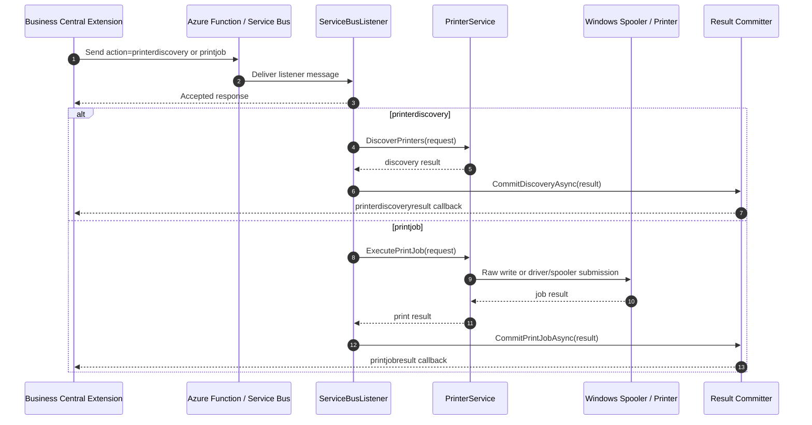

# DataMigratePro Listener Print Service - Technical Implementation

## 1. Scope

This document describes how the DataMigratePro listener print service is wired end-to-end and how it can be consumed from Business Central.

It covers:
- local printer discovery
- transparent printer selection
- raw Zebra printing
- normal Windows driver printing
- batch printing and job queue usage
- synchronous and asynchronous result handling

This document is the print-service equivalent of the listener enhancement implementation guide.

## 2. High-Level Architecture

Main parts:
- AL extension tables, pages, and management codeunit on the BC side
- existing Azure Function / Service Bus transport
- local listener action handling for `printerdiscovery` and `printjob`
- local print execution service
- callback commit path back to BC

Core runtime path:
1. BC stores a discovery or print transaction.
2. BC sends a listener envelope through the existing relay path.
3. Listener accepts the request and starts local printer work.
4. Listener enumerates printers or resolves a target printer.
5. Listener prints using raw pass-through or Windows driver/spooler mode.
6. Listener builds a structured result payload.
7. Listener posts the callback to BC.
8. BC updates printer inventory, job status, and audit data.

## 3. Listener Artifacts (PC)

### 3.1 Printer service

- [DataMigratePro.Core/PrinterService.cs](DataMigratePro.Core/PrinterService.cs)
  - `PrinterDiscoveryRequest`
  - `PrinterDiscoveryResult`
  - `PrintJobRequest`
  - `PrintJobResult`
  - `DiscoverPrinters(...)`
  - `ExecutePrintJob(...)`
  - raw printer writer implementation
  - discovery and print result committers

### 3.2 Action dispatch

- [DataMigratePro.Core/ServiceBusListener.cs](DataMigratePro.Core/ServiceBusListener.cs)
  - `ProcessActionAsync(...)` routes `printerdiscovery`
  - `ProcessActionAsync(...)` routes `printjob`
  - discovery path enriches the result with listener correlation data
  - print path writes the final job result back to BC

### 3.3 CLI entry point

- [DataMigratePro.Core/CommandLineProcessor.cs](DataMigratePro.Core/CommandLineProcessor.cs)
  - supports `-t printerdiscovery`
  - allows the planned `serviceSchedule` mode to run periodic discovery from `settings.json`

### 3.4 Metadata and help

- [DataMigratePro.Core/CommandMetadata.cs](DataMigratePro.Core/CommandMetadata.cs)
  - registers the printer discovery task and its arguments

- [DataMigratePro.Core/ParameterHelper.cs](DataMigratePro.Core/ParameterHelper.cs)
  - shows `printerdiscovery` in the CLI overview

### 3.5 Tests

- [DataMigratePro.Tests/UnitTests/PrinterServiceTests.cs](DataMigratePro.Tests/UnitTests/PrinterServiceTests.cs)
  - discovery contract coverage
  - raw payload preservation
  - unsupported mode / printer missing coverage

## 4. Protocol Contract

## 4.1 Discovery request envelope

Transport remains unchanged:
- the outer message uses the existing listener envelope
- the `data` field contains base64 UTF-8 JSON

Action:
- `printerdiscovery`

Request payload example:

```json
{
  "transactionId": "GUID",
  "listenerConnectionId": "DWP-01",
  "companyName": "CRONUS",
  "requestedBy": "MyExtension",
  "createdAtUtc": "2026-07-03T10:00:00Z"
}
```

## 4.2 Discovery result callback

Action:
- `printerdiscoveryresult`

Result payload example:

```json
{
  "transactionId": "GUID",
  "status": "Succeeded",
  "resultMessage": "Printer discovery completed.",
  "listenerActivityId": "GUID",
  "listenerConnectionId": "DWP-01",
  "printers": [
    {
      "printerName": "ZDesigner ZD421-203dpi ZPL",
      "displayName": "Zebra Label Printer",
      "driverName": "ZDesigner ZD421-203dpi ZPL",
      "portName": "USB001",
      "isDefault": false,
      "supportedPrintModes": ["Raw"],
      "supportedContentTypes": ["ZPL", "EPL"]
    }
  ]
}
```

## 4.3 Print job request envelope

Action:
- `printjob`

Request payload example for a Zebra label:

```json
{
  "transactionId": "GUID",
  "printerName": "ZDesigner ZD421-203dpi ZPL",
  "printMode": "Raw",
  "contentType": "ZPL",
  "payloadBase64": "XlhBXE4...",
  "copies": 1,
  "requestedBy": "MyExtension",
  "companyName": "CRONUS",
  "createdAtUtc": "2026-07-03T10:00:00Z"
}
```

Request payload example for a Windows driver printer:

```json
{
  "transactionId": "GUID",
  "printerName": "HP Universal Printing PCL 6",
  "printMode": "WindowsDriver",
  "contentType": "PDF",
  "payloadBase64": "JVBERi0xLjQK...",
  "copies": 2,
  "requestedBy": "MyExtension",
  "companyName": "CRONUS",
  "createdAtUtc": "2026-07-03T10:00:00Z"
}
```

## 4.4 Print job result callback

Action:
- `printjobresult`

Result payload example:

```json
{
  "transactionId": "GUID",
  "status": "Succeeded",
  "resultMessage": "Print job completed.",
  "spoolerJobId": 1234,
  "listenerActivityId": "GUID",
  "listenerConnectionId": "DWP-01"
}
```

## 5. Sequence Flow



## 6. Transparent Printer Selection

The main design goal is that the BC user or extension does not need to know the physical Windows printer details.

Recommended selection model:
1. BC chooses a logical printer code.
2. BC resolves that logical printer through printer mappings.
3. Listener receives the resolved Windows printer name.
4. Listener prints locally without exposing spooler complexity to the user.

Example mapping scenarios:
- report 1306 -> office printer
- label batch -> Zebra printer
- company-specific default -> fallback printer
- user-specific override -> personal workstation printer

## 7. Zebra and Raw Printing

Zebra printing should use raw output whenever possible.

Recommended usage:
- generate ZPL or EPL in BC or in the listener payload
- encode the exact bytes as base64
- select `printMode = Raw`
- select a printer that supports the target language

Example ZPL snippet:

```text
^XA
^FO50,50^ADN,36,20^FDDataMigratePro^FS
^FO50,100^BCN,100,Y,N,N^FD1234567890^FS
^XZ
```

Example AL-side call pattern:

```pascal
procedure PrintZebraLabel()
var
    PrintMgt: Codeunit "DMP Print Service Mgt. IOI";
begin
    PrintMgt.SubmitRawPrintJob(
        'DWP-01',
        'WAREHOUSE_ZEBRA',
        'ZPL',
        '^XA^FO50,50^ADN,36,20^FDDataMigratePro^FS^XZ',
        1);
end;
```

## 8. Windows Driver Printing

For normal office printers, the listener should use the installed Windows driver/spooler path.

Recommended usage:
- render or supply a driver-compatible payload
- select `printMode = WindowsDriver`
- supply the resolved printer name from the BC mapping layer
- keep the print path transparent to the caller

Example AL-side call pattern:

```pascal
procedure PrintInvoiceToOfficePrinter()
var
    PrintMgt: Codeunit "DMP Print Service Mgt. IOI";
begin
    PrintMgt.SubmitPrintJob(
        'DWP-01',
        'INVOICE_A4',
        'HP Universal Printing PCL 6',
        'PDF',
        ReportPayloadAsBase64,
        2);
end;
```

## 9. Batch Printing and Job Queue Usage

Batch printing is best implemented as multiple transactions that are coordinated by BC or a job queue.

Recommended patterns:
- one transaction per document
- one transaction per label
- one transaction per printer target
- queue the jobs in BC and let the scheduled process submit them in order

Example batch workflow:

```text
GenerateDocuments()
  -> create job rows for 100 labels
  -> job queue picks rows in batches
  -> each row becomes a printjob transaction
  -> listener prints and returns printjobresult
  -> BC marks each row complete or failed
```

Example queue-driven pseudo code:

```pascal
procedure ProcessQueuedPrintJobs()
var
    PrintMgt: Codeunit "DMP Print Service Mgt. IOI";
begin
    // Pick next 50 jobs, submit them, persist transaction ids, continue.
    PrintMgt.SubmitQueuedPrintJobs();
end;
```

## 10. Scheduled Discovery with serviceSchedule

The planned `serviceSchedule` mode can call the new CLI task directly.

Example `settings.json` fragment:

```json
{
  "ServiceSchedule": {
    "CommandArguments": "-t printerdiscovery --listenerconnectionid \"DWP-01\" --transactionid \"GUID\"",
    "RecurringType": "Interval",
    "RecurringInterval": "01:00:00"
  }
}
```

This keeps printer inventory refreshed without requiring a manual BC trigger.

## 11. Practical Integration Examples

### 11.1 Fire-and-continue

Use when the caller should not wait for completion.

```pascal
procedure QueueLabelPrint()
begin
    // Persist transaction, send printjob, continue immediately.
end;
```

### 11.2 Wait-for-completion

Use when the caller needs immediate success/failure feedback.

```pascal
procedure PrintAndWait()
begin
    // Send transaction, poll status, and fail the operation if the callback returns Failed.
end;
```

### 11.3 Background batch processing

Use when a job queue processes many items.

```pascal
procedure ProcessPrintQueue()
begin
    // Submit jobs in batches and let the callback update each transaction separately.
end;
```

## 12. Operational Notes

- Raw printing should not mutate the payload.
- Discovery should be repeatable and safe to run on a schedule.
- Driver errors should be returned as structured callback failures.
- Printer mappings should keep physical printer names out of most business logic.
- Batch print failures should be isolated to the failed transaction, not the entire batch.

## 13. Validation Checklist

- Verify printer discovery returns Zebra and office printers.
- Verify Zebra raw output is preserved byte-for-byte.
- Verify a Windows driver printer receives driver-compatible output.
- Verify batch jobs can be submitted from a queue.
- Verify callbacks update BC transaction status for both discovery and print jobs.