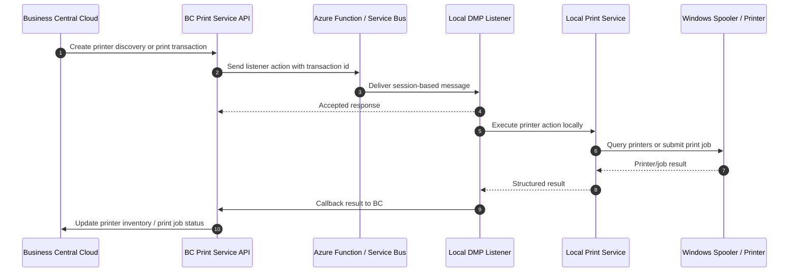

# DataMigratePro Listener Print Service - Requirements

## 1. Objective

Business Central in the cloud must be able to use local customer printers through the DataMigratePro listener as naturally as classic local NAV/C/AL installations used local printer access.

The print service shall provide a full local printer management layer:
- Business Central can discover locally installed printers.
- Business Central can store printer capabilities and printer mappings.
- Business Central can submit print jobs to a named local printer.
- The listener prints locally and returns status, errors, and job metadata.
- Report output from Business Central can be redirected to the listener print service.
- Zebra/raw printers and normal Windows driver-based printers must both be supported.

The target user experience is: Business Central runs in the cloud, but users and extensions can still address local printers as if NAV were running on the local machine.

## 2. Source Requirement

Initial request summary:

- Send print data to the listener; the listener transfers it to the specified printer.
- Query printer information from the listener for currently connected/installed printers.
- Printer discovery can be synchronous or asynchronous.
- For asynchronous discovery, BC sends a transaction id and later receives printer data into a printer table.
- BC report output should be redirected so print data is sent to the listener.
- Zebra printers must be supported; the stream contains raw Zebra-compatible data.
- Normal Windows printers must be supported via installed printer drivers, including PCL, PostScript, and other driver-supported formats.

## 3. Scope

### Included

- Local printer discovery from BC through the listener.
- Synchronous printer discovery for quick UI/API calls.
- Asynchronous printer discovery with transaction tracking and callback into BC.
- Scheduled CLI printer discovery for periodic refresh through Windows Task Scheduler.
- Persistent printer inventory in BC.
- Printer capability and status metadata.
- Print job queue and print job result tracking in BC.
- Sending print payloads from BC to a named local printer.
- RAW print mode for Zebra/ZPL/EPL and other device-native streams.
- Windows driver print mode for normal installed printers.
- BC report output redirection into print service payloads.
- Per-user, per-report, per-printer, and default printer mapping scenarios.
- Retry, failure visibility, and operational monitoring.

### Excluded From First Implementation Unless Explicitly Added Later

- Cloud print provider integrations outside the listener path.
- Full document rendering engine in the listener for arbitrary report formats.
- Printer driver installation or driver update management.
- Advanced print preview UI.
- Bidirectional printer device control beyond discovery/status/job result.
- Direct printing from browser client without listener.

## 4. Actors

- **Business Central user**: starts a print action or runs a report.
- **Business Central extension**: prepares print payloads and submits print/discovery commands.
- **DataMigratePro listener**: receives print commands, accesses local printers, and returns results.
- **DataMigratePro scheduled CLI**: runs configured listener actions periodically from Windows Task Scheduler.
- **Local Windows print spooler**: performs actual printer communication.
- **Administrator**: configures printer mappings, permissions, aliases, and default behavior.

## 5. Architecture Overview

The print service extends the existing listener command architecture.



## 6. Core Concepts

### 6.1 Printer Inventory

BC shall maintain a local-printer inventory per listener connection id.

Minimum fields:
- printer id / logical printer code
- listener connection id
- Windows printer name
- display name
- driver name
- port name
- is default printer
- is online / is available if detectable
- supported print modes (`Raw`, `WindowsDriver`)
- supported content types (`ZPL`, `EPL`, `PCL`, `PostScript`, `PDF`, `Text`, `EMF`, `Unknown`)
- last discovered timestamp
- last status/error text

### 6.2 Printer Mapping

BC shall support mappings so extensions and users do not need to know local Windows printer names.

Mapping dimensions:
- user id
- report id
- document type
- company
- listener connection id
- logical printer code
- fallback/default printer

Example:
- Report 1306 Sales Invoice -> logical printer `INVOICE_A4`
- Label report -> logical printer `WAREHOUSE_ZEBRA`
- local listener `DWP-01` maps `WAREHOUSE_ZEBRA` to Windows printer `ZDesigner ZD421-203dpi ZPL`

### 6.3 Print Job

Every print request shall be persisted as a transaction in BC.

Minimum fields:
- transaction id
- status
- listener connection id
- logical printer code
- resolved printer name
- print mode
- content type
- payload size
- requested by
- source report id / source record metadata if available
- copies
- created/sent/accepted/started/finished timestamps
- result message
- listener activity id
- spooler job id if available
- retry count

### 6.4 Print Payload

Payloads can be:
- raw printer language bytes, e.g. ZPL/EPL for Zebra
- PCL/PostScript data
- text data
- binary document data such as PDF, if supported by the selected implementation path
- report-rendered output from BC

Payload transfer must support base64 encoding.

## 7. Functional Requirements

### FR-001 Printer Discovery - Synchronous

BC shall be able to request currently installed local printers and receive a response directly from the listener call when the operation is short enough.

Acceptance criteria:
- BC can call the `printerdiscovery` action.
- Response contains all installed Windows printers visible to the listener process.
- Response contains default printer and driver/port metadata where available.
- Errors are returned as structured error responses.

### FR-002 Printer Discovery - Asynchronous

BC shall be able to request printer discovery asynchronously.

Acceptance criteria:
- BC creates a discovery transaction id.
- Listener accepts the request immediately.
- Listener queries local printers in background.
- Listener posts callback result to BC.
- BC updates printer inventory and marks transaction completed or failed.

### FR-003 Scheduled CLI Printer Discovery

DataMigratePro shall support scheduled printer discovery through a CLI parameter or action so the planned `serviceSchedule` mode can refresh BC printer inventory without a manual BC request.

Acceptance criteria:
- A configured CLI parameter/action executes the same local printer discovery as the ServiceBusListener `printerdiscovery` action.
- The CLI discovery enumerates installed Windows printers visible to the scheduled DMP process.
- The CLI discovery sends results to BC with callback action `printerdiscoveryresult`.
- The callback uses the same result contract as current print jobs and asynchronous discovery.
- Failures are reported to BC with the same structured status/error pattern as listener-driven discovery.

### FR-004 Printer Inventory Persistence

BC shall persist discovered printer information.

Acceptance criteria:
- Inventory is stored per listener connection id.
- Existing printer rows are updated on rediscovery.
- Printers no longer reported can be marked inactive instead of immediately deleted.
- Last discovery timestamp is maintained.

### FR-005 Print Job Submission

BC shall submit print jobs to a selected logical or physical printer.

Acceptance criteria:
- Print request contains transaction id, printer target, print mode, content type, and payload.
- Listener resolves the target printer locally.
- Listener submits the job to the local printer/spooler.
- BC receives final job status.

### FR-006 RAW/Zebra Printing

The system shall support direct raw output for Zebra printers.

Acceptance criteria:
- BC can send ZPL/EPL payload as bytes/base64.
- Listener sends payload unchanged to the selected printer.
- No formatting, conversion, or line-ending mutation is applied unless explicitly requested.
- Result includes success/failure and spooler/job metadata where available.

### FR-007 Windows Driver Printing

The system shall support normal Windows printers through installed drivers.

Acceptance criteria:
- BC can submit driver-compatible payloads to a normal Windows printer.
- PCL and PostScript payloads are supported when the installed driver/printer accepts them.
- The implementation clearly distinguishes raw pass-through from driver-rendered print paths.
- Driver/spooler errors are captured and returned to BC.

### FR-008 Report Print Redirection

BC report output shall be redirectable to the listener print service.

Acceptance criteria:
- An extension can intercept or replace standard report print flow where BC events allow it.
- Report output is rendered into a supported payload format.
- Printer target is resolved from printer mappings.
- Print job transaction is created and sent to listener.
- User receives meaningful feedback: queued, printed, failed, or pending.

### FR-009 Local NAV-Like Printer Experience

The system shall make cloud BC printing behave like local NAV printing from the business user's perspective.

Acceptance criteria:
- Users can print to named local printers associated with their local workstation/listener.
- Report-to-printer defaults can be configured.
- Zebra label printers and office/document printers can coexist.
- Users do not need to manually download files and print them outside BC.

### FR-010 Print Modes

The system shall support at least these print modes:

- `Raw`: send bytes exactly as provided.
- `WindowsDriver`: submit to Windows print infrastructure using available driver path.
- `Auto`: choose mode based on printer mapping/content type.

Acceptance criteria:
- Mode is persisted on the print job.
- Listener validates whether requested mode is supported.
- Unsupported mode returns a structured failure.

### FR-011 Status and Error Handling

BC shall track full job lifecycle.

Required statuses:
- `Created`
- `Sent`
- `Accepted`
- `Printing`
- `Printed`
- `Failed`
- `Timed Out`
- `Canceled`
- `Callback Failed`

Acceptance criteria:
- Every failure includes stable error code and human-readable message.
- Transport failure and print failure are distinguishable.
- Callback failure is distinguishable from successful local printing.

### FR-012 Retry

BC shall allow retrying failed print and discovery transactions.

Acceptance criteria:
- Retry creates either a new transaction or increments retry count on existing transaction.
- Payload and printer target are preserved.
- Retry history remains auditable.

### FR-013 Permissions

Only authorized BC users/extensions shall be able to manage printers or submit print jobs.

Acceptance criteria:
- Printer management pages require permissions.
- Print submission APIs require execution permission.
- Callback endpoints are not user-facing and must follow existing endpoint authentication patterns.

### FR-014 Auditing

BC shall keep an audit trail for printer discovery and print jobs.

Acceptance criteria:
- Requested by, timestamps, target printer, payload metadata, result, and listener id are retained.
- Sensitive payload content can be excluded or truncated according to configuration.
- Logs are sufficient for support troubleshooting without exposing document content unnecessarily.

### FR-015 Payload Size and Chunking

The print service shall define payload size limits and support chunking if necessary.

Acceptance criteria:
- Large payloads do not silently fail because of Service Bus or BC HTTP limits.
- Print job record stores payload length.
- If chunking is implemented, chunks are correlated by transaction id and sequence.

### FR-016 Multiple Listeners / Workstations

BC shall support multiple local listeners and route print jobs to the correct location.

Acceptance criteria:
- Printer inventory is scoped by listener connection id.
- Printer mappings can select a listener connection id.
- Print job fails clearly if the target listener is offline or unavailable.

## 8. Message Contracts

### 8.1 Printer Discovery Request

Action: `printerdiscovery`

```json
{
  "transactionId": "GUID",
  "mode": "sync|async",
  "includeCapabilities": true,
  "includeStatus": true,
  "requestedBy": "USERID",
  "createdAtUtc": "2026-07-02T10:00:00Z"
}
```

### 8.2 Printer Discovery Result

Action: `printerdiscoveryresult`

```json
{
  "transactionId": "GUID",
  "status": "Succeeded",
  "listenerConnectionId": "DWP-01",
  "printers": [
    {
      "printerName": "ZDesigner ZD421-203dpi ZPL",
      "displayName": "Warehouse Zebra",
      "driverName": "ZDesigner ZD421-203dpi ZPL",
      "portName": "USB001",
      "isDefault": false,
      "isAvailable": true,
      "supportedPrintModes": ["Raw"],
      "supportedContentTypes": ["ZPL", "EPL"]
    },
    {
      "printerName": "HP LaserJet M404",
      "displayName": "Office Printer",
      "driverName": "HP Universal Printing PCL 6",
      "portName": "IP_192.168.1.50",
      "isDefault": true,
      "isAvailable": true,
      "supportedPrintModes": ["WindowsDriver", "Raw"],
      "supportedContentTypes": ["PCL", "PostScript", "Text"]
    }
  ],
  "resultMessage": "2 printers discovered."
}
```

### 8.3 Print Job Request

Action: `printjob`

```json
{
  "transactionId": "GUID",
  "listenerConnectionId": "DWP-01",
  "printerName": "ZDesigner ZD421-203dpi ZPL",
  "logicalPrinterCode": "WAREHOUSE_ZEBRA",
  "printMode": "Raw",
  "contentType": "ZPL",
  "documentName": "Item Label 10000",
  "copies": 1,
  "payloadBase64": "XlhBXkZPMTAsMTBeQURON...",
  "requestedBy": "USERID",
  "createdAtUtc": "2026-07-02T10:00:00Z"
}
```

### 8.4 Print Job Result

Action: `printjobresult`

```json
{
  "transactionId": "GUID",
  "status": "Printed",
  "listenerActivityId": "GUID",
  "listenerConnectionId": "DWP-01",
  "printerName": "ZDesigner ZD421-203dpi ZPL",
  "spoolerJobId": "1234",
  "startedAtUtc": "2026-07-02T10:00:01Z",
  "finishedAtUtc": "2026-07-02T10:00:02Z",
  "durationMs": 830,
  "resultMessage": "Print job submitted successfully."
}
```

## 9. Business Central Objects Required

Recommended AL objects:

- table `DMP Printer IOI`
  - local printer inventory
- table `DMP Printer Mapping IOI`
  - report/user/document/default printer mappings
- table `DMP Print Job IOI`
  - print job transaction and status
- table `DMP Printer Discovery IOI`
  - discovery transaction/status if separated from printer inventory
- enum `DMP Print Job Status IOI`
- enum `DMP Print Mode IOI`
- enum `DMP Print Content Type IOI`
- codeunit `DMP Print Service Mgt. IOI`
  - synchronous discovery
  - asynchronous discovery
  - submit print job
  - retry print job
  - apply discovery result
  - apply print job result
- page `DMP Printers IOI`
- page `DMP Printer Mappings IOI`
- page `DMP Print Jobs IOI`

## 10. Listener Components Required

Recommended PC-side components:

- `PrinterService`
  - query installed printers
  - resolve printer target
  - submit raw print jobs
  - submit Windows-driver print jobs
  - map spooler exceptions to stable error codes
- `PrinterResultCommitter`
  - callback discovery and job results to BC
  - retry transient callback failures
- `PrinterModels`
  - request/result DTOs
- `ServiceBusListener`
  - action handlers for printer discovery and print jobs

Existing starting point:
- `GetPrinterPlugin` currently lists installed printers through `System.Drawing.Printing.PrinterSettings.InstalledPrinters`.

## 11. Report Redirection Requirements

BC report printing must support a redirection layer.

Recommended flow:
1. User runs report.
2. Extension determines target printer mapping.
3. Report output is rendered into supported payload format.
4. Print job is created in BC.
5. Payload is sent to listener.
6. Listener prints locally.
7. BC receives print result callback.

Important design decision:
- Report rendering format must be selected per use case.
- Zebra labels should preferably generate native ZPL/EPL.
- Office documents can use PCL/PostScript/PDF depending on available rendering and listener support.

## 12. Zebra Printing Requirements

Zebra support must prioritize exact raw stream transfer.

Acceptance criteria:
- Payload bytes are not modified.
- Encoding is explicit.
- ZPL/EPL examples are testable.
- Printer mapping can mark a printer as Zebra/raw-only.

Example ZPL payload:

```text
^XA
^FO50,50^A0N,40,40^FDItem 10000^FS
^FO50,110^BY2^BCN,80,Y,N,N^FD10000^FS
^XZ
```

## 13. Windows Printer Requirements

Windows printer support must use locally installed printers and drivers.

Acceptance criteria:
- Printer names match Windows installed printer names.
- Driver and port metadata are discoverable when available.
- PCL/PostScript streams can be sent to compatible queues.
- Driver-based output path is clearly separated from raw pass-through.
- Failures from missing printer, offline printer, spooler error, or unsupported payload are returned to BC.

## 14. Security Requirements

- Do not allow arbitrary printer access without BC permission checks.
- Restrict listener commands to configured connection id/session.
- Avoid storing full document payloads unless explicitly configured.
- Support payload length logging without content logging.
- Protect callback endpoint using existing BC authentication patterns.
- Do not expose local filesystem paths unless required for support diagnostics.

## 15. Operational Requirements

- Admin page to rediscover printers.
- Page/action to test-print to selected printer.
- Page/action to retry failed jobs.
- Clear status for listener offline or target printer not found.
- Log correlation by transaction id and listener activity id.
- Support multiple companies if printer mappings differ per company.

## 16. Compatibility Goal: NAV-Like Local Printing

The print service should close the gap caused by moving from local NAV to BC cloud.

Legacy NAV behavior:
- NAV ran on the local machine or terminal session.
- Windows printers were directly visible to the application runtime.
- C/AL code could use local shell/automation/printer access.

Target BC cloud behavior:
- BC runs in cloud and cannot directly see local printers.
- DataMigratePro listener acts as the local execution bridge.
- BC sends structured print commands.
- Listener performs local printer interaction.
- BC receives structured result and keeps transaction history.

## 17. Open Design Questions

- Should printer discovery use the existing plugin model first or be moved into core listener service immediately?
- Should raw print support use Win32 spooler APIs directly, or a dedicated library/wrapper?
- Should PDF printing be first-class in v1, or should v1 focus on raw/ZPL/PCL/PostScript?
- What maximum print payload size should be supported before chunking is required?
- Should printer mappings be global, per company, per user, or all three?
- Should BC store complete payloads for retry, or only metadata plus a re-render instruction?

## 18. Acceptance Test Scenarios

### ATS-001 Discover printers synchronously

Given listener is online and local printers are installed, when BC requests printer discovery synchronously, then BC receives printer names and metadata in the response.

### ATS-002 Discover printers asynchronously

Given listener is online, when BC creates asynchronous discovery transaction, then the listener later posts discovery result and BC updates printer inventory.

### ATS-003 Discover printers through scheduled CLI

Given DMP is configured as a scheduled task with the printer discovery CLI action, when the task runs, then DMP executes local printer discovery and posts a `printerdiscoveryresult` callback so BC updates printer inventory.

### ATS-004 Print Zebra label

Given a Zebra printer is installed and mapped, when BC sends ZPL payload to the listener in `Raw` mode, then the label is printed and BC marks the job `Printed`.

### ATS-005 Print PCL/PostScript document

Given a compatible Windows printer is installed, when BC sends a PCL/PostScript payload to that printer, then listener submits the job and BC receives printed or failed status.

### ATS-006 Printer not found

Given printer mapping points to a missing local printer, when BC submits a print job, then listener returns `Failed` with stable error code `PRINTER_NOT_FOUND`.

### ATS-007 Listener offline

Given the listener is offline, when BC submits discovery or print job, then BC marks transaction `Send Failed` or equivalent transport failure.

### ATS-008 Report redirection

Given a BC report is configured for listener printing, when user prints the report, then output is routed through the print service instead of relying on browser/manual download printing.

## 19. Implementation Phases

### Phase 1 - Printer Discovery

- Implement discovery action.
- Persist printer inventory in BC.
- Support synchronous and asynchronous discovery.
- Support scheduled CLI discovery using the same `printerdiscoveryresult` callback contract.
- Build basic pages for printers and discovery history.

### Phase 2 - RAW Print Jobs

- Implement raw print action.
- Support Zebra/ZPL/EPL payloads.
- Add print job table and status callback.
- Add test print action.

### Phase 3 - Windows Driver Print Jobs

- Add driver/spooler print mode.
- Support PCL/PostScript where driver/printer supports it.
- Improve capability detection and error mapping.

### Phase 4 - Report Redirection

- Add report-to-printer mapping.
- Add extension hooks/events for report output routing.
- Provide sample implementations for label and document reports.

### Phase 5 - Operations Hardening

- Add retry policies.
- Add payload chunking if required.
- Add monitoring/factboxes.
- Add permission set and admin role guidance.
