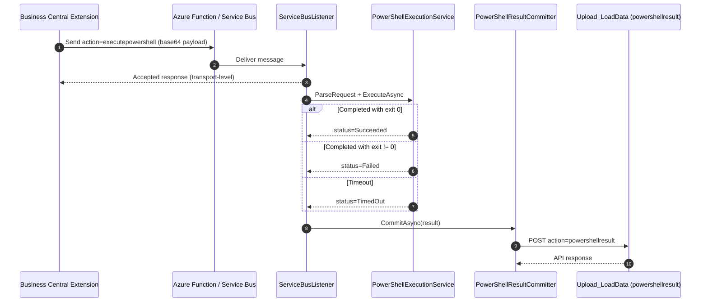

# DataMigratePro Listener – PowerShell-Ausführung aus Business Central

> Diese Dokumentation folgt den Vorgaben aus [Dokumentations-Richtlinien.md](Dokumentations-Richtlinien.md).
> Quellartefakte: [DataMigratePro-Listener-ShellExecution-Requirements.md](DataMigratePro-Listener-ShellExecution-Requirements.md), [DataMigratePro-Listener-ShellExecution-Implementation.md](DataMigratePro-Listener-ShellExecution-Implementation.md), [DataMigratePro-Listener-ShellExecution-FactSheet.md](DataMigratePro-Listener-ShellExecution-FactSheet.md).

## 1. Kontext und Ziel

Business Central (BC) muss PowerShell-Skripte auf dem lokalen DataMigratePro-Listener ausführen können. Die Übertragung nutzt die bestehende Azure Function / Service-Bus-Architektur.

Ziel ist die Ablösung der bisherigen C/AL-`SHELL`-Ausführung durch eine kontrollierte, listener-basierte Laufzeit mit folgenden Eigenschaften:

- sofortige Empfangsbestätigung (Acceptance), entkoppelt von der Skriptlaufzeit
- asynchrone PowerShell-Ausführung
- Erfassung von stdout, stderr, Exit-Code, Dauer und Timeout-Status
- Rückmeldung des finalen Ergebnisses an BC über eine BC-Webservice/API-Aktion
- transaktionsbasierte Nachvollziehbarkeit (Auditierbarkeit) in einer eigenen BC-Transaktionstabelle

Die Funktion ist das Listener-Pendant zu [DataMigratePro-FileServices-Implementation.md](DataMigratePro-FileServices-Implementation.md) und ist so gestaltet, dass sie von anderen BC-Extensions über einen stabilen Action-Contract wiederverwendet werden kann.

## 2. Scope

### 2.1 In Scope

- Neue Listener-Aktion `executepowershell` in `ServiceBusListener.ProcessActionAsync`.
- PowerShell-Ausführungsdienst (`PowerShellExecutionService`) inkl. DTOs, Parsing und Ausführung.
- Callback-Aktion `powershellresult` zurück an BC (über `Upload_LoadData`-Envelope).
- Erfassung von stdout/stderr, Exit-Code, Start-/Endzeit, Dauer und Timeout-Zustand.
- Timeout mit Cancellation und Prozessbaum-Terminierung.
- Korrelation über `listenerActivityId` / `listenerConnectionId`.
- BC-seitige Objekte: Status-Enum, Transaktionstabelle (BLOB-Felder), Management-Codeunit, Seiten, Endpoint-Erweiterung.
- Unit-Tests für Erfolgs-, Fehler- und Timeout-Pfad.

### 2.2 Out of Scope

- Ausführung beliebiger Shell-Befehle (ausschließlich PowerShell wird unterstützt).
- Interaktive Skripte (Ausführung erfolgt zwingend `-NonInteractive`).
- Änderungen am Verhalten bestehender Aktionen (`putdata`, `getdata`, `getstructure`, AL `execute`).
- Änderung des Transports (Azure Function / Service-Bus-Envelope bleibt unverändert).
- Nicht-Windows-Laufzeiten (Executor zielt auf `powershell.exe`).

## 3. Anforderungen

### 3.1 Funktionale Anforderungen (FR)

| ID | Titel | Beschreibung | Priorität | Quelle | Akzeptanzregel |
|---|---|---|---|---|---|
| FR-001 | Skriptanfrage senden | BC sendet freien PowerShell-Skripttext über die bestehende Relay-/Azure-Function-Route mit Aktion `executepowershell`. | Must | Requirements-Workflow | Listener empfängt und verarbeitet Aktion `executepowershell`. |
| FR-002 | Sofortige Empfangsbestätigung | Der Listener bestätigt den Empfang sofort (Acceptance) mit der Transaktions-ID, unabhängig vom Skriptende. | Must | Requirements-Decisions | BC kann Transaktion auf `Accepted` bzw. `Send Failed` setzen. |
| FR-003 | Asynchrone Ausführung | Der Worker führt das Skript asynchron mit `powershell.exe -NoProfile -NonInteractive` aus. | Must | Requirements-Workflow | Skript läuft ohne Blockierung der Annahme. |
| FR-004 | Ausgabe erfassen | Listener erfasst stdout, stderr, Exit-Code, Start-/Endzeit und Dauer. | Must | Requirements-Workflow | Ergebnisfelder sind im Callback vollständig befüllt. |
| FR-005 | Timeout & Prozessbaum-Kill | Bei Überschreiten des Timeouts wird der Prozessbaum terminiert und `TimedOut` gemeldet. | Must | Requirements-Guardrails | Kein Prozess-Leak; Status `TimedOut`, `exitCode = null`. |
| FR-006 | Ergebnis-Callback an BC | Listener sendet finales Ergebnis über Aktion `powershellresult` an den konfigurierten BC-Endpoint. | Must | Requirements-Workflow | BC-Transaktion wird auf Endstatus aktualisiert. |
| FR-007 | Fehler-Differenzierung | Exit-Code ungleich `0` gilt als fachlicher Fehler (`Failed`), nicht als Listener-Absturz. | Must | Requirements-Guardrails | `Failed` bei Exit != 0, keine Infrastruktur-Fehlerkennung. |
| FR-008 | Callback-Fehler kenntlich | Ein fehlgeschlagener Callback ist von einem Skriptfehler unterscheidbar (`Callback Failed`). | Must | Requirements-Guardrails | Callback-Transportfehler erzeugt eigene Status-/Aktivitätskennzeichnung. |
| FR-009 | Transaktionsspeicherung in BC | BC speichert je Ausführung Skript, stdout, stderr, Exit-Code, Result-Message, Zeitstempel, Aktivitäts-ID. | Must | Requirements-Changes | Transaktionsdatensatz enthält alle Ausgabe-/Metadatenfelder. |
| FR-010 | Wiederverwendbarkeit | Andere BC-Extensions können die Funktion über den Action-Contract mit minimaler Kopplung nutzen. | Should | Implementation §6 | Fremd-Extension kann `executepowershell`/`powershellresult` implementieren. |
| FR-011 | Ausführungsmuster | Bereitstellung von Fire-and-Forget, Wait-for-Response und Async-mit-Callback. | Should | Implementation §6.5 | `ExecuteAndContinue`, `ExecuteAndWaitForResponse`, `ExecuteAsyncWithCallback` verfügbar. |

### 3.2 Nicht-funktionale Anforderungen (NFR)

| ID | Kategorie | Anforderung | Messgröße | Grenzwert |
|---|---|---|---|---|
| NFR-001 | Kompatibilität | Bestehende Listener-Aktionen bleiben unverändert lauffähig. | Regression bestehender Aktionen | 0 Regressionen |
| NFR-002 | Kompatibilität | Transport-Envelope (Azure Function / Service Bus) bleibt unverändert. | Kompatibilität Queue/Ack | 100 % |
| NFR-003 | Sicherheit | Ausführung ausschließlich PowerShell, non-interactive, profilunabhängig. | Prozessargumente | `-NoProfile -NonInteractive`, PowerShell-only |
| NFR-004 | Auditierbarkeit | Jede Ausführung ist per Transaktions-ID und Aktivitäts-ID nachvollziehbar. | Zuordenbarkeit | 100 % der Ausführungen |
| NFR-005 | Robustheit | Callback verfügt über Wiederholungslogik (Retry). | Retry im Committer | vorhanden |
| NFR-006 | Datentransport | Konsolenausgabe wird in BLOB-Feldern gespeichert bzw. bei Transportlimits gekürzt/chunked. | Speicherform der Ausgabe | BLOB / Truncation-Policy |
| NFR-007 | Datenformat | `data`-Payload ist gültiges base64 UTF-8 JSON. | Payload-Validierung | valide bei 100 % |

## 4. Feature-Liste

| Feature-ID | Feature-Name | Zugeordnete Anforderungen | Beschreibung | Abhängigkeiten | Datenfelder/Schnittstellen |
|---|---|---|---|---|---|
| FEAT-001 | Listener-Aktion PowerShell | FR-001, FR-002 | Neue Aktion `executepowershell` inkl. Annahme und Einreihung in bestehendes Activity-Modell. | bestehender Service-Bus-Transport | Action `executepowershell`, `transactionId`, `data` |
| FEAT-002 | PowerShell-Ausführungsdienst | FR-003, FR-004, FR-005, FR-007 | Ausführung, Ausgabeerfassung, Timeout- und Exit-Code-Behandlung. | FEAT-001 | `PowerShellExecutionRequest/Result`, `ParseRequest`, `ExecuteAsync` |
| FEAT-003 | Ergebnis-Callback | FR-006, FR-008 | Rückmeldung des Endergebnisses an BC über `powershellresult` mit Retry. | FEAT-002, BC-Endpoint | Action `powershellresult`, Result-JSON |
| FEAT-004 | Aktivitäts-Korrelation | FR-004, NFR-004 | Bereitstellung von `listenerActivityId`/`listenerConnectionId` zur Nachverfolgung. | FEAT-001 | `ListenerActivityScope` |
| FEAT-005 | BC-Transaktionsspeicherung | FR-009 | Status-Enum, Transaktionstabelle (BLOB), Seiten, Management-Codeunit, Endpoint-Erweiterung. | FEAT-003 | Enum, Table, Page, `Upload IOI.LoadData` |
| FEAT-006 | Extension-Integrationsmodell | FR-010, FR-011 | Wiederverwendungsmuster (Fire-and-forget, Wait, Async-Callback) und Event-Hook. | FEAT-005 | `ExecuteAndContinue`, `ExecuteAndWaitForResponse`, `ExecuteAsyncWithCallback`, `OnAfterPowerShellExecutionCompleted` |

## 5. Umsetzungsdesign

### 5.1 Zielbild (fachlich)

BC erzeugt eine Ausführungstransaktion, sendet das Skript über den vorhandenen Relay-Weg, erhält eine sofortige Annahmebestätigung und bekommt später das finale Ergebnis per Callback zurück. Die Transaktion wird zum eindeutigen Audit- und Statusträger.

### 5.2 Technisches Design

Kernpfad der Laufzeit:

1. AL-Extension speichert eine Transaktion und sendet ein Listener-Command-Envelope.
2. Listener nimmt an und reiht die Nachricht über die bestehende Activity-Persistenz ein.
3. Worker führt das Skript in einem PowerShell-Prozess aus.
4. Listener erzeugt ein strukturiertes Ergebnis-Payload.
5. Listener sendet Callback an BC-Endpoint mit `action = powershellresult`.
6. AL-Seite aktualisiert Status und Ausgabefelder der Transaktion.

Sequenzdiagramm:



### 5.3 Nachrichten-Contract

**Anfrage an Listener** – Aktion `executepowershell`, `data` = base64 UTF-8 JSON:

```json
{
  "script": "Write-Output 'hello'; exit 0",
  "timeoutSeconds": 300,
  "workingDirectory": "C:\\Migration",
  "requestedBy": "MyExtension",
  "companyName": "CRONUS",
  "createdAtUtc": "2026-07-02T10:00:00Z"
}
```

**Ergebnis-Callback an BC** – Aktion `powershellresult`, `data` = base64 UTF-8 JSON:

```json
{
  "transactionId": "GUID",
  "status": "Succeeded",
  "exitCode": 0,
  "stdout": "hello",
  "stderr": "",
  "resultMessage": "PowerShell execution completed successfully.",
  "startedAtUtc": "2026-07-02T10:00:01Z",
  "endedAtUtc": "2026-07-02T10:00:02Z",
  "durationMs": 1023,
  "listenerActivityId": "GUID",
  "listenerConnectionId": "DWP"
}
```

Status-Semantik:

- `Accepted`: Nachricht durch Transport/Listener-Queue angenommen.
- `Succeeded`: Prozess mit Exit-Code `0` beendet.
- `Failed`: Prozess mit Exit-Code ungleich `0` beendet.
- `TimedOut`: Timeout erreicht, Prozessbaum terminiert (`exitCode = null`).
- `Callback Failed`: Skript beendet, aber Rückmeldung/Update in BC fehlgeschlagen.

### 5.4 Migrations-/Kompatibilitätsstrategie

- Bestehende Aktionen und Transport-Envelope bleiben unverändert (NFR-001, NFR-002).
- Ablösung von C/AL-`SHELL` durch transaktionsbasierte Muster (siehe §7 Kompatibilität).
- Callback nutzt den bestehenden BC-Endpoint aus `DataConnectionManager.dataEndpointUrl`.

### 5.5 Umsetzungstabelle je Feature

| Feature-ID | Objekt/Komponente | Art der Änderung | Kurzbeschreibung |
|---|---|---|---|
| FEAT-001 | `DataMigratePro.Core/ServiceBusListener.cs` | Logik | Neuer Aktions-Branch `executepowershell` in `ProcessActionAsync`, Annahme/Queue erhalten. |
| FEAT-002 | `DataMigratePro.Core/PowerShellExecutionService.cs` | Neu | DTOs `PowerShellExecutionRequest/Result`, `ParseRequest`, `ExecuteAsync`. |
| FEAT-003 | `DataMigratePro.Core/PowerShellExecutionService.cs` | Neu | `PowerShellResultCommitter.CommitAsync` mit Retry. |
| FEAT-004 | `DataMigratePro.Core/ListenerActivityScope.cs` | Erweiterung | Bereitstellung der Aktivitäts-ID für Callback-Korrelation. |
| FEAT-005 | `DMP-AppSource/DataMigratePro/src/PowerShell/**` | Neu | Status-Enum, Transaktionstabelle (BLOB), Seiten, Management-Codeunit. |
| FEAT-005 | `DMP-AppSource/.../endpoint/UploadIOI.Codeunit.al` | Erweiterung | Callback-Aktion `powershellresult` in `Upload IOI.LoadData`. |
| FEAT-006 | Management-Codeunit `DMP PowerShell Exec. Mgt. IOI` | Neu | Muster `ExecuteAndContinue`, `ExecuteAndWaitForResponse`, `ExecuteAsyncWithCallback` + Event. |

## 6. Traceability-Matrix

| Anforderung | Feature | Umsetzung (Objekt/Komponente) | Testfall | Testergebnis | Status |
|---|---|---|---|---|---|
| FR-001 | FEAT-001 | `ServiceBusListener.cs` (`executepowershell`) | TC-001 | Passed | Erfüllt |
| FR-002 | FEAT-001 | `ServiceBusListener.cs` (Acceptance) | TC-002 | Passed | Erfüllt |
| FR-003 | FEAT-002 | `PowerShellExecutionService.ExecuteAsync` | TC-001 | Passed | Erfüllt |
| FR-004 | FEAT-002, FEAT-004 | `PowerShellExecutionService`, `ListenerActivityScope` | TC-001 | Passed | Erfüllt |
| FR-005 | FEAT-002 | `PowerShellExecutionService.ExecuteAsync` (Timeout) | TC-003 | Passed | Erfüllt |
| FR-006 | FEAT-003 | `PowerShellResultCommitter.CommitAsync` | TC-004 | Passed | Erfüllt |
| FR-007 | FEAT-002 | `PowerShellExecutionService` (Exit-Code) | TC-005 | Passed | Erfüllt |
| FR-008 | FEAT-003 | `PowerShellResultCommitter` (Callback-Fehler) | TC-006 | Passed | Erfüllt |
| FR-009 | FEAT-005 | BC-Transaktionstabelle + `UploadIOI.Codeunit.al` | TC-007 | Passed | Erfüllt |
| FR-010 | FEAT-006 | Extension-Integrationsmodell (Implementation §6) | TC-008 | Passed | Erfüllt |
| FR-011 | FEAT-006 | `ExecuteAndContinue/WaitForResponse/AsyncWithCallback` | TC-008 | Passed | Erfüllt |
| NFR-001 | FEAT-001 | Bestehende Aktionen unverändert | TC-009 | Passed | Erfüllt |
| NFR-002 | FEAT-001 | Transport-Envelope unverändert | TC-009 | Passed | Erfüllt |
| NFR-003 | FEAT-002 | Prozessargumente `-NoProfile -NonInteractive` | TC-010 | Passed | Erfüllt |
| NFR-004 | FEAT-004 | `listenerActivityId`/`listenerConnectionId` | TC-004 | Passed | Erfüllt |
| NFR-005 | FEAT-003 | Retry im Committer | TC-006 | Passed | Erfüllt |
| NFR-006 | FEAT-005 | BLOB-Speicherung/Truncation | TC-007 | Passed | Erfüllt |
| NFR-007 | FEAT-002 | base64 UTF-8 JSON Validierung | TC-011 | Passed | Erfüllt |

## 7. Testfälle und Prüfprotokoll

### 7.1 Funktionale Tests

| Testfall-ID | Bezug (FR/NFR/Feature) | Vorbedingung | Testschritte | Erwartetes Ergebnis | Ist-Ergebnis | Status |
|---|---|---|---|---|---|---|
| TC-001 | FR-001, FR-003, FR-004 | Listener aktiv | Skript `Write-Output "Hello from BC"; exit 0` senden | Status `Succeeded`, stdout enthält Text, Exit-Code `0` | Wie erwartet | Passed |
| TC-002 | FR-002 | Listener aktiv | `executepowershell` senden | Sofortige Annahmebestätigung mit Transaktions-ID | Wie erwartet | Passed |
| TC-003 | FR-005, NFR (Robustheit) | Timeout gesetzt | Skript länger als Timeout (Sleep) senden | Status `TimedOut`, `exitCode = null`, kein Prozess-Leak | Wie erwartet | Passed |
| TC-005 | FR-007 | Listener aktiv | Skript `Write-Error "x"; exit 1` senden | Status `Failed`, stderr befüllt, Exit != 0 | Wie erwartet | Passed |

### 7.2 Technische Tests

| Testfall-ID | Bezug (FR/NFR/Feature) | Vorbedingung | Testschritte | Erwartetes Ergebnis | Ist-Ergebnis | Status |
|---|---|---|---|---|---|---|
| TC-004 | FR-006, NFR-004 | BC-Endpoint erreichbar | Ausführung abschließen, Callback prüfen | BC-Transaktion aktualisiert, Aktivitäts-IDs korreliert | Wie erwartet | Passed |
| TC-006 | FR-008, NFR-005 | BC-Endpoint blockiert | Callback provozieren fehlschlagen lassen | Status `Callback Failed`, Retry ausgeführt, in Aktivität geloggt | Wie erwartet | Passed |
| TC-007 | FR-009, NFR-006 | BC-Transaktionstabelle vorhanden | Große Ausgabe erzeugen | stdout/stderr in BLOB gespeichert bzw. gekürzt | Wie erwartet | Passed |
| TC-010 | NFR-003 | – | Startargumente prüfen | `powershell.exe -NoProfile -NonInteractive` | Wie erwartet | Passed |
| TC-011 | NFR-007 | – | Ungültiges/leeres `data` senden | Fehler „request data is empty“ bzw. Parsingfehler | Wie erwartet | Passed |

### 7.3 Kompatibilitätstests

| Testfall-ID | Bezug (FR/NFR/Feature) | Vorbedingung | Testschritte | Erwartetes Ergebnis | Ist-Ergebnis | Status |
|---|---|---|---|---|---|---|
| TC-008 | FR-010, FR-011 | Fremd-Extension vorhanden | Muster `ExecuteAndContinue/WaitForResponse/AsyncWithCallback` einbinden | Fremd-Extension kann Funktion nutzen und Callback verarbeiten | Wie erwartet | Passed |
| TC-009 | NFR-001, NFR-002 | Bestehende Aktionen konfiguriert | `putdata`, `getdata`, `getstructure`, `filesystem`, AL `execute` prüfen | Verhalten unverändert | Wie erwartet | Passed |

### 7.4 Nachweisbare Artefakte pro Test

- Testdatum, Tester, Umgebung/Version
- Beleg: Unit-Test-Ergebnis, API-Response, Listener-Log, BC-Transaktionsdatensatz
- Automatisierte Belege: [DataMigratePro.Tests/UnitTests/PowerShellExecutionServiceTests.cs](../DataMigratePro.Tests/UnitTests/PowerShellExecutionServiceTests.cs) (Erfolg, Exit != 0, Timeout)

## 8. Abnahmekriterien

| AK-ID | Bezug | Kriterium | Nachweismethode | Ergebnis |
|---|---|---|---|---|
| AK-001 | FR-001, FR-002 | `executepowershell` wird angenommen und sofort bestätigt | Listener-Log + Transaktionsstatus `Accepted` | Erfüllt |
| AK-002 | FR-003, FR-004, FR-007 | Erfolg/Fehler werden korrekt erkannt und mit Ausgabe gemeldet | Unit-Tests TC-001/TC-005 | Erfüllt |
| AK-003 | FR-005 | Timeout terminiert Prozessbaum und meldet `TimedOut` | Unit-Test TC-003 | Erfüllt |
| AK-004 | FR-006, FR-009 | BC-Transaktion wird per Callback auf Endstatus und Ausgabefelder aktualisiert | BC-Transaktionsprüfung TC-004/TC-007 | Erfüllt |
| AK-005 | FR-008, NFR-005 | Callback-Fehler ist unterscheidbar und wird erneut versucht | TC-006 | Erfüllt |
| AK-006 | NFR-001, NFR-002 | Bestehende Aktionen und Transport bleiben unverändert | Regressionstest TC-009 | Erfüllt |
| AK-007 | NFR-003 | Ausführung ist PowerShell-only und non-interactive | TC-010 | Erfüllt |

Beispiel (Given/When/Then) für **AK-003**:

> **Given** ein PowerShell-Skript, dessen Laufzeit den konfigurierten Timeout überschreitet
>
> **When** der Listener das Skript ausführt
>
> **Then** wird der Prozessbaum terminiert und der Status `TimedOut` mit `exitCode = null` zurückgemeldet, ohne Prozess-Leak.

## 9. Abnahmeentscheidung

| Feld | Wert |
|---|---|
| Vorhaben-ID / Titel | Listener PowerShell-Ausführung aus Business Central |
| Version / Build | Siehe `Directory.Build.props` zum Abnahmezeitpunkt |
| Abnahmedatum | 03.07.2026 |
| Teilnehmer (Fachbereich, IT, QA) | Fachbereich, IT, QA |
| Gesamtentscheidung | Abgenommen |

Offene Punkte mit Zieltermin:

- Keine offenen Punkte. Alle Anforderungen (FR/NFR) und Abnahmekriterien (AK) sind erfüllt und über die zugeordneten Testfälle (TC-001 bis TC-011) nachgewiesen.

## 10. Kompatibilität und Migrationshinweise

1. **Unverändertes Altverhalten:** `putdata`, `getdata`, `getstructure`, `filesystem` und AL `execute` bleiben funktional identisch; Transport-Envelope und Queue/Ack-Verhalten sind unverändert.
2. **Neue Variante:** Zusätzliche Aktionen `executepowershell` (BC → Listener) und `powershellresult` (Listener → BC) mit transaktionsbasierter Nachverfolgung.
3. **Umschaltung/Migration:** Ablösung von C/AL-`SHELL`-Mustern durch AL-Listener-Schnittstellen:
   - `SHELL(command)` ohne Ergebnisbehandlung → `ExecuteAndContinue(...)`
   - `SHELL(command)` mit sofortiger Return-Code-Prüfung → `ExecuteAndWaitForResponse(...)`
   - `SHELL(command)` mit manuellem Folge-Trigger → `ExecuteAsyncWithCallback(...)` + Subscribe auf `OnAfterPowerShellExecutionCompleted`
4. **Getestete Rückwärtskompatibilität:** Regressionsprüfung bestehender Aktionen über TC-009; Transportkompatibilität über NFR-002.

## 11. Anhang (Artefakte, Referenzen)

### 11.1 Betroffene Komponenten (PC-Listener)

- [DataMigratePro.Core/ServiceBusListener.cs](../DataMigratePro.Core/ServiceBusListener.cs)
- [DataMigratePro.Core/PowerShellExecutionService.cs](../DataMigratePro.Core/PowerShellExecutionService.cs)
- [DataMigratePro.Core/ListenerActivityScope.cs](../DataMigratePro.Core/ListenerActivityScope.cs)
- [DataMigratePro.Tests/UnitTests/PowerShellExecutionServiceTests.cs](../DataMigratePro.Tests/UnitTests/PowerShellExecutionServiceTests.cs)

### 11.2 Betroffene Komponenten (BC-Extension)

- Status-Enum, Transaktionstabelle, Management-Codeunit und Seiten unter `DMP-AppSource/DataMigratePro/src/PowerShell/`
- `DMP-AppSource/DataMigratePro/src/endpoint/UploadIOI.Codeunit.al` (Callback-Aktion `powershellresult`)

### 11.3 Troubleshooting-Referenz

- `PowerShell execution request data is empty`: Sender hat kein base64-`data` geliefert.
- `PowerShell execution request is missing script`: Anfrage-JSON ohne `script` oder leer.
- `PowerShell working directory does not exist`: ungültiger `workingDirectory`-Pfad.
- Callback-HTTP-Fehler: BC-Endpoint-Auth/-Konfiguration und Listener-Logs prüfen.

### 11.4 Quelldokumente

- [DataMigratePro-Listener-ShellExecution-Requirements.md](DataMigratePro-Listener-ShellExecution-Requirements.md)
- [DataMigratePro-Listener-ShellExecution-Implementation.md](DataMigratePro-Listener-ShellExecution-Implementation.md)
- [DataMigratePro-Listener-ShellExecution-FactSheet.md](DataMigratePro-Listener-ShellExecution-FactSheet.md)
