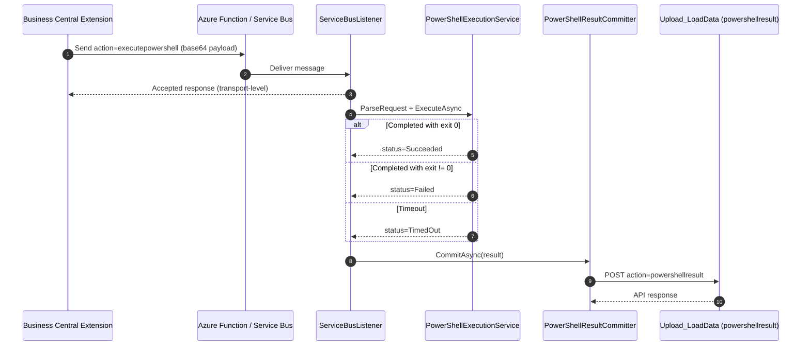

# DataMigratePro Listener Enhancement - Technical Implementation

## 1. Scope

This document describes the PowerShell listener enhancement end-to-end and explains how another Business Central extension can reuse the same functionality.

This is the listener equivalent of [docs/DataMigratePro-FileServices-Implementation.md](docs/DataMigratePro-FileServices-Implementation.md).

## 2. High-Level Architecture

Main components:
- AL extension API and transaction storage (AppSource side)
- existing Azure Function / Service Bus transport
- local `ServiceBusListener` action handler (`executepowershell`)
- local PowerShell execution service (`PowerShellExecutionService`)
- callback commit path to BC (`powershellresult` via `Upload_LoadData` envelope)

Core runtime path:
1. AL extension stores a transaction and sends a listener command envelope.
2. Listener accepts and queues the message using existing activity persistence.
3. Worker executes the script in a PowerShell process.
4. Listener builds a structured execution result payload.
5. Listener posts callback to BC endpoint with `action = powershellresult`.
6. AL side updates transaction status and output fields.

## 3. Listener Artifacts (PC)

### 3.1 Action dispatch

- [DataMigratePro.Core/ServiceBusListener.cs](DataMigratePro.Core/ServiceBusListener.cs)
  - `ProcessActionAsync(...)` contains branch:
    - parse `transactionId`
    - parse request payload from `data`
    - execute request asynchronously
    - set `listenerActivityId` and `listenerConnectionId`
    - commit callback result to BC

### 3.2 Execution service

- [DataMigratePro.Core/PowerShellExecutionService.cs](DataMigratePro.Core/PowerShellExecutionService.cs)
  - `PowerShellExecutionRequest`
  - `PowerShellExecutionResult`
  - `ParseRequest(base64Data, transactionId)`
  - `ExecuteAsync(request, cancellationToken)`
  - `PowerShellResultCommitter.CommitAsync(result, cancellationToken)`

### 3.3 Activity scope context

- [DataMigratePro.Core/ListenerActivityScope.cs](DataMigratePro.Core/ListenerActivityScope.cs)
  - exposes current listener activity id for callback correlation.

### 3.4 Unit tests

- [DataMigratePro.Tests/UnitTests/PowerShellExecutionServiceTests.cs](DataMigratePro.Tests/UnitTests/PowerShellExecutionServiceTests.cs)
  - success / failed exit code / timeout scenarios.

## 4. Protocol Contract

## 4.1 Request envelope (listener input)

Transport is unchanged:
- outer message is the existing listener envelope via Azure Function / Service Bus
- `data` inside the action payload is base64 UTF-8 JSON

Action:
- `executepowershell`

Request payload JSON:

```json
{
  "script": "Write-Output 'hello'; exit 0",
  "timeoutSeconds": 300,
  "workingDirectory": "C:\\Migration",
  "requestedBy": "MyExtension",
  "companyName": "CRONUS",
  "createdAtUtc": "2026-07-02T10:00:00Z"
}
```

## 4.2 Result callback envelope (BC input)

Action:
- `powershellresult`

Callback payload JSON (before base64 wrapping into envelope `data`):

```json
{
  "transactionId": "GUID",
  "status": "Succeeded",
  "exitCode": 0,
  "stdout": "hello",
  "stderr": "",
  "resultMessage": "PowerShell execution completed successfully.",
  "startedAtUtc": "2026-07-02T10:00:01Z",
  "endedAtUtc": "2026-07-02T10:00:02Z",
  "durationMs": 1023,
  "listenerActivityId": "GUID",
  "listenerConnectionId": "DWP"
}
```

Notes:
- timeout sets `status = TimedOut` and `exitCode = null`
- non-zero exit code sets `status = Failed`
- callback transport failures raise listener-side failure for activity tracking

## 5. Sequence Flow



## 6. Extending from Another BC Extension

This section shows how another extension can plug into the listener functionality with minimal coupling.

### 6.1 Recommended AL integration model

Implement a dedicated management codeunit in your extension, similar to the AppSource implementation:

1. create and persist a transaction record
2. build request JSON and base64-encode it
3. send to listener through existing relay sender
4. expose retry and status query actions
5. implement callback processing for `powershellresult`

### 6.2 Minimum AL responsibilities

- transaction persistence fields:
  - transaction id (GUID)
  - status
  - script blob
  - stdout/stderr blob
  - result message
  - exit code
  - started/finished timestamps and duration
- sender method:
  - creates `action = executepowershell`
  - includes base64 request JSON in `data`
- callback method:
  - handles `action = powershellresult`
  - updates transaction by transaction id

### 6.3 Suggested AL sender pseudo-flow

```text
CreateExecution(script, timeout)
  -> insert transaction (Created)
  -> build request JSON
  -> wrap as listener envelope
  -> RelaySender.SendMessage(base64Envelope)
  -> set status Accepted or Send Failed
```

### 6.4 Suggested AL callback pseudo-flow

```text
ApplyResult(resultJson)
  -> parse transactionId + status + output fields
  -> find transaction row
  -> update status/output/metadata
  -> return API response envelope
```

### 6.5 Practical migration examples: C/AL shell vs AL listener interfaces

The examples below show how typical legacy shell usage patterns can be implemented with the new listener interfaces.

#### Example A: Execute and continue (fire-and-forget)

Legacy C/AL idea (direct shell call):

```pascal
// C/AL style (conceptual)
Command := 'powershell.exe -File C:\Scripts\SyncMasterData.ps1';
ReturnCode := SHELL(Command, 0);
// continue immediately, no structured callback
```

Recommended AL using listener (transaction-based):

```pascal
procedure RunSyncWithoutWaiting()
var
  PsMgt: Codeunit "DMP PowerShell Exec. Mgt. IOI";
  TransactionId: Guid;
begin
  TransactionId := PsMgt.ExecuteAndContinue(
    'Write-Output ''Sync start''; & ''C:\Scripts\SyncMasterData.ps1''; exit $LASTEXITCODE',
    600,
    'C:\Migration',
    UserId());

  Message('PowerShell queued. Transaction: %1', TransactionId);
end;
```

When to use:
- background tasks
- user should not be blocked
- result is evaluated later via transaction status

#### Example B: Execute and wait for response

Legacy C/AL idea (blocking shell call):

```pascal
// C/AL style (conceptual)
Command := 'powershell.exe -File C:\Scripts\ValidateExport.ps1';
ReturnCode := SHELL(Command, 0);
IF ReturnCode <> 0 THEN
  ERROR('Validation failed.');
```

Recommended AL using listener with bounded wait:

```pascal
procedure RunValidationAndWait()
var
  PsMgt: Codeunit "DMP PowerShell Exec. Mgt. IOI";
  WaitResponse: Text;
begin
  WaitResponse := PsMgt.ExecuteAndWaitForResponse(
    'Write-Output ''Validate''; & ''C:\Scripts\ValidateExport.ps1''; exit $LASTEXITCODE',
    300,
    'C:\Migration',
    UserId(),
    120000,
    500);

  Message('Validation response: %1', WaitResponse);
end;
```

When to use:
- synchronous UX requirement
- immediate decision needed in current process
- short-running scripts only

#### Example C: Execute async and trigger follow-up function

Legacy C/AL idea often used custom polling/flags after SHELL:

```pascal
// C/AL style (conceptual)
ReturnCode := SHELL('powershell.exe -File C:\Scripts\PrepareData.ps1', 0);
// custom logic to trigger next step
IF ReturnCode = 0 THEN
  RunFollowUp();
```

Recommended AL using callback metadata + integration event:

```pascal
procedure RunPrepareWithCallback()
var
  PsMgt: Codeunit "DMP PowerShell Exec. Mgt. IOI";
  TransactionId: Guid;
begin
  TransactionId := PsMgt.ExecuteAsyncWithCallback(
    'Write-Output ''Prepare''; & ''C:\Scripts\PrepareData.ps1''; exit $LASTEXITCODE',
    900,
    'C:\Migration',
    UserId(),
    'AfterPrepareData',
    '{"jobId":"4711"}');

  Message('Prepare queued. Transaction: %1', TransactionId);
end;
```

Subscriber extension handling the callback function:

```pascal
codeunit 50100 "My PS Callback Handler"
{
  [EventSubscriber(ObjectType::Codeunit, Codeunit::"DMP PowerShell Exec. Mgt. IOI", 'OnAfterPowerShellExecutionCompleted', '', false, false)]
  local procedure HandlePowerShellCompleted(TransactionId: Guid; Status: Enum "DMP PowerShell Status IOI"; CallbackFunctionName: Text; CallbackParameter: Text; ResultMessage: Text; ExitCode: Integer)
  begin
    if CallbackFunctionName <> 'AfterPrepareData' then
      exit;

    if Status = Status::Succeeded then begin
      // Call your extension-specific follow-up function here.
      // Example: StartImportJob(CallbackParameter);
    end else begin
      // Example: log or notify failure with ResultMessage / ExitCode
    end;
  end;
}
```

When to use:
- asynchronous orchestration with explicit next-step handler
- decoupled extension integrations
- robust process chaining without blocking UI/session

#### Example D: Mapping from old shell patterns to new interfaces

- old pattern `SHELL(command)` with no result handling:
  use `ExecuteAndContinue(...)`
- old pattern `SHELL(command)` and immediate return code check:
  use `ExecuteAndWaitForResponse(...)`
- old pattern `SHELL(command)` plus manual follow-up trigger:
  use `ExecuteAsyncWithCallback(...)` and subscribe to `OnAfterPowerShellExecutionCompleted`

## 7. Where to Hook for Custom Extensions

### PC-side hooks (if PC repo customization is desired)

- [DataMigratePro.Core/ServiceBusListener.cs](DataMigratePro.Core/ServiceBusListener.cs)
  - action dispatch branch for `executepowershell`

- [DataMigratePro.Core/PowerShellExecutionService.cs](DataMigratePro.Core/PowerShellExecutionService.cs)
  - request validation rules
  - process startup arguments
  - timeout policy
  - callback serialization fields

### BC-side hooks (extension-specific)

- sender codeunit in your extension
- callback action handling in your endpoint codeunit
- transaction table/page for operations and support

## 8. Operational Semantics

- Acceptance and completion are different phases.
- Listener callback is the source of final execution truth.
- Non-zero exit code is an expected execution outcome, not a crash.
- Timeout implies process-tree termination and `TimedOut` status.

## 9. Security Guidance for Reuse

For external extensions using this functionality:

- require explicit permission before allowing script submission
- validate or constrain script origin where possible
- keep conservative timeout defaults
- monitor callback failures and retries
- avoid secrets in script text; prefer preconfigured secure endpoints or vault-backed lookup

## 10. Compatibility and Constraints

- current executor targets `powershell.exe` (Windows runtime)
- request `data` must be valid base64 UTF-8 JSON
- callback uses configured BC endpoint from `DataConnectionManager.dataEndpointUrl`
- transport remains compatible with existing listener queue/ack behavior

## 11. Troubleshooting

Common issues:
- `PowerShell execution request data is empty`:
  - sender did not provide base64 `data`.
- `PowerShell execution request is missing script`:
  - request JSON lacks `script` or is empty.
- `PowerShell working directory does not exist`:
  - invalid `workingDirectory` path.
- callback HTTP errors:
  - check BC endpoint auth/config and listener logs.

## 12. Validation Checklist

- request accepted and queued
- successful script returns `Succeeded` + stdout
- failing script returns `Failed` + stderr/exit code
- timeout returns `TimedOut` and no process leak
- callback updates BC transaction correctly
- existing listener actions remain unaffected
