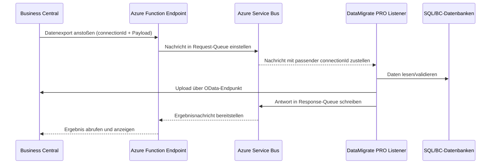

# DataMigrate PRO Synch-Service DWP

Diese Dokumentation beschreibt die Installation und den Betrieb des DataMigrate PRO Service-Bus-Listeners als Windows-Dienst unter dem Namen **"DataMigrate PRO Synch-Service DWP"**. Die Anleitung basiert auf den verfügbaren CLI-Referenzen und den Vorgaben für `settings.json`.

## Überblick

Der Befehl

```powershell
DataMigratePro -t listen --install "DataMigrate PRO Synch-Service DWP" --registration "E16BE4D170A041778415" --tenantid "906c85a9-4065-4b62-b27a-e644b351c27f"
```

führt nacheinander die folgenden Schritte aus:

1. `-t listen` startet den Azure Service Bus Listener von DataMigrate PRO. Für den produktiven Betrieb werden die Verbindungseinstellungen aus `settings.json` geladen.
2. `--install "DataMigrate PRO Synch-Service DWP"` installiert den Listener im Windows-Dienst-Wrapper (Launcher) und richtet den angegebenen Dienstnamen ein.
3. `--registration ... --tenantid ...` prüft und speichert den Registrierungs-/Lizenzschlüssel sowie den Azure AD Mandanten. Ohne gültige Registrierung verweigert das Tool nach kurzer Zeit den Dienstbetrieb.

Für den geplanten Service-Modus mit `serviceSchedule` gilt zusätzlich: Der Dienst kann auch dann als Windows-Dienst laufen, wenn er direkt per `sc.exe create` installiert wurde. In diesem Fall muss die jeweilige Kopie des Programms aber eine passende `settings.json` im selben Ordner enthalten.

## Voraussetzungen

- Windows-Server mit Administratorrechten (erforderlich für die Dienstinstallation).
- .NET Desktop Runtime entsprechend der DataMigrate PRO Version.
- Kopie des DataMigratePro-Programmordners (inkl. `DataMigratePro.exe`, `DataMigratePro.Launcher.exe`, `settings.json`).
- Netzwerkzugriff auf:
  - SQL Server der Business Central Datenbanken.
  - Business Central OData-Endpunkt (`Upload_LoadData`).
  - Azure Service Bus Namespace für eingehende Aufträge.
- Registrierungs-Key (`--registration`) und Azure AD Tenant-ID (`--tenantid`).

## Installationsschritte

1. **Ordner vorbereiten**
   - Kopieren Sie den gesamten Lieferumfang nach `C:\Programme\DataMigratePro` (oder ein anderes Ziel ohne Leerzeichen im Pfad).
   - Stellen Sie sicher, dass `DataMigratePro.exe` und `DataMigratePro.Launcher.exe` beschreibbar sind, damit Logs und `settings.json` geschrieben werden können.

2. **settings.json anlegen/anpassen**
   - Erstellen oder aktualisieren Sie `settings.json` im Installationsordner entsprechend dem Beispiel im Abschnitt [Beispielkonfiguration](#beispielkonfiguration-settingsjson).

3. **Registrierung vorbereiten**
   - Öffnen Sie eine administrative PowerShell.
   - Navigieren Sie in den Installationsordner: `cd C:\Programme\DataMigratePro`.

4. **Registrierung ausführen**
   - Führen Sie den Befehl oben aus, aber **ohne** `--install`, um Lizenz- und Service-Bus-Daten zu validieren:
     ```powershell
     .\DataMigratePro.exe -t listen --registration "E16BE4D170A041778415" --tenantid "906c85a9-4065-4b62-b27a-e644b351c27f"
     ```
   - Bei Erfolg werden die Service-Bus-Parameter (Queue-Namen, Connection String) in `settings.json` ergänzt.

5. **Dienst installieren**
   - Starten Sie anschließend die endgültige Installation:
     ```powershell
     .\DataMigratePro.exe -t listen --install "DataMigrate PRO Synch-Service DWP" --registration "E16BE4D170A041778415" --tenantid "906c85a9-4065-4b62-b27a-e644b351c27f"
     ```
   - Der Launcher registriert einen Windows-Dienst. Die Log-Ausgabe wird in das Windows-Ereignisprotokoll umgeleitet.
   - Für den geplanten Service-Modus mit `serviceSchedule` genügt alternativ auch eine direkte `sc.exe create`-Installation. Entscheidend ist dann, dass die Dienstkopie im gleichen Ordner eine passende `settings.json` besitzt.

6. **Dienst starten**
   - Öffnen Sie `services.msc`, suchen Sie **DataMigrate PRO Synch-Service DWP**, setzen Sie den Starttyp auf *Automatisch* und starten Sie den Dienst.

## Funktionsweise des Service-Bus-Listeners

- Der Listener überwacht die konfigurierte `RequestQueueName` auf eingehende Nachrichten. Jede Nachricht löst die Datenverarbeitungs-Pipeline von DataMigrate PRO aus.
- Antworten und Statusmeldungen werden auf `ResponseQueueName` geschrieben.
- Die Schleife läuft dauerhaft und nutzt kurze Polling-Intervalle (ca. 1 Sekunde), um neue Nachrichten zu erkennen.
- Fehler werden in das Windows-Ereignisprotokoll geschrieben; bei schwerwiegenden Fehlern stoppt der Dienst mit einem entsprechenden Fehlercode.

## Ablaufübersicht



## Geplanter Service-Modus (`serviceSchedule`)

Dieser Modus ist fuer zeitgesteuerte Einzel- oder Intervalllaeufe gedacht, die direkt im Windows-Dienst ausgefuehrt werden. Anders als `-t listen` wartet der Dienst nicht auf Service-Bus-Nachrichten, sondern liest die auszufuehrenden CLI-Argumente aus `settings.json`.

### Beispielkonfiguration

```json
{
   "ServiceSchedule": {
   "CommandArguments": "-t printerdiscovery --listenerconnectionid \"7A7B2D10-8A7A-4C61-9A9A-3C2F5A1C8D2E\" --transactionid \"9D3E5B2C-1A2F-4B7D-9C5E-4A1B2C3D4E5F\"",
      "StartDate": "2026-07-01",
      "EndDate": "2026-12-31",
      "RecurringType": "Interval",
      "RecurringInterval": "01:00:00",
      "StartingTime": "18:00:00",
      "EndingTime": "06:00:00",
      "Days": "Mo,Tu,We,Sa,Su"
   }
}
```

### Bedeutende Regeln

- `CommandArguments` enthaelt genau den DMP-Aufruf, der innerhalb des Zeitfensters ausgefuehrt werden soll, zum Beispiel `-t printerdiscovery` fuer eine regelmaessige Druckerbestandsaktualisierung.
- `RecurringInterval` definiert den Abstand zwischen zwei Pruefungen bzw. Ausfuehrungen.
- `Days` akzeptiert Wochentagskuerzel wie `Mo`, `Tu`, `We`, `Th`, `Fr`, `Sa`, `Su`.
- Wenn `StartingTime` groesser als `EndingTime` ist, darf das Fenster Mitternacht ueberqueren.
- Der Dienst laesst sich wie gewohnt entweder mit `--install "Dienstname"` oder direkt mit `sc.exe create` installieren.
- Fuer mehrere parallele Instanzen empfiehlt sich ein eigener Ordner pro Dienst, jeweils mit eigener `settings.json` und eigenem Dienstnamen.
- Zum Entfernen eines installierten Dienstes verwenden Sie `DataMigratePro.exe --uninstall "Dienstname"`.

### Installation per Parameter

```powershell
DataMigratePro.exe --install "DataMigratePro-Scheduled-Runner" --registration "E16BE4D170A041778415" --tenantid "906c85a9-4065-4b62-b27a-e644b351c27f"
```

### Installation per `sc.exe`

```powershell
sc.exe create "DataMigratePro-Scheduled-Runner" binPath= "\"C:\Programme\DataMigratePro\DataMigratePro.exe\"" start= auto
```

Danach den Dienst starten und die Ausfuehrung in den Windows-Ereignisprotokollen kontrollieren. Der Dienst startet in diesem Fall direkt aus dem Ordner der jeweiligen Kopie und liest `settings.json` von dort.

### Deinstallation

```powershell
DataMigratePro.exe --uninstall "DataMigrate PRO Synch-Service DWP"
```

Der Befehl stoppt den Dienst, falls er laeuft, und entfernt die Windows-Dienstregistrierung.

### Konfiguration in Business Central

- In der Business-Central-Erweiterung muss dieselbe `connectionId` hinterlegt sein wie in der `settings.json`, damit Nachrichten eindeutig dem Listener zugeordnet werden.
- Verwenden Sie nach Möglichkeit eine eindeutig generierte Kennung (z. B. GUID oder generiertes Passwort) als `connectionId`, um Überschneidungen mit weiteren Integrationen auszuschließen.
- In der Business-Central-Konfiguration wird außerdem der Endpunkt der vorbereiteten Azure Function samt dem in Azure generierten Zugriffsschlüssel hinterlegt. Nur so kann die Anwendung Nachrichten erfolgreich in die Service-Bus-Queue einstellen.

## Beispielkonfiguration (`settings.json`)

```json
{
  "SqlConnectionString": "Data Source=SQLSERVER;Initial Catalog=BC_PROD;Integrated Security=SSPI;",
  "SourceCompany": "CRONUS AG",
  "DestinationCompany": "CRONUS AG",
  "SourceDatabase": "BC_PROD",
  "MappingDatabase": "BC_PROD",
  "MigrationDatabase": "BC_MIGRATION",
  "EndpointUrl": "https://api.businesscentral.dynamics.com/v2.0/906c85a9-4065-4b62-b27a-e644b351c27f/Production/ODataV4/Upload_LoadData?company=CRONUS%20AG",
  "BlobMagicSignature": [2, 69, 125, 91],
  "IsSaaS": true,
  "Environment": "Production",
  "TenantInfo": {
    "TenantId": "906c85a9-4065-4b62-b27a-e644b351c27f",
    "ClientId": "<Azure AD App ID>",
    "ClientSecret": "<Azure AD App Secret>"
  },
  "ServiceBus": {
    "ServiceBusConnectionString": "Endpoint=sb://<namespace>.servicebus.windows.net/;SharedAccessKeyName=<Name>;SharedAccessKey=<Key>",
    "RequestQueueName": "datamigratepro-requests",
    "ResponseQueueName": "datamigratepro-responses",
    "connectionId": "DWP"
  }
}
```

**Hinweise:**
- Die `ServiceBus`-Sektion ist zwingend erforderlich für `-t listen`. Fehlende Werte führen beim Start des Dienstes zu einer Validierungs-Exception.
- Stimmen Sie die hier eingetragene `connectionId` mit der Konfiguration in Business Central ab. Verwenden Sie eine eindeutige Kennung, um Fehlzuordnungen zu vermeiden.
- `TenantInfo` wird für SaaS/OAuth benötigt. Für On-Premises-Betrieb setzen Sie `IsSaaS` auf `false` und verwenden `BCUser`/`BCPassword` statt `TenantInfo`.
- `BlobMagicSignature` kann übernommen werden, sofern keine individuelle Vorgabe vorliegt.
- Weitere optionale Einstellungen wie `SqlConnectionStringMigration` oder `AppSourceEnabled` können bei Bedarf ergänzt werden.

## Überprüfung und Wartung

1. **Dienststatus prüfen**
   - `Get-Service "DataMigrate PRO Synch-Service DWP"` in PowerShell aufrufen.
2. **Logausgaben kontrollieren**
   - Ereignisanzeige → *Anwendungs- und Dienstprotokolle* → *DataMigratePro*.
3. **Einstellungen anpassen**
   - Dienst vorher stoppen, `settings.json` bearbeiten, Dienst neu starten.
4. **Dienst deinstallieren**
   - `DataMigratePro.exe --uninstall "DataMigrate PRO Synch-Service DWP"` ausführen.

## Troubleshooting

| Symptom | Ursache | Lösung |
|---------|---------|--------|
| Dienst startet und stoppt sofort | Ungültige oder fehlende `ServiceBus`-Einträge | `settings.json` prüfen, Registrierung erneut ausführen |
| Fehlermeldung „Registration invalid“ | Falscher Key oder Tenant-ID | Werte prüfen, ggf. Support kontaktieren |
| Keine Nachrichtenverarbeitung | Falscher `RequestQueueName` oder fehlende Berechtigungen | Queue-Namen und SAS-Policy kontrollieren |
| OAuth-Authentifizierung schlägt fehl | `TenantInfo` unvollständig oder App-Registrierung ohne BC-Berechtigungen | Azure AD App prüfen, Secret erneuern |

Mit dieser Anleitung sollte der DataMigrate PRO Synch-Service DWP zuverlässig installiert und betrieben werden können.
