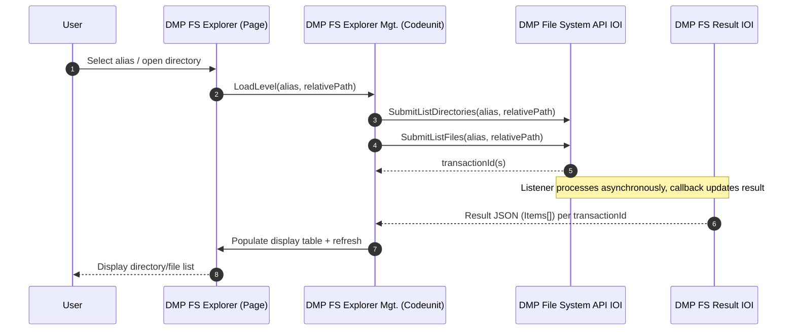
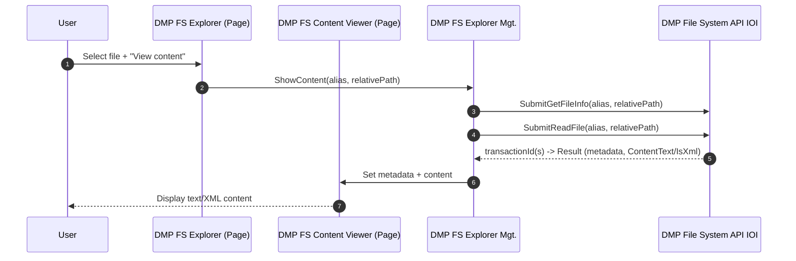

# Requirements – BC File System Explorer (File Services Demo)

> Purpose: Demonstration of the File Services functionality described in [DataMigratePro-FileServices-Dokumentation.md](DataMigratePro-FileServices-Dokumentation.md), [DataMigratePro-FileServices-Implementation.md](DataMigratePro-FileServices-Implementation.md), and [DataMigratePro-FileServices-FactSheet.md](DataMigratePro-FileServices-FactSheet.md) using an interactive file system explorer in Business Central (BC).

## 1. Context and Objective

A BC extension ("**DMP File System Explorer**") shall be created that provides a **file system explorer** directly in Business Central. The explorer uses only the existing, alias-based File Services contract of the **DataMigrate Pro** app and makes it interactively usable for users.

The explorer shall cover three core tasks:

1. **Navigation & Display** - Load and display the directory structure and file list of a configured alias.
2. **File Operations** - Trigger typical file and directory operations (copy, move, delete, create, archive, write) from the UI.
3. **View Content** - Load file contents (text/XML) and display them in the BC client.

The functionality is intended as an **example implementation** and shows how a BC extension reuses the stable action contract of File Services.

## 2. Dependency

The new extension adds **DataMigrate Pro** as a dependency. Add the following entry to `dependencies` in the new extension's `app.json` (values from [app.json.text](app.json.text)):

```json
"dependencies": [
  {
    "id": "87b41ac4-158e-4748-a31f-34d1176a2982",
    "name": "DataMigrate Pro",
    "publisher": "IO Integrated",
    "version": "27.1.175.0"
  }
]
```

Requirements from the base app:

- `application`: `27.0.0.0`, `platform`: `1.0.0.0`, `runtime`: `16.0`.
- The new extension uses its **own** `idRanges` range (not the base app's range `72359575–72359624`).
- Public objects of the base app used:
  - `codeunit 72359617 "DMP File System API IOI"` (Submit* methods, `RetryRequest`, XML hooks)
  - `table 72359615 "DMP FS Request IOI"` (request lifecycle)
  - `table 72359616 "DMP FS Result IOI"` (result lifecycle including `Error Code`, `Message`)
  - `page 72359618 "DMP FS Request List IOI"`, `page 72359619 "DMP FS Result List IOI"`

## 3. Scope

### 3.1 In Scope

- BC role center/menu entry for opening the explorer.
- Alias selection (from the configured `FileSystemAliases`).
- Loading and displaying subdirectories (`ListDirectories`) and files (`ListFiles`) for an alias and relative path.
- Navigation between levels (enter a subdirectory, go up one level, return to the root).
- Display of file metadata (`GetFileInfo`): size, timestamp (UTC), extension, read-only.
- Display of file contents (`ReadFile`): text and XML representation.
- Triggering file operations from the UI: `WriteFile`, `AppendFile`, `CopyFile`, `MoveFile`, `DeleteFile`, `ArchiveFile`.
- Triggering directory operations: `CreateDirectory`, `DeleteDirectory`, `DirectoryExists`, `FileExists`.
- Status feedback per action through the existing request/result tables (asynchronous result via callback).
- Refreshing the view after a command completes.

### 3.2 Out of Scope

- Changes to the listener, `FileSystemService`, transport envelope, or callback (`Upload_CommitFsResult`) - the base app remains unchanged.
- Direct access through absolute paths or unconfigured aliases.
- Configuration of the aliases/policy itself (performed in the listener's `settings.json`).
- Operations outside the supported command list (e.g. permission changes, symlinks).
- Licensing/security logic - this remains entirely in the listener (alias whitelist, traversal protection, policy).

## 4. Constraints and Assumptions

- The DataMigratePro listener runs in Service Bus mode (`-t listen`) and is configured with `FileSystemAliases`/`FileSystemSecurity`.
- All operations are **asynchronous**: a `Submit*` call returns a `transactionId`; the final result arrives later via callback and updates `DMP FS Request IOI`/`DMP FS Result IOI`.
- The explorer operates **purely alias-relative**: users select an alias and navigate through relative paths; absolute paths are never sent from BC.
- Security violations (traversal, disallowed extension, size limit) are returned by the listener with stable error codes and displayed in the explorer.

## 5. Functional Requirements (FR)

| ID | Title | Description | Priority | Underlying API | Acceptance Rule |
|---|---|---|---|---|---|
| FR-101 | Select alias | User selects a configured alias as the explorer root. | Must | `FileSystemAliases` | Only configured aliases can be selected; selection sets the relative path to the root. |
| FR-102 | Load directories | Subdirectories of the current path are loaded and displayed. | Must | `SubmitListDirectories(alias, relativePath)` | Result list shows all subdirectories (`Items`). |
| FR-103 | Load files | Files in the current path are loaded and displayed. | Must | `SubmitListFiles(alias, relativePath)` | Result list shows all files (`Items`). |
| FR-104 | Navigate into directory | User opens a subdirectory and refreshes the view. | Must | `SubmitListDirectories`, `SubmitListFiles` | Relative path is extended; view shows the content of the new level. |
| FR-105 | Go up one level / to root | Navigate one level up or back to the alias root. | Must | – (local path logic) | Relative path is correctly shortened; view is refreshed. |
| FR-106 | Display file metadata | Metadata of a selected file is displayed. | Should | `SubmitGetFileInfo(alias, relativePath)` | Size, UTC timestamp, extension, and read-only status are displayed. |
| FR-107 | Display file content | Content of a selected file is loaded and displayed. | Must | `SubmitReadFile(alias, relativePath)` | `ContentText`/`ContentBase64` available; XML is detected (`IsXml`). |
| FR-108 | Write file | Create a new file or overwrite it from the UI. | Must | `SubmitWriteFile(alias, relativePath, content)` | File is created with the expected size; result `Completed`. |
| FR-109 | Append to file | Append content to an existing file. | Should | `SubmitAppendFile(alias, relativePath, content)` | Content is appended; size increases accordingly. |
| FR-110 | Copy file | Copy a file to a target alias/path. | Must | `SubmitCopyFile(srcAlias, srcPath, tgtAlias, tgtPath)` | Target file is created; source remains. |
| FR-111 | Move file | Move a file to a target alias/path. | Must | `SubmitMoveFile(srcAlias, srcPath, tgtAlias, tgtPath)` | Target file is created; source is removed. |
| FR-112 | Archive file | Move a file to an archive alias/path. | Should | `SubmitArchiveFile(srcAlias, srcPath, archiveAlias, archivePath)` | File is in the archive; source is removed. |
| FR-113 | Delete file | Delete a selected file (with confirmation). | Must | `SubmitDeleteFile(alias, relativePath)` | File is removed; view is refreshed. |
| FR-114 | Create directory | Create a new subdirectory in the current path. | Should | `SubmitCreateDirectory(alias, relativePath)` | Directory exists after execution. |
| FR-115 | Delete directory | Delete a directory (recursively only when allowed by policy). | Should | `SubmitDeleteDirectory(alias, relativePath, recursive)` | Directory is removed or policy rejection is displayed. |
| FR-116 | Check existence | Check whether a file/directory exists. | Could | `SubmitFileExists`, `SubmitDirectoryExists` | `Exists` result is displayed. |
| FR-117 | XML import source | Read an XML file through an XML port alias. | Could | `SubmitImportXmlPortSource(alias, relativePath)` | Behavior matches `ReadFile`. |
| FR-118 | XML export target | Write XML content through an XML port alias. | Could | `SubmitExportXmlPortTarget(alias, relativePath, xml)` | Behavior matches `WriteFile`. |
| FR-119 | Status tracking | Active actions are tracked with status/error code. | Must | `DMP FS Request IOI`, `DMP FS Result IOI` | Status `Created→Sent→Completed/Failed`; `Error Code`/`Message` visible. |
| FR-120 | Retry failed action | Resend failed requests. | Should | `RetryRequest(TransactionId)` or page action | Only `Failed` entries are resent. |
| FR-121 | Refresh view | Reload the explorer after a command completes. | Must | repeat `ListDirectories`/`ListFiles` | View reflects the current state of the alias path. |

## 6. Non-functional Requirements (NFR)

| ID | Category | Requirement | Metric | Limit |
|---|---|---|---|---|
| NFR-101 | Compatibility | Base app (DataMigrate Pro) remains unchanged; only public objects are consumed. | Changes to base app | 0 |
| NFR-102 | Security | Only alias-relative paths are sent; no absolute paths from BC. | Absolute paths in envelope | 0 |
| NFR-103 | Robustness | Asynchronous results are correctly mapped and displayed, even with delays. | Mapping via `transactionId` | 100% |
| NFR-104 | Usability | Current alias + relative path are always visible (breadcrumb/path display). | Path display present | yes |
| NFR-105 | Traceability | Every triggered action can be found through `transactionId` in the request/result. | Findability | 100% |
| NFR-106 | Error transparency | Stable listener error codes are displayed to the user in an understandable way. | Error display | all codes covered |
| NFR-107 | Performance | Large content is identified through `Payload/Result Truncated` notices. | Truncation notice | displayed |

## 7. Feature List

| Feature ID | Feature Name | Assigned Requirements | Description |
|---|---|---|---|
| FEAT-101 | Explorer Navigation | FR-101–FR-105, FR-121, NFR-104 | Alias selection, directory/file loading, level navigation, refresh. |
| FEAT-102 | Content/Metadata View | FR-106, FR-107, FR-117, NFR-107 | Display metadata and text/XML content of a file. |
| FEAT-103 | File Operations | FR-108–FR-113, FR-118 | Write, append, copy, move, archive, delete, XML export. |
| FEAT-104 | Directory Operations | FR-114–FR-116 | Create, delete, existence check. |
| FEAT-105 | Status Monitor & Retry | FR-119, FR-120, NFR-103, NFR-105, NFR-106 | Status/error tracking and retry of failed actions. |

## 8. Implementation Design (BC Extension)

### 8.1 Target Picture (Functional)

The user opens the explorer, selects an alias, and sees the directory/file list. Through actions, the user triggers file/directory operations or opens a content view. Each action creates a request to the listener; the result arrives asynchronously via callback and updates the status and view.

### 8.2 Proposed AL Objects (Example Extension, Own ID Range)

| Object | Type | Purpose | Uses |
|---|---|---|---|
| `DMP FS Explorer` | Page (Card/List part) | Main UI: alias selection, path display, directory/file list, actions. | `SubmitListDirectories`, `SubmitListFiles` |
| `DMP FS Explorer Entry` | Table (temporary) | In-memory representation of the current level (name, type, size, modified). | Result from `ListFiles`/`ListDirectories` |
| `DMP FS Content Viewer` | Page | Display of metadata and text/XML content of a file. | `SubmitReadFile`, `SubmitGetFileInfo` |
| `DMP FS Explorer Mgt.` | Codeunit | Process logic: path handling, API calls, result parsing (JSON), refresh. | `"DMP File System API IOI"` |
| `DMP FS Explorer RC Ext.` | PageExtension | Menu entry in the role center. | – |

> Note: The result data of the `List*` commands arrives asynchronously through the result table. Explorer management reads the result JSON from `DMP FS Result IOI` and populates the temporary display table. Alternatively, an event hook/refresh pattern can be used for display only.

### 8.3 Flow (Example: Open Directory)



### 8.4 Flow (Example: View File Content)



### 8.5 Explorer Action to API Command Mapping

| Explorer Action | API Call |
|---|---|
| Open/Refresh | `SubmitListDirectories`, `SubmitListFiles` |
| View content | `SubmitReadFile` (+ `SubmitGetFileInfo`) |
| Metadata | `SubmitGetFileInfo` |
| New file / overwrite | `SubmitWriteFile` |
| Append | `SubmitAppendFile` |
| Copy | `SubmitCopyFile` |
| Move | `SubmitMoveFile` |
| Archive | `SubmitArchiveFile` |
| Delete file | `SubmitDeleteFile` |
| Create directory | `SubmitCreateDirectory` |
| Delete directory | `SubmitDeleteDirectory` |
| Check existence | `SubmitFileExists`, `SubmitDirectoryExists` |
| Import XML | `SubmitImportXmlPortSource` |
| Export XML | `SubmitExportXmlPortTarget` |

## 9. Traceability Matrix (Requirement → Feature → Implementation → Test)

| Requirement | Feature | Implementation (Object) | Test Case | Status |
|---|---|---|---|---|
| FR-101 | FEAT-101 | `DMP FS Explorer` (alias selection) | TC-101 | Open |
| FR-102/103 | FEAT-101 | `DMP FS Explorer Mgt.` (List*) | TC-102 | Open |
| FR-104/105 | FEAT-101 | Path logic in management | TC-103 | Open |
| FR-106 | FEAT-102 | `SubmitGetFileInfo` | TC-104 | Open |
| FR-107 | FEAT-102 | `DMP FS Content Viewer` | TC-105 | Open |
| FR-108/109 | FEAT-103 | `SubmitWriteFile`/`SubmitAppendFile` | TC-106 | Open |
| FR-110/111/112 | FEAT-103 | `SubmitCopyFile`/`SubmitMoveFile`/`SubmitArchiveFile` | TC-107 | Open |
| FR-113 | FEAT-103 | `SubmitDeleteFile` | TC-108 | Open |
| FR-114/115/116 | FEAT-104 | Directory commands | TC-109 | Open |
| FR-117/118 | FEAT-102/103 | XML port commands | TC-110 | Open |
| FR-119/120 | FEAT-105 | Request/result + `RetryRequest` | TC-111 | Open |
| FR-121 | FEAT-101 | Refresh after command | TC-112 | Open |

## 10. Test Cases

| Test Case ID | Reference | Precondition | Test Steps | Expected Result | Status |
|---|---|---|---|---|---|
| TC-101 | FR-101 | Alias `IMPORT` configured | Open explorer, select alias | Only configured aliases selectable; root loaded | Open |
| TC-102 | FR-102/103 | Alias directory with content | Load level | Directories and files are displayed | Open |
| TC-103 | FR-104/105 | Multi-level structure | Navigate into subfolder, back, to root | Path and content update correctly | Open |
| TC-104 | FR-106 | File exists | Open metadata | Size, UTC time, extension, read-only status correct | Open |
| TC-105 | FR-107 | XML file exists | View content | Text/XML visible; `IsXml` correct | Open |
| TC-106 | FR-108/109 | Alias writable | Write, then append | File is created/grows; result `Completed` | Open |
| TC-107 | FR-110/111/112 | Source + target alias | Copy/move/archive | Target is created; source is retained/removed as appropriate | Open |
| TC-108 | FR-113 | File exists | Delete with confirmation | File is removed; view refreshed | Open |
| TC-109 | FR-114/115/116 | Alias directory | Create/delete/check existence | Result object (`Created`/`Deleted`/`Exists`) correct | Open |
| TC-110 | FR-117/118 | XML alias configured | Import source/export target | Behavior matches `ReadFile`/`WriteFile` | Open |
| TC-111 | FR-119/120 | Faulty request | Create error, run retry | Status/error code visible; retry sends only `Failed` | Open |
| TC-112 | FR-121 | Command completed | Trigger refresh | View reflects current state | Open |
| TC-113 | NFR-102 | Traversal attempt | `..` in relative path | Listener returns `ACCESS_DENIED`; error is displayed | Open |

## 11. Acceptance Criteria

| AC ID | Reference | Criterion | Verification Method |
|---|---|---|---|
| AK-101 | FR-101–FR-105 | Explorer navigates alias-relatively through directories and files. | Functional test |
| AK-102 | FR-106/107 | Metadata and text/XML content are displayed correctly. | Functional test |
| AK-103 | FR-108–FR-116 | All file/directory operations can be triggered from the UI. | Functional test per command |
| AK-104 | FR-119/120 | Status, error code, and retry are traceable. | Request/result log |
| AK-105 | NFR-101/102 | Base app unchanged; alias-relative paths only. | Review + negative test |

Given/When/Then (Examples):

> **Given** a configured alias `IMPORT` with subdirectories and files
> **When** the user selects the alias and opens a subdirectory
> **Then** the explorer displays the directories and files of the selected level.

> **Given** a selected XML file
> **When** the user runs "View content"
> **Then** the text/XML content is displayed in the Content Viewer and `IsXml` is set correctly.

> **Given** a `relativePath` with `..` traversal
> **When** the user triggers an operation
> **Then** the command is rejected by the listener with `ACCESS_DENIED` and the error is displayed in the explorer.

## 12. Open Points

- Definition of the example extension's own `idRanges` range.
- Display pattern for asynchronous results of the `List*` commands (polling the result table vs. event hook).
- Scope of content display (text/XML only vs. additional Base64 download of large files).
