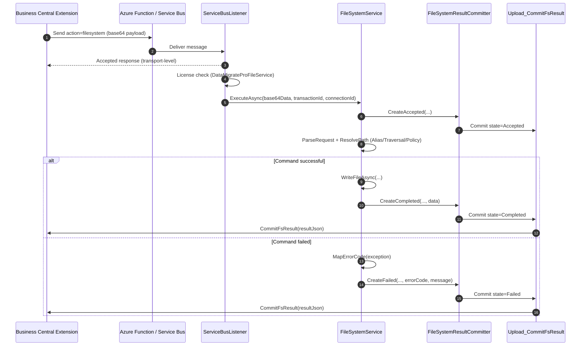

# DataMigratePro Listener - File System Services (File Services)

> This documentation follows the requirements from [Documentation Guidelines](Dokumentations-Richtlinien.md).
> Source artifacts: [DataMigratePro-FileServices-Implementation.md](DataMigratePro-FileServices-Implementation.md), [FileSystemService.cs](../DataMigratePro.Core/FileSystemService.cs), [ServiceBusListener.cs](../DataMigratePro.Core/ServiceBusListener.cs), [DataConnectionSettings.cs](../DataMigratePro.Core/DataConnectionSettings.cs), [DataConnectionManager.cs](../DataMigratePro.Core/DataConnectionManager.cs).

## 1. Context and Objective

Business Central (BC) must be able to execute file system operations on the local DataMigratePro listener without having direct access to the local file system itself. Transmission uses the existing Azure Relay/Service Bus architecture with the listener action `filesystem`.

The objective is a controlled, alias-based file access layer with the following properties:

- Execution of typical file and directory operations (read, write, append, copy, move, archive, list, delete, existence check).
- Access exclusively through configured **path aliases** - never through absolute paths supplied by BC.
- Prevention of path traversal outside the alias root directory.
- Policy-based security checks (allowed extensions, maximum file size, recursive deletion).
- Immediate transport-level receipt confirmation (Accepted), decoupled from the actual command.
- Reporting the final result (Completed/Failed) to BC through the callback action `Upload_CommitFsResult` with retry.
- Transaction-based traceability through a unique `transactionId`.

The function is the file system counterpart to listener-based [PowerShell execution](DataMigratePro-Listener-ShellExecution-Dokumentation.md) and is designed to be reusable by BC extensions through a stable action contract.

## 2. Scope

### 2.1 In Scope

- Listener action `filesystem` in `ServiceBusListener` including an immediate Accepted response.
- File system execution service `FileSystemService` including request parsing, alias/path resolution, and command dispatch.
- Supported commands: `ListFiles`, `ListDirectories`, `CreateDirectory`, `DeleteDirectory`, `DirectoryExists`, `ReadFile`, `WriteFile`, `AppendFile`, `DeleteFile`, `MoveFile`, `CopyFile`, `FileExists`, `GetFileInfo`, `ArchiveFile`, `ImportXmlPortSource`, `ExportXmlPortTarget`.
- Callback committer `FileSystemResultCommitter` (Accepted/Completed/Failed) with retry logic.
- Security and policy checks through `FileSystemSecuritySettings` and alias whitelist.
- License check: action permitted only for extension `DataMigrateProFileService`.
- Stable error-code mapping for error analysis in BC.

### 2.2 Out of Scope

- Access through absolute paths or unconfigured aliases.
- Operations not included in the command list (e.g. permission changes, symlinks).
- Changes to the transport (Azure Function / Service Bus envelope remains unchanged).
- Changes to the behavior of existing actions (`putdata`, `getdata`, `getstructure`, `executepowershell`, AL `execute`).
- BC-side AL objects (tables/pages/codeunits) are only referenced here, not specified (see [Implementation](DataMigratePro-FileServices-Implementation.md)).

## 3. Requirements

### 3.1 Functional Requirements (FR)

| ID | Title | Description | Priority | Source | Acceptance Rule |
|---|---|---|---|---|---|
| FR-001 | Send file command | BC sends a base64-encoded JSON envelope through the relay path with action `filesystem`. | Must | Implementation §4 | Listener receives and processes action `filesystem`. |
| FR-002 | Immediate receipt confirmation | The listener immediately confirms receipt of a `filesystem` command with an Accepted response, regardless of command duration. | Must | ServiceBusListener | BC receives an Accepted response before command execution. |
| FR-003 | Alias-based path resolution | Target paths are formed exclusively from configured aliases plus a relative path. | Must | FileSystemService `ResolvePath` | Unconfigured alias results in error `INVALID_OPERATION`. |
| FR-004 | Prevent path traversal | A resolved path outside the alias root is rejected. | Must | FileSystemService `IsUnderRoot` | Traversal path produces `ACCESS_DENIED`. |
| FR-005 | Read file | `ReadFile` returns size, Base64 content, decoded text, and XML detection. | Must | `ReadFileAsync` | Result contains `ContentBase64`, `ContentText`, `IsXml`. |
| FR-006 | Write/append file | `WriteFile` creates/overwrites, `AppendFile` appends; missing target directories are created. | Must | `WriteFileAsync`, `AppendFileAsync` | File exists with the expected size after execution. |
| FR-007 | Copy/move/archive file | `CopyFile`, `MoveFile`, `ArchiveFile` use the target alias/path from the payload. | Must | `CopyFile`, `MoveFile`, `ArchiveFile` | Target path is correctly resolved from the payload alias/path. |
| FR-008 | Directory operations | `ListFiles`, `ListDirectories`, `CreateDirectory`, `DeleteDirectory`, `DirectoryExists` are supported. | Must | `ExecuteCommandAsync` | Each directory command returns the documented result object. |
| FR-009 | Existence/metadata query | `FileExists`, `DirectoryExists`, `GetFileInfo` return existence and metadata. | Must | `GetFileInfo` | `GetFileInfo` returns size, timestamp (UTC), extension, read-only status. |
| FR-010 | XML port aliases | `ImportXmlPortSource` reads and `ExportXmlPortTarget` writes a file. | Should | `ExecuteCommandAsync` | Both commands behave like `ReadFile`/`WriteFile`. |
| FR-011 | Result callback to BC | Final result is reported to BC through `Upload_CommitFsResult`. | Must | `FileSystemResultCommitter` | BC transaction is updated to Completed/Failed. |
| FR-012 | Error differentiation | Exceptions are mapped to stable, meaningful error codes. | Must | `MapErrorCode` | Known exceptions produce stable codes (e.g. `FILE_NOT_FOUND`). |
| FR-013 | License check | `filesystem` is permitted only for extension `DataMigrateProFileService`. | Must | ServiceBusListener | Wrong extension produces `LICENSE_NOT_PERMITTED`. |

### 3.2 Non-functional Requirements (NFR)

| ID | Category | Requirement | Metric | Limit |
|---|---|---|---|---|
| NFR-001 | Compatibility | Existing listener actions continue to run unchanged. | Regression of existing actions | 0 regressions |
| NFR-002 | Compatibility | Transport envelope (Azure Function / Service Bus) remains unchanged. | Queue/ack compatibility | 100% |
| NFR-003 | Security | Access only through configured aliases, no path traversal, policy checks active. | Alias/traversal/policy check | no violation |
| NFR-004 | Security | Allowed file extensions and maximum file size are enforced when a policy is configured. | Extension/size guard | 100% checked |
| NFR-005 | Robustness | The result callback has retry logic. | Retry in committer | up to 5 attempts |
| NFR-006 | Auditability | Every execution is traceable through `transactionId`. | Traceability | 100% of executions |
| NFR-007 | Data format | `data` payload and result are valid base64 UTF-8 JSON (CamelCase). | Payload/result validation | valid in 100% |

## 4. Feature List

| Feature ID | Feature Name | Assigned Requirements | Description | Dependencies | Data Fields/Interfaces |
|---|---|---|---|---|---|
| FEAT-001 | Listener File System Action | FR-001, FR-002, FR-013 | Action `filesystem` including Accepted response and license check. | existing Service Bus transport | Action `filesystem`, `transactionId`, `data` |
| FEAT-002 | Request Parsing | FR-001, NFR-007 | Decoding of the base64 JSON envelope to `FileSystemCommandRequest`. | FEAT-001 | `ParseRequest`, `FileSystemCommandRequest` |
| FEAT-003 | Alias & Path Security | FR-003, FR-004, NFR-003, NFR-004 | Alias resolution, traversal protection, extension/size policy. | FEAT-002, configuration | `ResolvePath`, `IsUnderRoot`, `FileSystemSecuritySettings` |
| FEAT-004 | Command Execution | FR-005–FR-010 | Dispatch and execution of all file/directory commands. | FEAT-003 | `ExecuteCommandAsync`, `ReadFileAsync`, `WriteFileAsync`, and others |
| FEAT-005 | Result Callback | FR-011, FR-012, NFR-005 | Reporting of the final result with retry and error-code mapping. | FEAT-004, BC endpoint | `FileSystemResultCommitter`, `MapErrorCode`, `Upload_CommitFsResult` |
| FEAT-006 | Configuration | FR-003, NFR-003, NFR-004 | Provision of aliases and security policy through settings. | Setup | `FileSystemAliases`, `FileSystemSecurity` |

## 5. Implementation Design

### 5.1 Target Picture (Functional)

BC creates a file command (e.g. "write XML file to import directory"), sends it through the existing relay path, and immediately receives an acceptance confirmation. The listener resolves the alias to a secure, encapsulated path, executes the command, and returns the result via callback. The `transactionId` remains the unique audit and status reference.

### 5.2 Technical Design

Core runtime path:

1. The BC extension stores a request and sends a `filesystem` command envelope (base64 JSON).
2. `ServiceBusListener` queues the message and immediately sends an Accepted response (FR-002).
3. The worker checks the license (extension `DataMigrateProFileService`) and calls `FileSystemService.ExecuteAsync`.
4. `FileSystemService` parses the request, securely resolves the alias and path, and executes the command.
5. `FileSystemResultCommitter` sends the result state (Accepted initially, then Completed/Failed) to the BC endpoint `Upload_CommitFsResult`.
6. BC updates the request and result records.

Important design decisions:

- **Alias whitelist:** `ResolvePath` allows only roots registered in `FileSystemAliases`; an empty or unknown alias results in `INVALID_OPERATION`.
- **Traversal protection:** `IsUnderRoot` normalizes the root and candidate and checks that the candidate is below the root; otherwise `ACCESS_DENIED`.
- **Policy check:** When `FileSystemSecurity` is set, allowed extensions (`AllowedExtensions`), maximum file size (`MaxFileSizeBytes`), and recursive directory deletion (`AllowRecursiveDeleteDirectories`) are enforced.
- **Error codes:** `MapErrorCode` maps .NET exceptions to stable codes (`PATH_NOT_FOUND`, `FILE_NOT_FOUND`, `ACCESS_DENIED`, `COMMAND_NOT_SUPPORTED`, `INVALID_OPERATION`, `IO_ERROR`, `PROCESSING_ERROR`).
- **Callback endpoint:** `BuildFileSystemCommitEndpointUrl` derives the `Upload_CommitFsResult` endpoint from `Upload_LoadData` unless explicitly configured.
- **Retry:** The committer attempts delivery up to five times with a 1 s delay; under SaaS, a bearer token is set.

### 5.3 Sequence Diagram (Example: ExportXmlPortTarget)



### 5.4 Change Overview

| Feature ID | Object/Component | Change Type | Short Description |
|---|---|---|---|
| FEAT-001 | `ServiceBusListener` | Logic | Handling of action `filesystem`, Accepted response, license check |
| FEAT-002 | `FileSystemService.ParseRequest` | Logic | Envelope decoding to `FileSystemCommandRequest` |
| FEAT-003 | `FileSystemService.ResolvePath`/`IsUnderRoot` | Security | Alias resolution, traversal protection, extension/size policy |
| FEAT-004 | `FileSystemService.ExecuteCommandAsync` | Logic | Dispatch and execution of all commands |
| FEAT-005 | `FileSystemResultCommitter` | Logic | Callback with retry + `MapErrorCode` |
| FEAT-006 | `DataConnectionSettings`/`DataConnectionManager` | Configuration | `FileSystemAliases`, `FileSystemSecurity` |

### 5.5 Risks and Mitigations

| Risk | Mitigation |
|---|---|
| Path traversal through manipulated `relativePath` | `IsUnderRoot` normalization, hard rejection with `ACCESS_DENIED` |
| Access to unapproved directories | Alias whitelist only (`FileSystemAliases`) |
| Unwanted recursive deletion | `AllowRecursiveDeleteDirectories` policy enforces `recursive=false` |
| Oversized files / disallowed types | `MaxFileSizeBytes` and `AllowedExtensions` check |
| Transient callback error | Retry (up to 5 attempts) in the committer |

## 6. Traceability Matrix (Requirement → Implementation → Test)

| Requirement | Feature | Implementation (Object/Component) | Test Case | Test Result | Status |
|---|---|---|---|---|---|
| FR-001 | FEAT-001, FEAT-002 | `ServiceBusListener` (`action=filesystem`), `ParseRequest` | TC-001 | Open | Ready for Test |
| FR-002 | FEAT-001 | `ServiceBusListener` Accepted response | TC-002 | Open | Ready for Test |
| FR-003 | FEAT-003 | `ResolvePath` | TC-003 | Open | Ready for Test |
| FR-004 | FEAT-003 | `IsUnderRoot` | TC-004 | Open | Ready for Test |
| FR-005 | FEAT-004 | `ReadFileAsync` | TC-005 | Open | Ready for Test |
| FR-006 | FEAT-004 | `WriteFileAsync`, `AppendFileAsync` | TC-006 | Open | Ready for Test |
| FR-007 | FEAT-004 | `CopyFile`, `MoveFile`, `ArchiveFile`, `ResolveTargetPath` | TC-007 | Open | Ready for Test |
| FR-008 | FEAT-004 | `ListFiles`, `ListDirectories`, `CreateDirectory`, `DeleteDirectory` | TC-008 | Open | Ready for Test |
| FR-009 | FEAT-004 | `GetFileInfo`, `FileExists`, `DirectoryExists` | TC-009 | Open | Ready for Test |
| FR-010 | FEAT-004 | `ImportXmlPortSource`, `ExportXmlPortTarget` | TC-010 | Open | Ready for Test |
| FR-011 | FEAT-005 | `FileSystemResultCommitter`, `Upload_CommitFsResult` | TC-011 | Open | Ready for Test |
| FR-012 | FEAT-005 | `MapErrorCode` | TC-012 | Open | Ready for Test |
| FR-013 | FEAT-001 | License check in listener | TC-013 | Open | Ready for Test |
| NFR-003/004 | FEAT-003 | `ResolvePath` + `FileSystemSecuritySettings` | TC-014 | Open | Ready for Test |
| NFR-005 | FEAT-005 | Retry loop in committer | TC-015 | Open | Ready for Test |
| NFR-001/002 | – | Existing actions unchanged | TC-016 | Open | Ready for Test |

## 7. Test Cases and Verification Log

### 7.1 Functional Tests

| Test Case ID | Reference | Precondition | Test Steps | Expected Result | Actual Result | Status |
|---|---|---|---|---|---|---|
| TC-005 | FR-005, FEAT-004 | File exists in alias `IMPORT` | 1. Send `ReadFile` 2. Check result | `Exists=true`, `ContentBase64`/`ContentText` populated, `IsXml` correct | – | Open |
| TC-006 | FR-006, FEAT-004 | Alias `IMPORT` writable | 1. `WriteFile` 2. `AppendFile` | File exists, `SizeBytes` is correct, appended content is added | – | Open |
| TC-007 | FR-007, FEAT-004 | Source file exists, target alias configured | 1. `CopyFile`/`MoveFile`/`ArchiveFile` | Target is created from payload alias/path; source is moved/copied as appropriate | – | Open |
| TC-008 | FR-008, FEAT-004 | Alias directory exists | 1. `ListFiles`/`ListDirectories`/`CreateDirectory`/`DeleteDirectory` | Corresponding result object (`Items`, `Created`, `Deleted`) | – | Open |
| TC-009 | FR-009, FEAT-004 | File exists | 1. `GetFileInfo` | Size, UTC timestamp, extension, read-only status correct | – | Open |
| TC-010 | FR-010, FEAT-004 | XML file exists/alias writable | 1. `ImportXmlPortSource` 2. `ExportXmlPortTarget` | Behavior identical to `ReadFile`/`WriteFile` | – | Open |

### 7.2 Technical Tests

| Test Case ID | Reference | Precondition | Test Steps | Expected Result | Actual Result | Status |
|---|---|---|---|---|---|---|
| TC-001 | FR-001 | Listener is running | 1. Send `filesystem` envelope | Action is received and processed | – | Open |
| TC-002 | FR-002 | Listener is running | 1. Send `filesystem` 2. Observe response | Accepted response before command execution | – | Open |
| TC-003 | FR-003 | Alias not configured | 1. Command with unknown alias | Error `INVALID_OPERATION` | – | Open |
| TC-004 | FR-004 | Alias configured | 1. `relativePath` with `..` traversal | Error `ACCESS_DENIED` | – | Open |
| TC-011 | FR-011 | BC endpoint reachable | 1. Execute command 2. Check callback | BC transaction set to Completed/Failed | – | Open |
| TC-012 | FR-012 | File is missing | 1. `ReadFile` on missing file | Error code `FILE_NOT_FOUND` | – | Open |
| TC-013 | FR-013 | Extension ≠ FileService | 1. Send `filesystem` | Error `LICENSE_NOT_PERMITTED` | – | Open |
| TC-015 | NFR-005 | BC endpoint temporarily unreachable | 1. Trigger callback | Up to 5 retries, then failure | – | Open |

### 7.3 Compatibility Tests

| Test Case ID | Reference | Precondition | Test Steps | Expected Result | Actual Result | Status |
|---|---|---|---|---|---|---|
| TC-014 | NFR-003, NFR-004 | Policy with `AllowedExtensions`/`MaxFileSizeBytes` set | 1. Disallowed extension 2. Oversized file 3. Recursive delete with Policy=false | `ACCESS_DENIED` or `INVALID_OPERATION`; `recursive` forced to false | – | Open |
| TC-016 | NFR-001, NFR-002 | Existing actions configured | 1. Check `putdata`, `getdata`, `getstructure`, `executepowershell`, AL `execute` | Behavior unchanged | – | Open |

Verifiable artifacts per test: test date, tester, environment/version, evidence (log, API response, screenshot).

## 8. Acceptance Criteria

| AC ID | Reference | Criterion | Verification Method | Result |
|---|---|---|---|---|
| AK-001 | FR-001, FR-002 | `filesystem` command is accepted and immediately confirmed | Listener log + BC response | Open |
| AK-002 | FR-003, FR-004, NFR-003 | Access through alias only, no path traversal | Negative test + log | Open |
| AK-003 | FR-005–FR-010 | All commands provide the documented result | Functional test per command | Open |
| AK-004 | FR-011, FR-012 | Result including stable error codes is reported to BC | Callback log + BC transaction | Open |
| AK-005 | NFR-004 | Extension/size policy is enforced | Policy negative test | Open |
| AK-006 | NFR-001, NFR-002 | Existing actions remain unchanged | Regression test | Open |

Wording examples (Given/When/Then):

> **Given** a configured alias `IMPORT` and a valid `WriteFile` command
> **When** the listener processes the `filesystem` command
> **Then** the file is created within the alias root and state `Completed` is reported to BC.

> **Given** a `relativePath` that escapes the alias root with `..`
> **When** `ResolvePath` resolves the target path
> **Then** the command is rejected with error code `ACCESS_DENIED` and no file access is performed.

> **Given** an extension other than `DataMigrateProFileService`
> **When** a `filesystem` command arrives
> **Then** `LICENSE_NOT_PERMITTED` is reported and no file access is performed.

## 9. Acceptance Decision

| Field | Value |
|---|---|
| Project ID / Title | FileServices - Listener file system services |
| Version / Build | *(enter during acceptance)* |
| Acceptance date | *(open)* |
| Participants (business area, IT, QA) | *(open)* |
| Result per AC ID | AK-001…AK-006: *(open)* |
| Overall decision | *(open: Accepted / accepted with conditions / Not accepted)* |
| Open points with target date | *(open)* |

## 10. Compatibility and Migration Notes

1. **Unchanged legacy behavior:** `putdata`, `getdata`, `getstructure`, `executepowershell`, and AL `execute` remain functionally identical; the transport envelope and queue/ack behavior are unchanged (NFR-001, NFR-002).
2. **Additional variant:** The `filesystem` action is added and is reachable through the existing relay/Service Bus path.
3. **Switching/Migration:** Activation is performed by registering the `DataMigrateProFileService` extension and configuring `FileSystemAliases`/`FileSystemSecurity`; commands are rejected without this configuration.
4. **Backward-compatible check:** Regression test TC-016 ensures that existing actions continue to work unchanged.

## 11. Appendix

### 11.1 Request Envelope (Listener Input)

```json
{
  "interfaceVersion": "1.0",
  "transactionId": "GUID",
  "connectionId": "DWP",
  "command": "WriteFile",
  "pathAlias": "IMPORT",
  "relativePath": "inbound/customer.xml",
  "requestedBy": "Extension",
  "createdAt": "2026-06-24T10:15:00Z",
  "payload": {
    "contentText": "<root>...</root>",
    "recursive": false,
    "targetPathAlias": "ARCHIVE",
    "targetRelativePath": "done/customer.xml"
  }
}
```

### 11.2 Result Envelope (Commit Callback)

```json
{
  "interfaceVersion": "1.0",
  "transactionId": "GUID",
  "state": "Completed",
  "success": true,
  "command": "WriteFile",
  "pathAlias": "IMPORT",
  "relativePath": "inbound/customer.xml",
  "data": {
    "written": true,
    "sizeBytes": 2048,
    "fullPath": "C:\\Migration\\Import\\inbound\\customer.xml"
  },
  "completedAt": "2026-06-24T10:15:02Z"
}
```

### 11.3 Configuration Example (Settings)

```json
{
  "FileSystemAliases": {
    "IMPORT": "C:\\Migration\\Import",
    "EXPORT": "C:\\Migration\\Export",
    "ARCHIVE": "C:\\Migration\\Archive"
  },
  "FileSystemSecurity": {
    "AllowedExtensions": [".xml", ".json", ".txt"],
    "MaxFileSizeBytes": 52428800,
    "ReadOnlyAliases": [],
    "WriteOnlyAliases": [],
    "AllowRecursiveDeleteDirectories": false,
    "ValidateXmlWellFormed": false
  }
}
```

### 11.4 Error Code Mapping (`MapErrorCode`)

| Exception | Error Code |
|---|---|
| `DirectoryNotFoundException` | `PATH_NOT_FOUND` |
| `FileNotFoundException` | `FILE_NOT_FOUND` |
| `UnauthorizedAccessException` | `ACCESS_DENIED` |
| `NotSupportedException` | `COMMAND_NOT_SUPPORTED` |
| `InvalidOperationException` | `INVALID_OPERATION` |
| `IOException` | `IO_ERROR` |
| Other | `PROCESSING_ERROR` |

### 11.5 Referenced Source Files

- [FileSystemService.cs](../DataMigratePro.Core/FileSystemService.cs)
- [ServiceBusListener.cs](../DataMigratePro.Core/ServiceBusListener.cs)
- [DataConnectionSettings.cs](../DataMigratePro.Core/DataConnectionSettings.cs)
- [DataConnectionManager.cs](../DataMigratePro.Core/DataConnectionManager.cs)
- [CommandMetadata.cs](../DataMigratePro.Core/CommandMetadata.cs)
- [DataMigratePro-FileServices-Implementation.md](DataMigratePro-FileServices-Implementation.md)
